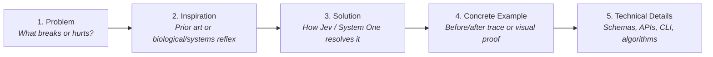

# Documentation & Proposal Standards Protocol

> **Canonical Protocol**: `.agents/protocols/documentation-standard-protocol.md`  
> **Status**: Active Standard  
> **Author**: TypeSafe AI Systems & Hook Architect  

---

## 1. Core Purpose & Invariant

Every piece of documentation in this repository—from high-level READMEs to operational user guides, architectural specs, and technical RFC proposals—must maintain structural consistency, readability, and immediate cognitive clarity.

To prevent documentation decay, audience confusion, and prompt bloat, all documents must adhere to:
1. **The Human-Centric Narrative Flow**: Technical details must always be preceded by a human-relatable rationale.
2. **Clear Audience Segmentation**: User-facing onboarding and operational controls must never be conflated with developer-facing internals and IPC contracts.
3. **The Root README Boundary**: The root README is a fast, high-impact **Hub** ($\le 150$ lines), not an exhaustive reference manual.
4. **Unified Proposal (RFC) Taxonomy**: All architectural blueprints must follow standard numeric IDs, typed categories, and uniform sections.
5. **Cross-Platform Portability & Relative Links**: All document links must be relative (zero `file:///` local schemes), and all shell commands must use portable `%CD%` paths rather than hardcoded local drives.

---

## 2. The Human-Centric Narrative Standard

Whenever authoring a README, guide, or RFC proposal, the first section must always follow the 5-step human progression:



### Mandatory Structural Blocks:
1. **`## 1. Problem`**:
   - Describe the concrete pain point in agent harnesses or software systems (e.g., token waste, accidental deletion, lossy summarization, confirmation fatigue).
   - Use measurable failure modes (e.g., "Advertising 50 skills wastes 15,000 prompt tokens every turn").
2. **`## 2. Inspiration`** *(Optional if no direct precedent, but highly encouraged)*:
   - Reference natural or established architectural systems: Kahneman's System 1 (fast instincts) vs System 2 (deliberation), microkernel OS hooks, CPU speculative branch prediction, biological reflexes, or existing industry tools (e.g., Shapeshift UI).
3. **`## 3. Solution`**:
   - Explain how Jev's non-autoregressive primitives (`Choice`, `Score`, `Noul`) or the specific hook architecture solve the problem with guaranteed types, sub-120ms latency, and extreme token efficiency.
4. **`## 4. Concrete Example & Impact`**:
   - Provide a concise before/after trace, realistic terminal logs, or a visual artifact showing the solution in action.
   - Highlight concrete metrics (latency, tokens saved, error reduction).
5. **`## 5. Technical Specification & Implementation`**:
   - Deep architectural details: IPC payloads (stdin/stdout JSON), database tables, CLI commands, thresholds, or test harness commands.

---

## 3. Audience Segmentation Standard

Documentation must be strictly partitioned into two distinct audiences:

### A. User-Faced Documentation (`docs/USER_GUIDE.md`)
* **Audience**: Application developers and engineers adopting Jev to accelerate and protect their Antigravity workspaces.
* **Core Content**:
  - 60-second setup and OpenRouter / TypeSafe API key configuration.
  - Interactive IDE confirmation modals: what they mean, how to choose (Allow Once, Save for Session, Save Always).
  - CLI rule management and auditing: `safety_db.py --review`, `--list`, `--allow`, `--prune`.
  - Knowledge Item capture: `jev_ki_engine.py --learn`.
  - Multi-workspace directory junctions on Windows (`mklink /J`).
* **Tone**: Developer-friendly, crisp, practical, zero unnecessary internal jargon.

### B. Dev-Faced Documentation (`docs/ARCHITECTURE.md`)
* **Audience**: Hook authors, framework contributors, and systems architects extending Jev.
* **Core Content**:
  - Machine-native lifecycle hook contracts (`PreInvocation`, `PreToolUse`, `Session GC`).
  - Stdin/stdout JSON IPC contracts and exit code semantics.
  - SQLite active learning schemas (`safety_decisions.db`, `decision_log`, `speculative_decisions`).
  - System One vs System Two balance invariants (preventing agent paralysis and confirmation fatigue).
  - Defensive engineering invariants: zero external dependencies, 3.5s fail-open network timeout, Windows `cmd /c` EOF invariant.
  - Test suites and CI/CD verification harnesses.
* **Tone**: Rigorous, authoritative, precise, deterministic.

---

## 4. Root README Invariants

The root `README.md` is the front door of the repository. It must obey these constraints:

1. **Size Limit**: Maximum **150 lines** (excluding raw badges).
2. **First Fold**:
   - High-impact title, badges (System One, Antigravity 2.0, OpenRouter, <120ms P95, 0 Dependencies).
   - Crisp 1-sentence value proposition.
   - The Human-Centric core narrative (Problem $\rightarrow$ Solution in 2 short paragraphs).
3. **Second Fold**:
   - Visual Proof Gallery: 3 high-signal screenshots/badges (Safety Gate Modal, Skill Router Badge, Speculative Pre-Flight Badge).
   - 60-Second Quick Start: 3 simple copy-paste blocks (clone/secrets, test command, global junction link).
   - Summary Table: 5-row hook overview mapping lifecycle phase to responsibility and link to deep docs.
4. **Footer Hub**:
   - Clean navigational links to:
     - 📖 [User Guide & CLI Manual](docs/USER_GUIDE.md)
     - 🛠️ [Developer Architecture Spec](docs/ARCHITECTURE.md)
     - 📋 [Master Proposals & RFC Index (23 Specs)](proposals/README.md)

---

## 5. Unified Proposals (RFC) Taxonomy

All proposals under `proposals/` must adhere to a standardized naming and numbering convention:

### Filename Format:
$$\mathbf{RFC\text{-}\langle ID\rangle\_\langle CATEGORY\rangle\_\langle slug\rangle.md}$$
* `ID`: 2-digit zero-padded number (`01` through `99`).
* `CATEGORY`: One of the 6 canonical categories:
  - `CORE`: Foundational Antigravity lifecycle hooks.
  - `USE_CASE`: Dedicated domain applications and patterns.
  - `FOUNDATION`: Theoretical frameworks, treatises, and inspirational case studies.
  - `EXT`: Harness extensions, jaggedness mitigations, and speculative arbitration.
  - `GUIDE`: Step-by-step setup guides and environment configurations.
  - `PROTOCOL`: Architectural rules of engagement and agent balance protocols.
* `slug`: Lowercase snake_case descriptor (e.g. `verbatim_context_compactor`).

### Proposal Header Standard:
Every proposal must begin with:
```markdown
# RFC-XX: [Descriptive Title]

> **Category**: [CORE | USE_CASE | FOUNDATION | EXT | GUIDE | PROTOCOL]  
> **Status**: [Implemented | Blueprint | Catalog | Case Study]  
> **Target Lifecycle**: [PreInvocation | PreToolUse | Session GC | CI/CD | Harness Core]  

---
```

### Master Catalog Synchronization:
Whenever an RFC is created, renamed, or updated, [`proposals/README.md`](../../proposals/README.md) must be updated simultaneously to keep the master status matrix and link catalog 100% in sync.

---

## 6. Cross-Platform Portability & Shell Invariants

To guarantee that documentation renders flawlessly on remote git platforms (GitHub, GitLab), works across any clone path, and executes cleanly across user environments:

### A. Git-Compatible Relative Links
* **Strict Rule**: NEVER use local absolute URI schemes (e.g. `file:///d:/...` or `file:///C:/...`).
* **Format**: All document links must be strictly relative to the markdown file's directory:
  - Inside `proposals/`: point to root via `../README.md` and to hooks via `../.agents/hooks/`.
  - Inside `.agents/skills/`: point to protocols via `../../protocols/` and proposals via `../../../proposals/`.
* **Rationale**: Absolute local file schemes break immediately when pushed to remote git repositories, browsed in web UI, or cloned to another machine or drive.

### B. Portable Windows Shell Commands (`%CD%` Invariant)
* **Strict Rule**: In Quick Start guides, operational manuals, and setup documentation, NEVER hardcode absolute local repository paths (e.g. `d:\01_GIT\Jev\...`).
* **Format**: Use `%CD%` (current directory when run from repository root) or relative target paths:
  ```cmd
  cmd /c mklink /J "%USERPROFILE%\.gemini\config\hooks" "%CD%\.agents\hooks"
  cmd /c mklink /J "%USERPROFILE%\.gemini\config\skills" "%CD%\.agents\skills"
  cmd /c mklink /J "%USERPROFILE%\.gemini\config\protocols" "%CD%\.agents\protocols"
  cmd /c mklink "%USERPROFILE%\.gemini\config\hooks.json" "%CD%\.agents\hooks.json"
  cmd /c mklink "%USERPROFILE%\.gemini\config\.env" "%CD%\.agents\.env"
  ```
* **Windows Execution Prefix**: Always include the `cmd /c` prefix for all shell commands to ensure clean process termination and EOF signal delivery.
