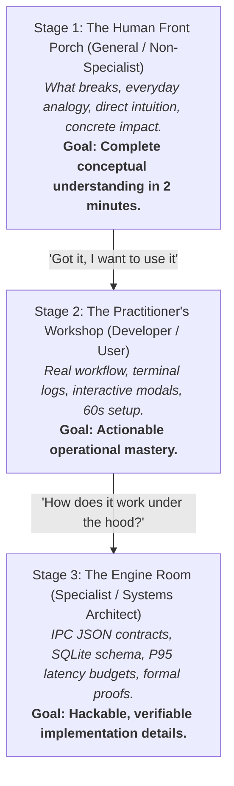

# Documentation & Proposal Standards Protocol

> **Canonical Protocol**: `.agents/protocols/documentation-standard-protocol.md`
> **Status**: Active Standard
> **Author**: Vasily Betin / TypeSafe AI Systems & Hook Architect
> **Related Protocols**: [Authorial Voice & Style](style-protocol.md) | [Anti-Slop Protocol](anti-slop-protocol.md)

---

## 1. Core Purpose & Invariants

Every piece of documentation in this repository—from high-level READMEs to operational guides, architectural specifications, and technical RFC proposals—must maintain structural clarity, readability, and immediate cognitive flow.

To prevent documentation decay, audience confusion, and prompt bloat, all documents must adhere to:

1. **Progressive Disclosure (The 3-Stage Reading Flow)**: Technical implementation details must never block high-level conceptual understanding.
2. **Authorial Voice & Anti-Slop Calibration**: Adhere strictly to [`.agents/protocols/style-protocol.md`](style-protocol.md) and [`.agents/protocols/anti-slop-protocol.md`](anti-slop-protocol.md). No corporate hype, no robotic negative parallelisms, and no copy-paste throat-clearing.
3. **Audience Segmentation Without Duplication**: Do not copy-paste the high-level background into every single document. User guides focus on operations; architecture specs focus on plumbing; philosophy owns the conceptual foundations.
4. **The Root README Boundary**: The root README is a fast, high-impact **Hub** ($\le 150$ lines), not an exhaustive manual.
5. **Unified Proposal (RFC) Taxonomy**: All architectural blueprints live under `docs/proposals/` and follow standard numeric IDs, typed categories, and uniform sections.
6. **Cross-Platform Portability**: All internal document links must be relative (zero `file:///` local schemes), and all shell commands must use portable `%CD%` paths with `cmd /c` prefixes on Windows.

---

## 2. The 3-Stage Progressive Disclosure Flow

Rather than forcing every document to re-tell the entire origin story, documents structure information so readers can stop whenever their questions are answered:


```mermaid
flowchart TD
    S1["Stage 1: The Human Front Porch (General / Non-Specialist)<br/><i>What breaks, everyday analogy, direct intuition, concrete impact.</i><br/><b>Goal: Complete conceptual understanding in 2 minutes.</b>"]
    S2["Stage 2: The Practitioner's Workshop (Developer / User)<br/><i>Real workflow, terminal logs, interactive modals, 60s setup.</i><br/><b>Goal: Actionable operational mastery.</b>"]
    S3["Stage 3: The Engine Room (Specialist / Systems Architect)<br/><i>IPC JSON contracts, SQLite schema, P95 latency budgets, formal proofs.</i><br/><b>Goal: Hackable, verifiable implementation details.</b>"]

    S1 -->|'Got it, I want to use it'| S2
    S2 -->|'How does it work under the hood?'| S3
```

### Stage 1: The Human Front Porch (The "What" and "Why")
- **Target Audience**: Anyone reading the project for the first time; developers evaluating whether Jev solves their problem.
- **Rules**:
  - Open with the raw, relatable friction (e.g., watching an agent delete a directory or burn 20,000 prompt tokens on turn 1).
  - Use physical or biological analogies (e.g., reflex arcs vs conscious contemplation) to give immediate intuition.
  - Zero raw JSON, zero mathematical formulas, zero low-level code dumps.
  - If a reader reads *only* Stage 1, they walk away with a complete understanding of what the system does and why it was built.

### Stage 2: The Practitioner's Workshop (The "How to Use It")
- **Target Audience**: Engineers adopting Jev in Antigravity or Codex.
- **Rules**:
  - Focus on operational reality: 60-second installation, CLI commands, and real IDE interactions.
  - Show, don't tell: include terminal logs, before/after traces, or screenshots of modals.
  - Keep commands copy-paste ready and portable.

### Stage 3: The Engine Room (The "How It Works Under the Hood")
- **Target Audience**: Hook contributors, framework authors, and systems architects.
- **Rules**:
  - Detail machine contracts: stdin/stdout JSON payloads, exit codes, SQLite schema tables, latency budgets, and fail-open invariants.
  - Rigorous, deterministic, and unambiguous. Keep this material in `docs/ARCHITECTURE.md` or dedicated RFC files under `docs/proposals/`.

---

## 3. Audience Segmentation Standard

Documentation is strictly partitioned into distinct roles:

### A. Root Front Door (`README.md`)
- **Role**: High-signal entry hub ($\le 150$ lines).
- **Contents**: 1-sentence value proposition, Stage 1 conceptual punch, 3 visual proofs, 60-second quickstart, and navigation links.

### B. Conceptual Foundation (`docs/PHILOSOPHY.md`)
- **Role**: The intellectual home of Jev.
- **Contents**: The Context Envelope, Kahneman's System 1 vs System 2, meaning in situated context, verbatim compaction vs lossy summarization. Written in Vasily's systems-philosopher voice.

### C. User & Operational Manual (`docs/USER_GUIDE.md`)
- **Role**: Stage 2 practitioner handbook.
- **Contents**: Setup, OpenRouter key management, interactive IDE modals, `safety_db.py` CLI rule auditing, Knowledge Item capture, and Windows directory junctions. No duplicate philosophy lectures.

### D. Architecture & Engineering Spec (`docs/ARCHITECTURE.md`)
- **Role**: Stage 3 engine room manual.
- **Contents**: Ports-and-adapters pattern, machine-native hook contracts, IPC schemas, active learning SQLite tables, P95 latency budgets, and test suites.

### E. Master Proposals & RFCs (`docs/proposals/`)
- **Role**: Formal architectural blueprints, treatises, and implementation specifications (`RFC-01` through `RFC-26`).

---

## 4. Root README Invariants

The root `README.md` must obey these constraints:

1. **Size Limit**: Maximum **150 lines** (excluding badges).
2. **First Fold**:
   - High-impact title and badges.
   - 1-sentence core value proposition.
   - Stage 1 Human Front Porch: ground-level friction $\rightarrow$ System One intuition.
3. **Second Fold**:
   - Visual Production Proofs: 3 high-signal screenshots/terminal logs (Safety Gate, Speculative Pre-Flight, Skill Router).
   - 60-Second Quick Start: 3 simple copy-paste blocks.
   - Core Capabilities summary table.
4. **Footer Hub**:
   - Clean navigational links to `docs/USER_GUIDE.md`, `docs/PHILOSOPHY.md`, `docs/ARCHITECTURE.md`, and `docs/proposals/README.md`.

---

## 5. Unified Proposals (RFC) Taxonomy

All proposals under `docs/proposals/` must adhere to standard naming and numbering:

### Filename Format:
$$\mathbf{RFC\text{-}\langle ID\rangle\_\langle CATEGORY\rangle\_\langle slug\rangle.md}$$
* `ID`: 2-digit zero-padded number (`01` through `99`).
* `CATEGORY`: One of the 6 canonical categories:
  - `CORE`: Foundational lifecycle hooks.
  - `USE_CASE`: Domain applications and patterns.
  - `FOUNDATION`: Theoretical frameworks and treatises.
  - `EXT`: Harness extensions and speculative arbiters.
  - `GUIDE`: Setup guides and environment configurations.
  - `PROTOCOL`: Rules of engagement and balance protocols.
* `slug`: Lowercase snake_case descriptor.

### Proposal Header Standard:
Every proposal must begin with:
```markdown
# RFC-XX: [Descriptive Title]

> **Category**: [CATEGORY]
> **Status**: [Implemented | Blueprint | Catalog | Case Study]
> **Target Lifecycle**: [PreInvocation | PreToolUse | Session GC | CI/CD | Harness Core]

---
```

---

## 6. Cross-Platform Portability & Shell Invariants

1. **Git-Compatible Relative Links**:
   - **Strict Rule**: NEVER use local absolute URI schemes (`file:///d:/...` or `file:///C:/...`).
   - All document links must be strictly relative to the markdown file's directory.
2. **Portable Windows Shell Commands (`%CD%` Invariant)**:
   - NEVER hardcode developer drive paths (`d:\01_GIT\Jev\...`).
   - Use `%CD%` (current directory when run from repository root) or relative paths.
   - Always prefix Windows shell commands with `cmd /c` to ensure clean process termination and EOF signal delivery.
