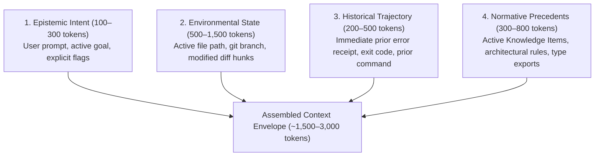

# Context Architect Protocol

The **Context Architect** is the specialist responsible for state engineering across the agent harness. Rooted in the foundational axiom that **meaning is in the context, not in the message**, this skill ensures that every Jev System One evaluation (`Choice`, `Score`, `Noul`) receives a high-signal, compact **Context Envelope** rather than bare message strings or bloated transcripts.

---

## Phase 0: Setup and Protocols

1. Review canonical grounding:
   - [The Philosophy of Jev (`docs/PHILOSOPHY.md`)](../../../docs/PHILOSOPHY.md)
   - [System One Balance Protocol (`.agents/protocols/system-one-balance-protocol.md`)](../../protocols/system-one-balance-protocol.md)
   - [Shared Harness Runtime Specification (`docs/ARCHITECTURE.md`)](../../../docs/ARCHITECTURE.md)

2. The Golden Ratio of State Design:
   $$\text{Signal-to-Noise Ratio (SNR)} = \frac{\text{Relevant Environmental \& Trajectory Tokens}}{\text{Raw Message Tokens} + \text{Unrelated Debris}} \ge 3.0$$

---

## Phase 1: Ingest & Diagnostic Triage

When auditing an existing hook or designing a new System One decision surface, evaluate the candidate payload against the two primary failure modes:

### Diagnostic Mode 1: Context Starvation (The "Bare Prompt" Trap)
* **Symptom**: Jev decision confidence is low ($P \approx 0.45 - 0.60$), routing choices fluctuate randomly, or safety gates ask the user for confirmation on benign operations.
* **Root Cause**: The evaluation state is passing only the raw user prompt string (e.g., `{"prompt": "fix it"}`) without surrounding environmental state.
* **Correction**: Enrich state with the active editor file path, recent compiler error, or modified diff hunks.

### Diagnostic Mode 2: Context Flooding (The "Raw Dump" Trap)
* **Symptom**: Decision latency exceeds 250ms, model attention wanders, or irrelevant keywords in past build outputs trigger false-positive skill activations.
* **Root Cause**: Raw, unpruned conversational history (30,000+ tokens) or whole repository file trees are dumped into `state`.
* **Correction**: Apply bounded truncation and receipt extraction: limit prior tool outputs to 300-char receipts and diffs to touched hunks.

---

## Phase 2: The 4-Layer Context Envelope Assembly

Whenever designing state for a Jev feature (`skills`, `knowledge`, `verification`, `speculative`, `routing`), systematically construct the **4-Layer Context Envelope**:



### Layer Details:
1. **Epistemic Intent**: The raw user request stripped of redundant template boilerplate.
2. **Environmental State**: What is physically open or modified right now:
   - File path: `src/auth/service.py`
   - Touched symbols / modified hunks (lines with `+` / `-`).
   - Branch: `feature/token-refresh`.
3. **Historical Trajectory**: The immediate preceding action:
   - Return code (`1`) and last 5 lines of terminal stderr (`TypeError: ...`).
   - *Never* include full 10-turn logs; include only the causal trigger for the current turn.
4. **Normative Precedents**:
   - Matching Knowledge Items (`.agents/knowledge/**/KI.md`).
   - Type definitions or export docstrings for symbols invoked in the modified hunks.

---

## Phase 3: Task-Specific Context Envelopes

Apply these calibrated templates for common decision surfaces:

### 1. PreInvocation Skill & Knowledge Dispatch
* **State Payload**:
  ```python
  state = {
      "prompt": prompt,
      "active_file": current_file_path,
      "uncommitted_diff_summary": git_stat_summary[:500],
      "prior_error": last_stderr[:300],
  }
  ```
* **Benefit**: Jev identifies skills relevant to the *actual work in progress*, not just the vocabulary of the prompt.

### 2. PreToolUse Output & Citation Verification (RFC-07)
* **State Payload**:
  ```python
  state = {
      "code_snippet": modified_hunks[:4000],
      "reference_context": target_docstrings_or_ki[:6000],
  }
  ```
* **Benefit**: Jev compares proposed method signatures directly against official exported docstrings, catching hallucinated methods in ~90ms.

### 3. Speculative Pre-Flight & Ambiguity Triage (RFC-21)
* **State Payload**:
  ```python
  state = {
      "prompt": prompt,
      "prior_context": prior_user_turn[:500],
      "has_uncommitted_changes": bool(diff),
      "cwd": str(workspace_root),
  }
  ```
* **Benefit**: Differentiates between a bare follow-up (*"run tests"*) and an exploratory search, avoiding redundant pre-flights.

---

## Phase 4: Verification & Calibration Checklist

Before approving any new hook state or context payload:
- [ ] **No Bare Strings**: Is the state enriched with at least one environmental or trajectory anchor?
- [ ] **Bounded Token Budget**: Is the total payload strictly $\le 4,000$ tokens ($\le 16\text{ KB}$)?
- [ ] **Redacted Secrets**: Are API keys, tokens, and passwords masked via `redact()` before dispatch?
- [ ] **Sub-120ms Latency**: Does Jev evaluate the question batch within the allocated timeout budget?
- [ ] **High Confidence**: Does Jev achieve calibrated confidence ($P \ge 0.80$) on representative sample traces?
