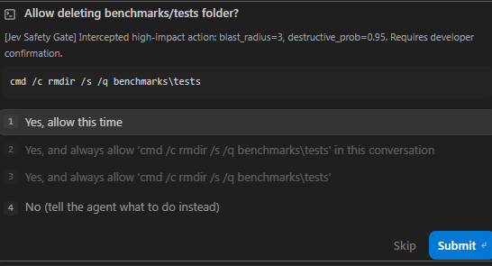
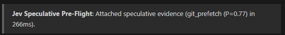

# Jev for Google Antigravity

[](https://docs.typesafe.ai)
[](https://github.com/google/antigravity)
[](https://openrouter.ai/~typesafe/jev-latest)
[](https://docs.typesafe.ai)
[](https://python.org)

**Machine-native System One semantic control layer for Google Antigravity.** Provides sub-120ms dynamic skill dispatch, autonomous execution safety guardrails, speculative diff prefetching, and verbatim context compaction powered by **TypeSafe AI's Jev model**.

---

## 1. Problem & Inspiration

### The Problem
Autonomous coding agent harnesses empower foundation models (Gemini, Claude, GPT) with direct local execution privileges. However, relying exclusively on large **System Two** models for routine low-level control flow causes severe degradation:
1. **Prompt Bloat & Token Waste**: Advertising 50+ domain skills in prompts consumes 5,000–25,000 tokens on *every single turn*.
2. **Accidental Destruction**: Models occasionally emit dangerous commands (`rmdir /s`, `git reset --hard`) with no deterministic barrier.
3. **Turn-1 Latency & Amnesia**: Multi-turn sequential file grep and status discovery waste user time before real coding begins.

### The Inspiration
In human cognition and modern operating systems, high-frequency micro-decisions do not consult the conscious mind or userspace interpreters. Fast **reflex arcs** and **eBPF probes** handle micro-actions at hardware speeds.

### The Solution: Jev System One
**Jev** is TypeSafe AI's non-autoregressive decision model:
* **Sub-120ms P95 Latency**: Evaluates structured judgments in parallel (190x faster than LLMs).
* **Extreme Efficiency**: **$0.042 per 1M input tokens** with **free unmetered outputs** (440x cheaper than LLMs).
* **Guaranteed Typing**: Native `Choice`, `Score`, and `Noul` primitives with zero schema validation failures.

**Deterministic shields handle safety, Jev handles fast semantic micro-decisions, and Gemini focuses purely on high-level reasoning and synthesis.**

---

## 2. Live Production Proof

### PreToolUse Safety Gate (Halting Destructive Execution)
When an agent attempts `cmd /c rmdir /s /q benchmarks\tests`, Jev scores `blast_radius=3` and `destructive_prob=0.95`, immediately halting execution and rendering an interactive confirmation modal in the Antigravity IDE:



### PreInvocation Dynamic Skill Router (Zero Prompt Bloat)
Instead of advertising 30+ skills on every turn, Jev evaluates the prompt in **~95ms**, selects the exact qualifying skill, and injects it ephemerally with a visible badge:

```text
> **Activated Skill**: `app-security`
```

### PreInvocation Speculative Pre-Flight Arbiter (Eliminating Turn-1 Roundtrips)
Before primary reasoning starts, Jev evaluates a parallel batch in **~220ms**, auto-prefetching git diffs or pytest diagnostics into Turn 1:



```text
> **Jev Speculative Pre-Flight**: Attached speculative evidence (git_prefetch (P=0.77) in 266ms).
```

---

## 3. Quick Start (60 Seconds)

### Step 1: Configure Secret
```cmd
cmd /c copy .agents\.env.example .agents\.env
```
Open `.agents/.env` and add your [OpenRouter](https://openrouter.ai/~typesafe/jev-latest) or TypeSafe API key:
```ini
OPENROUTER_API_KEY=sk-or-v1-your_openrouter_api_key_here
```

### Step 2: Verify Connectivity
```cmd
cmd /c python test_jev.py
```

### Step 3: Global Install Across All Workspaces
Link the suite to your global Antigravity configuration (`~/.gemini/config`). Edits in this repo immediately protect **every workspace on your machine**:
```cmd
cmd /c mklink /J "%USERPROFILE%\.gemini\config\hooks" "%CD%\.agents\hooks"
cmd /c mklink /J "%USERPROFILE%\.gemini\config\skills" "%CD%\.agents\skills"
cmd /c mklink /J "%USERPROFILE%\.gemini\config\protocols" "%CD%\.agents\protocols"
cmd /c mklink "%USERPROFILE%\.gemini\config\hooks.json" "%CD%\.agents\hooks.json"
cmd /c mklink "%USERPROFILE%\.gemini\config\.env" "%CD%\.agents\.env"
```
Restart Antigravity or press <kbd>Ctrl</kbd> + <kbd>Shift</kbd> + <kbd>P</kbd> $\rightarrow$ **`Developer: Reload Window`**.

---

## 4. Machine-Native Lifecycle Hooks Summary

| Hook File | Lifecycle Phase | Latency | Core Responsibility | Deep Spec |
| :--- | :--- | :---: | :--- | :---: |
| **[`jev_safety_gate.py`](.agents/hooks/jev_safety_gate.py)** | `PreToolUse` | ~0–80ms | 3-stage defense: Deterministic Invariant Shield $\rightarrow$ SQLite memory $\rightarrow$ Jev blast radius. | [Architecture](docs/ARCHITECTURE.md#hook-1-pretooluse-safety-gate) |
| **[`jev_skill_router.py`](.agents/hooks/jev_skill_router.py)** | `PreInvocation` | ~95ms | Progressive disclosure: injects full body ($\ge 0.80$) or lightweight soft hint ($0.50 \le P < 0.80$). | [Architecture](docs/ARCHITECTURE.md#hook-2-preinvocation-dynamic-skill-router) |
| **[`jev_speculative_router.py`](.agents/hooks/jev_speculative_router.py)** | `PreInvocation` | ~220ms | Parallel batch: prefetches git diffs or test logs; provides recency-aware ambiguity triage. | [Architecture](docs/ARCHITECTURE.md#hook-3-preinvocation-speculative-arbiter) |
| **[`jev_compactor.py`](.agents/hooks/jev_compactor.py)** | Session GC | ~270ms | Verbatim GC: prunes stale tool outputs to 300ch receipts while preserving 100% of prose and edits. | [Architecture](docs/ARCHITECTURE.md#hook-4-trajectory-compactor) |
| **[`jev_ki_engine.py`](.agents/hooks/jev_ki_engine.py)** | `PreInvocation` & Commit | ~70ms | Dual-engine: sub-70ms pre-flight triage with Turn-1 auto-mounting + closed-loop git distillation. | [Architecture](docs/ARCHITECTURE.md#hook-5-knowledge-item-lifecycle-engine) |

---

## 5. Documentation Hub

* 📖 **[User Guide & Operational Manual](docs/USER_GUIDE.md)**: Interactive modals, SQLite permission overrides, CLI auditing commands, and troubleshooting.
* 🛠️ **[Architecture & Technical Specification](docs/ARCHITECTURE.md)**: Full Mermaid control-flow diagrams, stdin/stdout IPC schemas, SQLite database structures, latency budgets, and test suites.
* 📋 **[Master Proposals & RFC Index](proposals/README.md)**: 23 unified technical specifications, blueprints, and industry domain patterns (`RFC-01` to `RFC-23`).
* 📜 **[Documentation Standards Protocol](.agents/protocols/documentation-standard-protocol.md)**: Invariants for human-centric narrative, audience segmentation, and RFC taxonomy.

---

## License & Attribution

* Released under the [MIT License](LICENSE).
* **Jev** is a proprietary System One foundation model developed by **TypeSafe AI** ([docs.typesafe.ai](https://docs.typesafe.ai)).
* **Antigravity** is Google's advanced agentic coding harness.
