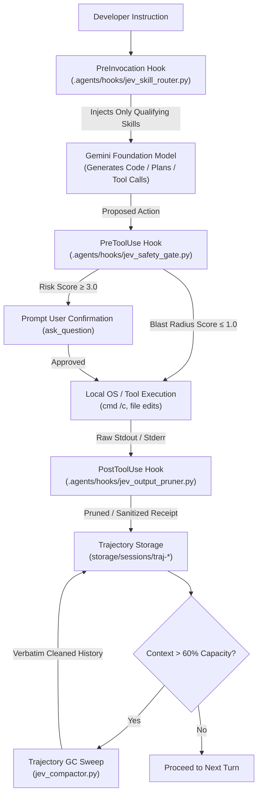

# Jev (TypeSafe AI) Integration for Google Antigravity

Machine-native **System One** semantic control layer for Google Antigravity, implementing automated skill routing, execution safety guardrails, real-time log pruning, and verbatim context compaction using **TypeSafe AI's Jev model**.

---

## Architecture Overview

Language model harnesses traditionally rely on monolithic autoregressive models (System Two) for both high-level reasoning and low-level control flow. In long-horizon agent workflows, this causes context rot, high token cost, and lossy summarization.

This repository integrates **TypeSafe Jev** (a non-autoregressive, calibrated decision model) into the **Google Antigravity** harness:
- **Deterministic Code**: Manages sandboxed filesystems, loops, and baseline security rules.
- **System One (Jev)**: Evaluates high-frequency semantic micro-decisions (skill relevance, tool safety, log compaction) in ~70–200ms at $0.042/1M input tokens (unmetered free outputs).
- **System Two (Gemini)**: Focuses computational capacity on long-horizon planning, system architecture, and code synthesis, operating over clean, verbatim context.



---

## Quick Start & Configuration

### 1. Environment Configuration (`.env`)
The hook scripts include a zero-dependency environment loader that automatically looks for `.env` files in:
1. `.agents/.env` (recommended for agent-scoped config)
2. `.env` (project root)
3. System environment variables

Copy the example template:
```cmd
cmd /c copy .agents\.env.example .agents\.env
```

#### Option A: Using OpenRouter (Recommended if you already have OpenRouter credits)
You can use Jev directly through OpenRouter using the model slug [`typesafe/jev-latest`](https://openrouter.ai/~typesafe/jev-latest).
```ini
# In .agents/.env
OPENROUTER_API_KEY=sk-or-v1-your_openrouter_api_key_here
```
*The hook loader auto-detects `OPENROUTER_API_KEY`, redirects endpoints to `https://openrouter.ai/api/v1/systemone`, selects model `typesafe/jev-latest`, and adds OpenRouter headers (`HTTP-Referer`, `X-Title`). See [22. Guide: OpenRouter Jev Setup](file:///d:/01_GIT/Jev/proposals/22_GUIDE_OPENROUTER_JEV_SETUP.md) for details.*

#### Option B: Using Direct TypeSafe AI API
```ini
# In .agents/.env
TYPESAFE_API_KEY=your_typesafe_api_key_here
TYPESAFE_ENDPOINT=https://api.typesafe.ai/v1/systemone
JEV_MODEL=jev-latest
```

> **Note**: If neither key is set, all hooks safely fail open (transparently passing prompts, commands, and logs unhindered).


---

## Implemented Lifecycle Hooks

All hooks are wired declaratively in [`.agents/hooks.json`](file:///d:/01_GIT/Jev/.agents/hooks.json):

```json
{
  "enabled": true,
  "PreInvocation": [
    {
      "command": "cmd /c python .agents/hooks/jev_skill_router.py"
    }
  ],
  "PreToolUse": [
    {
      "matcher": "run_command|write_to_file|replace_file_content",
      "command": "cmd /c python .agents/hooks/jev_safety_gate.py"
    }
  ],
  "PostToolUse": [
    {
      "matcher": "run_command|grep_search|view_file",
      "command": "cmd /c python .agents/hooks/jev_output_pruner.py"
    }
  ]
}
```

---

### 1. PreInvocation: Dynamic Skill Routing (`jev_skill_router.py`)
- **Location**: [`.agents/hooks/jev_skill_router.py`](file:///d:/01_GIT/Jev/.agents/hooks/jev_skill_router.py)
- **Problem**: Advertising 50+ installed skills in system prompts wastes 5k–20k tokens per turn and causes skill hallucinations.
- **Solution**: Evaluates the incoming user prompt against all `SKILL.md` frontmatter descriptions in ~100ms.
- **Behavior**:
  - Asks Jev `requires_skill` (Noul) and `selected_skill` (Choice).
  - If $P \ge 0.65$ and confidence $C \ge 0.70$, outputs an `ephemeralMessage` hydrating only the winning skill's instructions.
  - If no skill fits, passes zero extra tokens to the LLM.

#### Test Manually:
```cmd
cmd /c python -c "import json; print(json.dumps({'prompt': 'Check repository for over-engineering and unused dependencies'}))" | python .agents/hooks/jev_skill_router.py
```

---

### 2. PreToolUse: Command Safety Gate (`jev_safety_gate.py`)
- **Location**: [`.agents/hooks/jev_safety_gate.py`](file:///d:/01_GIT/Jev/.agents/hooks/jev_safety_gate.py)
- **Problem**: Autonomous agents can accidentally run destructive shell commands (`rm -rf`, `git reset --hard`, accidental directory format).
- **Solution**:
  - Deterministic Windows check: Enforces `cmd /c` prefix on shell commands.
  - Semantic Blast Radius check: Jev scores commands on an ordered 0–3 risk rubric:
    - Level 0: Read-only inspection (e.g. `dir`, `git status`).
    - Level 1: Idempotent local mutation (e.g. `git checkout -b`).
    - Level 2: Non-idempotent mutation or network calls.
    - Level 3: Destructive operations (recursive deletion, credential access).
- **Behavior**:
  - If blast radius $\ge 2$ or `is_destructive` $\ge 0.70$, exits with status code `1`, halting execution and prompting developer confirmation.

#### Test Manually:
```cmd
cmd /c python -c "import json; print(json.dumps({'tool_name': 'run_command', 'args': {'CommandLine': 'cmd /c del /f /s /q build'}}))" | python .agents/hooks/jev_safety_gate.py
```

---

### 3. PostToolUse: Real-Time Stream Pruner (`jev_output_pruner.py`)
- **Location**: [`.agents/hooks/jev_output_pruner.py`](file:///d:/01_GIT/Jev/.agents/hooks/jev_output_pruner.py)
- **Problem**: Passing massive test suites, build outputs, or grep searches (2,000+ lines) directly into conversation history rapidly exhausts context windows.
- **Solution**:
  - Intercepts completed tool stdout exceeding 1,000 characters.
  - Asks Jev whether the execution succeeded cleanly and whether any error stack traces exist.
  - If clean, compresses the output into a concise structural receipt (e.g. `[... Jev Stream Pruner: Execution succeeded cleanly. 12,410 non-failing log characters omitted ...]`).
  - If failures or stack traces exist, leaves the output completely intact for agent debugging.

#### Test Manually:
```cmd
cmd /c python -c "import json; print(json.dumps({'exit_code': 0, 'stdout': 'test passed\n' * 500}))" | python .agents/hooks/jev_output_pruner.py
```

---

### 4. Trajectory Garbage Collector (`jev_compactor.py`)
- **Location**: [`.agents/hooks/jev_compactor.py`](file:///d:/01_GIT/Jev/.agents/hooks/jev_compactor.py)
- **Problem**: Traditional LLM summarization forgets exact compiler flags, line numbers, and file paths (the "Funes Trap").
- **Solution**: Adapts Tamara Tran's `fast-jev-compaction` algorithm to Antigravity session trajectories:
  - Pins root prompt (`messages[0]`) and recent turns (`preserveRecentMessages=6`).
  - Evaluates dual Nouls per tool call:
    - $Q_1$: Does knowing this call was made still matter?
    - $Q_2$: Does the full output need to stay verbatim, or is it stale?
  - Drops obsolete calls, truncates superseded results to 300ch stubs, and preserves all user prompts and code diffs **100% verbatim**.

#### Run on a Trajectory File:
```cmd
cmd /c python .agents/hooks/jev_compactor.py "path/to/trajectory.json"
```

---

## Proposals & Architectural Specifications

The [proposals/](file:///d:/01_GIT/Jev/proposals) directory contains complete research and technical blueprints:

| Document | Description |
| :--- | :--- |
| **[proposals/README.md](file:///d:/01_GIT/Jev/proposals/README.md)** | Master proposals index & architecture flowchart. |
| **[18_ARCHITECTURAL_TREATISE_SYSTEM_ONE_ANTIGRAVITY.md](file:///d:/01_GIT/Jev/proposals/18_ARCHITECTURAL_TREATISE_SYSTEM_ONE_ANTIGRAVITY.md)** | Master treatise: *Machine-Native Semantic Control in Google Antigravity*. |
| **[01_PROPOSAL_A_VERBATIM_CONTEXT_COMPACTOR.md](file:///d:/01_GIT/Jev/proposals/01_PROPOSAL_A_VERBATIM_CONTEXT_COMPACTOR.md)** | Verbatim Transcript Compactor blueprint. |
| **[02_PROPOSAL_B_DYNAMIC_SKILL_DISPATCHER.md](file:///d:/01_GIT/Jev/proposals/02_PROPOSAL_B_DYNAMIC_SKILL_DISPATCHER.md)** | Two-stage progressive skill selection & disclosure. |
| **[03_PROPOSAL_C_KNOWLEDGE_ITEM_MATCHER.md](file:///d:/01_GIT/Jev/proposals/03_PROPOSAL_C_KNOWLEDGE_ITEM_MATCHER.md)** | Automated repository Knowledge Item memory pre-filter. |
| **[04_PROPOSAL_D_SAFETY_AND_TOOL_ROUTER.md](file:///d:/01_GIT/Jev/proposals/04_PROPOSAL_D_SAFETY_AND_TOOL_ROUTER.md)** | Pre-execution safety guardrail & closed-set tool routing. |
| **[06_USE_CASE_MODEL_ROUTING.md](file:///d:/01_GIT/Jev/proposals/06_USE_CASE_MODEL_ROUTING.md)** | 70ms task difficulty scoring to tier between Flash and Pro models. |
| **[07_USE_CASE_OUTPUT_AND_CITATION_VERIFICATION.md](file:///d:/01_GIT/Jev/proposals/07_USE_CASE_OUTPUT_AND_CITATION_VERIFICATION.md)** | Pre-execution verification of generated API signatures against docs. |
| **[08_USE_CASE_SEMANTIC_CODE_LINTING.md](file:///d:/01_GIT/Jev/proposals/08_USE_CASE_SEMANTIC_CODE_LINTING.md)** | Automated CI/CD PR diff checking against architectural guidelines. |
| **[09_USE_CASE_STRUCTURED_DATA_EXTRACTION_CASCADE.md](file:///d:/01_GIT/Jev/proposals/09_USE_CASE_STRUCTURED_DATA_EXTRACTION_CASCADE.md)** | Regex extraction + Jev Choice for schema-guaranteed data extraction. |
| **[10_USE_CASE_RAG_RERANKING_AND_FILTERING.md](file:///d:/01_GIT/Jev/proposals/10_USE_CASE_RAG_RERANKING_AND_FILTERING.md)** | Parallel vector chunk re-ranking, pruning 85% of distractor noise. |
| **[11_USE_CASE_LINE_BY_LINE_SEMANTIC_SEARCH.md](file:///d:/01_GIT/Jev/proposals/11_USE_CASE_LINE_BY_LINE_SEMANTIC_SEARCH.md)** | Scoring hundreds of line IDs to locate exact clauses in massive files. |
| **[12_USE_CASE_REALTIME_GUARDRAILS.md](file:///d:/01_GIT/Jev/proposals/12_USE_CASE_REALTIME_GUARDRAILS.md)** | Sub-100ms scans for prompt injections and secret/credential leaks. |
| **[13_USE_CASE_AUTONOMOUS_UI_NAVIGATION.md](file:///d:/01_GIT/Jev/proposals/13_USE_CASE_AUTONOMOUS_UI_NAVIGATION.md)** | Sub-100ms DOM element selection for browser automation. |
| **[14_USE_CASE_KNOWLEDGE_GRAPH_ENTITY_ALIGNMENT.md](file:///d:/01_GIT/Jev/proposals/14_USE_CASE_KNOWLEDGE_GRAPH_ENTITY_ALIGNMENT.md)** | High-throughput entity deduplication across inconsistent databases. |
| **[15_USE_CASE_PREDICTIVE_ML_FEATURE_EXTRACTION.md](file:///d:/01_GIT/Jev/proposals/15_USE_CASE_PREDICTIVE_ML_FEATURE_EXTRACTION.md)** | Continuous calibrated numeric features for CatBoost / XGBoost. |
| **[16_INSPIRATION_SHAPESHIFT_DYNAMIC_UI.md](file:///d:/01_GIT/Jev/proposals/16_INSPIRATION_SHAPESHIFT_DYNAMIC_UI.md)** | Shapeshift Case Study: *"Jev decides, code computes"*. |
| **[17_FRAMEWORK_PYDANTIC_AI_TYPESAFE_INTEGRATION.md](file:///d:/01_GIT/Jev/proposals/17_FRAMEWORK_PYDANTIC_AI_TYPESAFE_INTEGRATION.md)** | Reference implementation: Pydantic AI's native `TypeSafeModel`. |
| **[19_PROPOSAL_OFFICIAL_AGENT_SKILL_PORT_AND_DISPATCH.md](file:///d:/01_GIT/Jev/proposals/19_PROPOSAL_OFFICIAL_AGENT_SKILL_PORT_AND_DISPATCH.md)** | Integration of official `typesafe-ai` skill into Antigravity with live docs index. |
| **[20_PROPOSAL_JEV_1_13_JAGGEDNESS_MITIGATION_AND_ANTI_ARITHMETIC_LINTING.md](file:///d:/01_GIT/Jev/proposals/20_PROPOSAL_JEV_1_13_JAGGEDNESS_MITIGATION_AND_ANTI_ARITHMETIC_LINTING.md)** | Runtime guardrails and linters preventing known `jev-1.13` failure modes. |
| **[21_PROPOSAL_SPECULATIVE_FAN_OUT_AND_CONFIDENCE_ARBITRATION.md](file:///d:/01_GIT/Jev/proposals/21_PROPOSAL_SPECULATIVE_FAN_OUT_AND_CONFIDENCE_ARBITRATION.md)** | Speculative fan-out prefetching and dual-axis confidence arbitration matrix. |
| **[22_GUIDE_OPENROUTER_JEV_SETUP.md](file:///d:/01_GIT/Jev/proposals/22_GUIDE_OPENROUTER_JEV_SETUP.md)** | Guide to using Jev via OpenRouter (`typesafe/jev-1.13`) with single-key billing. |

---

## Testing & Verification Suite

You can test each Jev component directly in your terminal right now. All hooks run on standard Windows PowerShell / CMD with zero external pip dependencies.

### 1. Test Live API Connectivity (`test_jev.py`)
Run the included verification script to confirm your API key and connection to OpenRouter:
```cmd
cmd /c python test_jev.py
```
**Expected Output**:
```text
[*] API Key detected: sk-or-v1-077...a8a9
[*] Endpoint: https://openrouter.ai/api/v1/systemone
[*] Model: typesafe/jev-1.13
[+] HTTP Status: 200
[+] Response JSON:
{
  "model": "typesafe/jev-1.13-20260917",
  "answers": {
    "is_safe": {
      "type": "noul",
      "noul": 0.89
    }
  },
  "usage": {
    "cost": 0.0000116
  },
  "provider": "TypeSafe"
}
```

---

### 2. Test Safety Gate (`jev_safety_gate.py`)

#### A. Destructive Operation (Intercepted & Halted):
```cmd
cmd /c python -c "import subprocess, json; p = subprocess.Popen(['python', '.agents/hooks/jev_safety_gate.py'], stdin=subprocess.PIPE, stderr=subprocess.PIPE, text=True); _, err = p.communicate(json.dumps({'tool_name': 'run_command', 'args': {'CommandLine': 'cmd /c rmdir /s /q C:\\Windows'}})); print('Exit code:', p.returncode); print('Stderr:', err)"
```
- **Exit Code**: `1` (Halt execution, prompt user for confirmation)
- **Stderr**: `[Jev Safety Gate] Intercepted high-impact action: blast_radius=3, destructive_prob=0.94. Halting for developer confirmation.`

#### B. Safe Operation (Transparent Passthrough):
```cmd
cmd /c python -c "import subprocess, json; p = subprocess.Popen(['python', '.agents/hooks/jev_safety_gate.py'], stdin=subprocess.PIPE, stderr=subprocess.PIPE, text=True); _, err = p.communicate(json.dumps({'tool_name': 'run_command', 'args': {'CommandLine': 'cmd /c git status'}})); print('Exit code:', p.returncode); print('Stderr:', err)"
```
- **Exit Code**: `0` (Execution proceeds immediately without interruption)

---

### 3. Test Dynamic Skill Selection (`jev_skill_router.py`)

#### A. Prompt Requiring Specialized Skill:
```cmd
cmd /c python -c "import subprocess, json; p = subprocess.Popen(['python', '.agents/hooks/jev_skill_router.py'], stdin=subprocess.PIPE, stdout=subprocess.PIPE, text=True); out, _ = p.communicate(json.dumps({'prompt': 'How do I use TypeSafe Jev System One primitives in Python?'})); print('Injected Step:', out[:120])"
```
- **Output**: Ephemeral message injected hydrating the `typesafe-ai` skill into context:
  `{"injectSteps": [{"type": "ephemeralMessage", "content": "<activated_skill name='typesafe-ai'>..."}]}`

#### B. General Programming Prompt:
```cmd
cmd /c python -c "import subprocess, json; p = subprocess.Popen(['python', '.agents/hooks/jev_skill_router.py'], stdin=subprocess.PIPE, stdout=subprocess.PIPE, text=True); out, _ = p.communicate(json.dumps({'prompt': 'What is the capital of France?'})); print('Output:', out.strip() or 'EMPTY (No tokens wasted)')"
```
- **Output**: `EMPTY (No tokens wasted)` — Zero context overhead.

---

### 4. Test Stream Log Pruning (`jev_output_pruner.py`)
Simulate a terminal test run emitting over 2,500 characters of passing test logs:
```cmd
cmd /c python -c "import subprocess, json; p = subprocess.Popen(['python', '.agents/hooks/jev_output_pruner.py'], stdin=subprocess.PIPE, stdout=subprocess.PIPE, text=True); raw = 'test_ok: passed\n' * 150; out, _ = p.communicate(json.dumps({'stdout': raw, 'exit_code': 0})); print(json.loads(out)['stdout'])"
```
- **Output**: Real-time log condensation removing repetitive lines while preserving structural receipts:
  `[... Jev Stream Pruner: Execution succeeded cleanly. 2,058 non-failing log characters omitted ...]`

---

## Installation & Deployment Modes

### Mode 1: Workspace Installation (Local to this Repo)
This repository is already fully configured for Antigravity:
- Hook definitions: [`.agents/hooks.json`](file:///d:/01_GIT/Jev/.agents/hooks.json)
- Hook scripts: [`.agents/hooks/`](file:///d:/01_GIT/Jev/.agents/hooks)
- API configuration: [`.agents/.env`](file:///d:/01_GIT/Jev/.agents/.env)

Whenever you open `d:\01_GIT\Jev` in Antigravity, all hooks execute automatically.

### Mode 2: Global Installation via Symlinks (Recommended)
Instead of copying files, you can link them directly to your global Antigravity configuration directory (`C:\Users\user\.gemini\config`). Any edits, prompt adjustments, or threshold changes in this repo will take effect across **all** your workspaces immediately:

```cmd
:: Create directory junctions for hooks and skills (works across drives without admin privileges)
cmd /c mklink /J "C:\Users\user\.gemini\config\hooks" "d:\01_GIT\Jev\.agents\hooks"
cmd /c mklink /J "C:\Users\user\.gemini\config\skills" "d:\01_GIT\Jev\.agents\skills"

:: Create symbolic links for hooks.json and .env
cmd /c mklink "C:\Users\user\.gemini\config\hooks.json" "d:\01_GIT\Jev\.agents\hooks.json"
cmd /c mklink "C:\Users\user\.gemini\config\.env" "d:\01_GIT\Jev\.agents\.env"
```

*(Note: These symlinks and junctions are already configured on your machine and verified active across all workspaces).*


## Defensive Engineering & Failure Policy

1. **Strict Timeout**: All hook scripts configure an **800ms HTTP timeout**. If the network stalls, the script exits cleanly without blocking Antigravity.
2. **Fail-Open Policy**: If Jev is unreachable or encounters an error:
   - Skills fall back to standard baseline indexing.
   - Logs are preserved unedited.
   - The agent continues uninterrupted.
3. **Fail-Closed on Severe Mutation**: High-risk shell commands (`del /f /s /q`, `rm -rf`) require developer confirmation if Jev flags risk.
