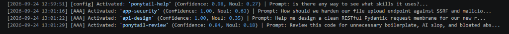
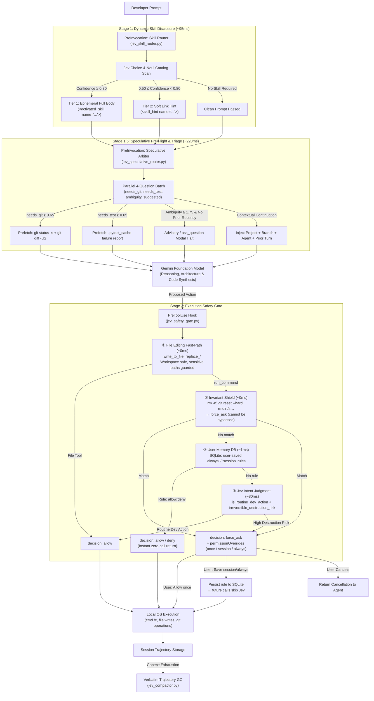

# Jev for Google Antigravity

[](https://docs.typesafe.ai)
[](https://github.com/google/antigravity)
[](https://openrouter.ai/~typesafe/jev-latest)
[](https://docs.typesafe.ai)
[](https://python.org)

**Machine-native System One semantic control layer for Google Antigravity.** Provides sub-100ms dynamic skill dispatch, autonomous execution safety guardrails, real-time log pruning, and verbatim context compaction powered by **TypeSafe AI's Jev model**.

---

## Overview

Modern coding agent harnesses like **Google Antigravity** empower generative foundation models (Gemini, Claude, GPT) with direct local tools: executing shell commands, mutating files, and running long-horizon workflows. 

However, relying exclusively on large autoregressive **System Two** models for routine low-level control flow causes severe issues:
1. **Prompt Bloat & Token Waste**: Advertising 50+ domain skills in system prompts consumes 5,000–25,000 tokens on *every single turn*.
2. **Accidental Destruction**: Generative models occasionally emit dangerous commands (`rm -rf`, `git reset --hard`, accidental directory deletions) with no deterministic barrier.
3. **Lossy Compaction**: When conversation histories grow too long, generative summarizers summarize away exact file paths, compiler error codes, and verbatim user constraints.

### The Solution: Jev as System One

**Jev** is TypeSafe AI's non-autoregressive **System One decision model**:
* **Sub-120ms P95 Latency**: Evaluates structured semantic judgments in parallel (190x faster than LLMs).
* **Extreme Efficiency**: **$0.042 per 1M input tokens** with **free unmetered outputs** (440x cheaper than LLMs).
* **Guaranteed Typing**: Evaluates native primitives (`Choice`, `Score`, `Noul`) with dual-axis calibrated probabilities and confidence ratings.

This repository connects Jev directly into Antigravity's native lifecycle hooks. **Deterministic code handles execution, Jev handles fast semantic micro-decisions, and Gemini focuses purely on high-level reasoning and synthesis.**

---

## Live Production Proof

Both hooks are actively deployed across multi-workspace environments on Windows, Linux, and macOS.

### 1. PreToolUse Safety Gate (Halting Destructive Actions)
When a developer or agent prompts: *"can you delete benchmarks/tests folder?"*, the agent attempts `cmd /c rmdir /s /q benchmarks\tests`. 

Before the shell executes the command, the `PreToolUse` hook evaluates the blast radius. Jev scores `blast_radius=3` and `destructive_prob=0.95`, immediately halting execution and rendering an interactive confirmation modal in the Antigravity IDE:


### 2. PreInvocation Dynamic Skill Router (Zero Prompt Bloat)
Instead of advertising 30+ domain skills in the prompt on every turn, Jev evaluates the developer's prompt in **~95ms**, selects the exact qualifying skill, and injects it ephemerally with a visible developer status badge:



```text
[2026-09-24 13:01:16] [AAA] Activated: 'app-security'   (Confidence: 1.00, Noul: 0.63) | Prompt: How should we harden our file upload endpoint against SSRF...
[2026-09-24 13:01:22] [AAA] Activated: 'api-design'     (Confidence: 1.00, Noul: 0.35) | Prompt: Help me design a clean RESTful Pydantic request membrane...
[2026-09-24 13:01:29] [AAA] Activated: 'ponytail-review'(Confidence: 0.84, Noul: 0.18) | Prompt: Review this code for unnecessary boilerplate, AI slop...
```

Every activated skill displays a transparent in-chat badge:
> **Activated Skill**: `app-security`

### 3. PreInvocation Speculative Pre-Flight Arbiter (Eliminating Turn-1 Roundtrips)
Before the primary reasoning model begins Turn 1, Jev evaluates a parallel 4-question speculative batch in **~220ms**. It auto-prefetches git diffs or pytest diagnostic summaries when relevant, and intercepts unguided or bare link prompts with an interactive clarification modal:


```text
> **Jev Speculative Pre-Flight**: Attached speculative evidence (git_prefetch (P=0.98) in 240ms). Proceed directly to reasoning without intermediate status tool calls.
```

---

## Architecture & Control Flow



---

## Quick Start (60 Seconds)

### 1. Clone & Configure Secrets

```cmd
git clone https://github.com/Ajasra/jev-hooks.git
cd jev-hooks
cmd /c copy .agents\.env.example .agents\.env
```

Open `.agents/.env` and add your API key:

#### Option A: Using OpenRouter (Recommended)
If you already use OpenRouter, Jev is available under the [`typesafe/jev-latest`](https://openrouter.ai/~typesafe/jev-latest) slug with single-key billing:
```ini
OPENROUTER_API_KEY=sk-or-v1-your_openrouter_api_key_here
```

#### Option B: Using Direct TypeSafe AI API
```ini
TYPESAFE_API_KEY=your_typesafe_key_here
TYPESAFE_ENDPOINT=https://api.typesafe.ai/v1/systemone
JEV_MODEL=jev-latest
```

*The included [`env_loader.py`](file:///d:/01_GIT/Jev/.agents/hooks/env_loader.py) auto-detects key format, routes endpoints, sets OpenRouter headers, and falls back gracefully.*

---

### 2. Verify Connectivity

Test your connection directly in your terminal:
```cmd
cmd /c python test_jev.py
```

Expected output:
```text
[*] API Key detected: sk-or-v1-077...a8a9
[*] Endpoint: https://openrouter.ai/api/v1/systemone
[*] Model: typesafe/jev-1.13
[+] HTTP Status: 200
[+] Response JSON: {"model":"typesafe/jev-1.13","answers":{"is_safe":{"type":"noul","noul":0.89}}}
```

---

### 3. Global Installation Across All Workspaces

Instead of copying scripts to every project, link them globally to your Antigravity configuration directory (`~/.gemini/config`). Edits in this repo immediately protect **every workspace on your machine**:

```cmd
:: 1. Create directory junctions for hooks, skills, and protocols (no admin privileges needed)
cmd /c mklink /J "%USERPROFILE%\.gemini\config\hooks" "d:\01_GIT\Jev\.agents\hooks"
cmd /c mklink /J "%USERPROFILE%\.gemini\config\skills" "d:\01_GIT\Jev\.agents\skills"
cmd /c mklink /J "%USERPROFILE%\.gemini\config\protocols" "d:\01_GIT\Jev\.agents\protocols"

:: 2. Create symbolic links for hooks.json and .env
cmd /c mklink "%USERPROFILE%\.gemini\config\hooks.json" "d:\01_GIT\Jev\.agents\hooks.json"
cmd /c mklink "%USERPROFILE%\.gemini\config\.env" "d:\01_GIT\Jev\.agents\.env"
```

Restart Antigravity or press <kbd>Ctrl</kbd> + <kbd>Shift</kbd> + <kbd>P</kbd> $\rightarrow$ **`Developer: Reload Window`**.

---

## Implemented Lifecycle Hooks

### 1. `PreToolUse`: Safety Gate ([`jev_safety_gate.py`](file:///d:/01_GIT/Jev/.agents/hooks/jev_safety_gate.py))
* **Matcher**: `run_command|write_to_file|replace_file_content|multi_replace_file_content`
* **Protocol**: Complies with official Antigravity `PreToolUse` contract.
* **3-stage decision pipeline** (in priority order):

  | Stage | Source | Latency | Notes |
  |:---|:---|:---|:---|
  | **1. Critical Shield** | Hard regex in `safety_db.py` | ~0ms | `git reset --hard`, `rmdir /s`, `git push --force`, `rm -rf`, `DROP DATABASE`, etc. **Always** `force_ask` — cannot be overridden. |
  | **2. Decision DB** | SQLite `safety_decisions.db` | ~1ms | Pattern rules with `always` (permanent) or `session` (conversation-scoped) lifetime. Pre-seeded with 23 safe-by-default rules covering all routine git and file ops. |
  | **3. Jev Scoring** | TypeSafe API | ~80ms | Only reached for unknown commands. `blast_radius ≥ 2` or `is_destructive ≥ 0.70` triggers `force_ask` with save-back options. |

* **Save-back**: When the user approves a `force_ask` modal, their choice can be saved permanently (`always`) or for the current conversation (`session`).
* **Audit & Lifecycle**:
  * All decisions (routing source, scores, command, decision) are recorded in the `decision_log` table.
  * **Session Auto-Expiration**: Session-scoped rules automatically expire after **30 days**. Permanent rules remain indefinitely.
  * **Full Audit Retention**: The decision log retains history until explicitly pruned.

#### Integration Test Results:
```
[     allow]  write_to_file / replace_*                   ← Fast-path (workspace safe, 0ms)
[ force_ask]  write_to_file on ~/.ssh/id_rsa              ← Guarded sensitive credentials
[     allow]  run_command: git commit / status / add      ← Jev Intent (routine dev action)
[     allow]  run_command: pytest / npm run / cargo       ← Jev Intent (routine dev action)
[ force_ask]  run_command: git push --force / reset -hard ← Invariant Shield (0ms, non-bypassable)
[ force_ask]  run_command: rmdir /s / rm -rf              ← Invariant Shield (0ms, non-bypassable)
[     allow]  run_command: custom tool                    ← User Memory SQLite (~1ms)
```

#### Decision DB & Audit CLI:
```cmd
:: Inspect security audit, top intercepted commands & stats
cmd /c python %USERPROFILE%\.gemini\config\hooks\safety_db.py --review

:: Inspect speculative fan-out active learning audit & user clarifications
cmd /c python %USERPROFILE%\.gemini\config\hooks\safety_db.py --review-speculative

:: List all active saved rules
cmd /c python %USERPROFILE%\.gemini\config\hooks\safety_db.py --list

:: Add a permanent allow rule
cmd /c python %USERPROFILE%\.gemini\config\hooks\safety_db.py --allow "docker compose*" --tool run_command

:: Test command resolution against Shield & DB
cmd /c python %USERPROFILE%\.gemini\config\hooks\safety_db.py --test-cmd "cmd /c git reset --hard"

:: Prune decision logs and expired session rules older than 30 days
cmd /c python %USERPROFILE%\.gemini\config\hooks\safety_db.py --prune --days 30

:: Clear all saved user rules
cmd /c python %USERPROFILE%\.gemini\config\hooks\safety_db.py --clear-all
```

---

### 2. `PreInvocation`: Dynamic Skill Router ([`jev_skill_router.py`](file:///d:/01_GIT/Jev/.agents/hooks/jev_skill_router.py))
* **Scope**: Discovers skills across workspace (`.agents/skills`), global (`~/.gemini/config/skills`), and installed plugins (`~/.gemini/config/plugins/*/skills`).
* **Protocol**:
  * Input (`stdin`): `{"transcriptPath": "...", "workspacePaths": [...]}`
  * Output (`stdout`):
    ```json
    {
      "injectSteps": [
        {
          "ephemeralMessage": "<activated_skill name='...'>\n> **Activated Skill**: `...`\n\n...\n</activated_skill>"
        }
      ]
    }
    ```
* **Audit Trail**: Writes timestamped decisions to `~/.gemini/config/jev_activations.log`.

#### Manual Test Command:
```cmd
cmd /c python -c "import subprocess, json; p = subprocess.Popen(['python', r'%USERPROFILE%\.gemini\config\hooks\jev_skill_router.py'], stdin=subprocess.PIPE, stdout=subprocess.PIPE, text=True); out, _ = p.communicate(json.dumps({'prompt': 'How should we harden our file upload endpoint against SSRF?'})); print(out[:250])"
```

---

### 3. Trajectory Compactor ([`jev_compactor.py`](file:///d:/01_GIT/Jev/.agents/hooks/jev_compactor.py))
* **Algorithm**: Adapts Tamara Tran's `fast-jev-compaction` algorithm to Antigravity session trajectories.
* **Mechanism**: Scores individual tool calls with dual-Nouls. Drops superseded outputs to 300ch receipts while preserving 100% of user discourse, file paths, and code edits verbatim.
* **Measured Performance**: Evaluates 12 turns in **0.27s** with a **53.9% size reduction** ($0.00003 cost per run).

#### Run Test Harness:
```cmd
cmd /c python tests\test_compactor.py
```

---

### 4. `PreInvocation`: Speculative Fan-Out & Dual-Axis Arbiter ([`jev_speculative_router.py`](file:///d:/01_GIT/Jev/.agents/hooks/jev_speculative_router.py))
* **Scope**: Submits a parallel 4-question speculative batch to Jev in ~220ms before primary LLM reasoning starts.
* **Prefetch Actions**:
  * **Git Status & Diff**: Injects `git status -s` and concise diffs when `needs_git_diff ≥ 0.65`, eliminating Turn-1 status roundtrips.
  * **Test Diagnostics**: Prefetches `.pytest_cache/lastfailed` reports when `needs_test_log ≥ 0.65`.
* **Ambiguity & Bare Link Halts**:
  * Evaluates `ambiguity_score` (0–2 scale).
  * Automatically flags bare URLs (`is_bare_link`) and underspecified commands (`Score ≥ 1.75`), immediately halting execution via interactive `ask_question` clarification modals.
  * Informational queries (`"what is..."`, `"how..."`, `"why..."`) bypass modals cleanly.
* **Context Enrichment**:
  * Dynamically injects Project Identity ([`README.md`](file:///d:/01_GIT/Jev/README.md), `package.json`), Git Branch (0ms direct `.git/HEAD` read), and Active Agent Persona ([`AGENTS.md`](file:///d:/01_GIT/Jev/AGENTS.md), [`AGENT.md`](file:///d:/01_GIT/Jev/AGENT.md)).
* **Active Learning & Feedback**:
  * Every decision is recorded in `~/.gemini/config/safety_decisions.db` (`speculative_decisions`).
  * Affirmative continuations (`"yes"`, `"proceed"`, `"approved"`) are logged as positive reinforcement.

#### Run Test Suite:
```cmd
cmd /c python tests\test_speculative_router.py
```

---

## Master Proposals & Architecture Directory

The [`proposals/`](file:///d:/01_GIT/Jev/proposals) directory houses 22 detailed technical specifications and architectural blueprints:

| # | Proposal Document | Status | Description & Core Value |
| :-: | :--- | :---: | :--- |
| **01** | **[Verbatim Context Compactor](file:///d:/01_GIT/Jev/proposals/01_PROPOSAL_A_VERBATIM_CONTEXT_COMPACTOR.md)** | **Implemented** | Replaces lossy summaries with surgical tool pruning while keeping code & discourse 100% verbatim. |
| **02** | **[Dynamic Skill Dispatcher](file:///d:/01_GIT/Jev/proposals/02_PROPOSAL_B_DYNAMIC_SKILL_DISPATCHER.md)** | **Implemented** | Two-stage progressive disclosure cutting wrong skill loads by >50% and eliminating prompt bloat. |
| **03** | **[Knowledge Item Dual Engine](file:///d:/01_GIT/Jev/proposals/03_PROPOSAL_C_KNOWLEDGE_ITEM_MATCHER.md)** | *Blueprint* | Closed-loop dual engine: Autonomous Distiller (Write) synthesizes gotchas/patterns on task completion; Pre-Flight Triage (Read) auto-mounts relevant precedents into Turn 1 in ~70ms. |
| **04** | **[Safety & Tool Router](file:///d:/01_GIT/Jev/proposals/04_PROPOSAL_D_SAFETY_AND_TOOL_ROUTER.md)** | **Implemented** | 3-stage pipeline: deterministic Critical Shield → SQLite Decision DB fast-path → Jev blast-radius scoring. Session and permanent save-back eliminates repetitive confirmations for routine operations. |
| **05** | **[Additional Industry Patterns](file:///d:/01_GIT/Jev/proposals/05_ADDITIONAL_USE_CASES_AND_INDUSTRY_PATTERNS.md)** | *Catalog* | Reference catalog mapping 10 enterprise domains to System One non-autoregressive decision patterns. |
| **06** | **[Intelligent Model Routing](file:///d:/01_GIT/Jev/proposals/06_USE_CASE_MODEL_ROUTING.md)** | *Blueprint* | 70ms task difficulty scoring to tier requests between fast (Flash/Haiku) and reasoning (Pro/Opus) models. |
| **07** | **[Output & Citation Verification](file:///d:/01_GIT/Jev/proposals/07_USE_CASE_OUTPUT_AND_CITATION_VERIFICATION.md)** | *Blueprint* | Pre-execution verification of generated API signatures against library ASTs and documentation. |
| **08** | **[Semantic Code Linting](file:///d:/01_GIT/Jev/proposals/08_USE_CASE_SEMANTIC_CODE_LINTING.md)** | *Blueprint* | Automated CI/CD PR diff checking against architectural guidelines and design principles. |
| **09** | **[SDE Cascades](file:///d:/01_GIT/Jev/proposals/09_USE_CASE_STRUCTURED_DATA_EXTRACTION_CASCADE.md)** | *Blueprint* | Regex extraction + Jev Choice for schema-guaranteed, hallucination-free structured data extraction. |
| **10** | **[RAG Re-Ranking & Filtering](file:///d:/01_GIT/Jev/proposals/10_USE_CASE_RAG_RERANKING_AND_FILTERING.md)** | *Blueprint* | Parallel vector chunk re-ranking pruning 85% of distractor passages before reaching the LLM context. |
| **11** | **[Line-by-Line Semantic Search](file:///d:/01_GIT/Jev/proposals/11_USE_CASE_LINE_BY_LINE_SEMANTIC_SEARCH.md)** | *Blueprint* | Scoring hundreds of line IDs in parallel to locate exact clauses in massive files without full reads. |
| **12** | **[Real-Time Security Guardrails](file:///d:/01_GIT/Jev/proposals/12_USE_CASE_REALTIME_GUARDRAILS.md)** | **Implemented** | Sub-100ms scans on inbound prompts and outbound git commits for prompt injections and secret leaks. |
| **13** | **[Autonomous UI Navigation](file:///d:/01_GIT/Jev/proposals/13_USE_CASE_AUTONOMOUS_UI_NAVIGATION.md)** | *Blueprint* | Real-time DOM element selection for browser automation agents replacing multi-second LLM delays. |
| **14** | **[Knowledge Graph Alignment](file:///d:/01_GIT/Jev/proposals/14_USE_CASE_KNOWLEDGE_GRAPH_ENTITY_ALIGNMENT.md)** | *Blueprint* | High-throughput entity deduplication and contradiction resolution across disparate enterprise databases. |
| **15** | **[Predictive ML Feature Extraction](file:///d:/01_GIT/Jev/proposals/15_USE_CASE_PREDICTIVE_ML_FEATURE_EXTRACTION.md)** | *Blueprint* | Converts unstructured text signals into continuous calibrated numeric features for XGBoost/CatBoost. |
| **16** | **[Shapeshift Dynamic UI](file:///d:/01_GIT/Jev/proposals/16_INSPIRATION_SHAPESHIFT_DYNAMIC_UI.md)** | *Case Study* | Case study of an input morphing into 8+ UI cards via 14 parallel Jev questions in 118ms. |
| **17** | **[Pydantic AI Integration](file:///d:/01_GIT/Jev/proposals/17_FRAMEWORK_PYDANTIC_AI_TYPESAFE_INTEGRATION.md)** | *Blueprint* | Architectural adapter integrating TypeSafe as a first-class `TypeSafeModel` in Pydantic AI. |
| **18** | **[Architectural Treatise: System One](file:///d:/01_GIT/Jev/proposals/18_ARCHITECTURAL_TREATISE_SYSTEM_ONE_ANTIGRAVITY.md)** | *Master Spec* | Comprehensive treatise defining the formal division of labor between System 1 and System 2. |
| **19** | **[Official Agent Skill Port](file:///d:/01_GIT/Jev/proposals/19_PROPOSAL_OFFICIAL_AGENT_SKILL_PORT_AND_DISPATCH.md)** | **Implemented** | Vendors the official `typesafe-ai` agent skill with live documentation navigation via `llms.txt`. |
| **20** | **[Jev 1.13 Jaggedness Mitigation](file:///d:/01_GIT/Jev/proposals/20_PROPOSAL_JEV_1_13_JAGGEDNESS_MITIGATION_AND_ANTI_ARITHMETIC_LINTING.md)** | **Implemented** | Runtime guardrails and linters preventing known `jev-1.13` failure modes (arithmetic, date math). |
| **21** | **[Speculative Fan-Out & Arbitration](file:///d:/01_GIT/Jev/proposals/21_PROPOSAL_SPECULATIVE_FAN_OUT_AND_CONFIDENCE_ARBITRATION.md)** | **Implemented** | Evaluates 4–5 speculative questions in a single 110ms batch at turn start. Pre-fetches git status, diffs, and test diagnostics to eliminate Turn-1 sequential tool roundtrips. |
| **22** | **[OpenRouter Setup Guide](file:///d:/01_GIT/Jev/proposals/22_GUIDE_OPENROUTER_JEV_SETUP.md)** | **Implemented** | Step-by-step configuration guide for using `typesafe/jev-latest` on OpenRouter with single-key billing. |
| **23** | **[Agent Balance & Anti-Bureaucracy](file:///d:/01_GIT/Jev/proposals/23_PROTOCOL_SYSTEM_ONE_AGENT_BALANCE_AND_ANTI_BUREAUCRACY.md)** | **Implemented** | Architectural protocol preventing over-governance, turn-1 amnesia, and confirmation fatigue via conversational recency, calibrated advisories, and two-tier skill hints. |

---

## Defensive Engineering & Failure Policy

1. **Zero External Dependencies**: All hooks use standard library Python (`urllib`, `json`, `pathlib`, `os`, `sys`, `sqlite3`, `re`, `fnmatch`). No virtual environment activation or `pip install` required.
2. **Strict 3.5s Timeout**: HTTP requests to Jev are hard-capped at 3.5 seconds. If the network stalls, the hook exits cleanly with `{"decision": "allow"}` without blocking Antigravity.
3. **Fail-Open Policy for Routine Tasks**: If Jev is unreachable or encounters an API limit:
   * Skills fall back to standard baseline progressive disclosure.
   * Tool calls proceed unhindered.
   * Logs are preserved unedited.
4. **Deterministic Windows Rule Enforcement**: Shell commands are checked deterministically for the mandatory `cmd /c` prefix on Windows, catching unmanaged subshells before shell execution errors happen.

---

## License & Attribution

* Released under the [MIT License](file:///d:/01_GIT/Jev/LICENSE).
* **Jev** is a proprietary System One foundation model developed by **TypeSafe AI** ([docs.typesafe.ai](https://docs.typesafe.ai)).
* **Antigravity** is Google's advanced agentic coding harness.
