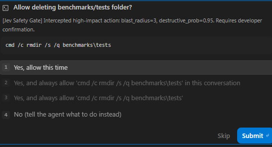
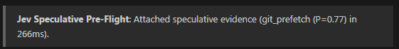

# Jev: System One Semantic Control for AI Coding Harnesses

[](https://docs.typesafe.ai)
[](./docs/proposals/RFC-24_CORE_shared_harness_runtime.md)
[](https://openrouter.ai/~typesafe/jev-latest)
[](https://docs.typesafe.ai)
[](https://python.org)

**A local safety guard and smart router for your AI coding assistant (Google Antigravity, OpenAI Codex).**

---

## 1. What Jev Does

When you let AI coding assistants (like Google Antigravity or OpenAI Codex) run in your project, they have access to your terminal and files. Two things go wrong all the time:

- **Dangerous commands**: The AI tries to wipe a folder, discard your uncommitted git changes, or run destructive scripts before you can stop it.
- **Waste & lag**: The AI dumps 50 skill files into its prompt on every turn (burning tokens and money), or wastes several turns fumbling around before finding the right files.

**Jev sits between your agent and your machine as a lightweight safety guard and smart router:**
- **Catches dangerous commands** before they execute and asks for your approval in an IDE popup.
- **Loads only the skills your agent needs** for the current task, keeping prompts small, cheap, and fast.
- **Prefetches relevant git diffs and test results**, so the agent gets to work on Turn 1 without wandering around.
- **Verifies code edits** against your project docs to catch hallucinated APIs before they break your build.

---

## 2. Visual Proof in Action

### PreToolUse Safety Gate (Halting Destructive Execution)
When an agent attempts `cmd /c rmdir /s /q benchmarks\tests`, Jev evaluates blast radius in ~80ms, halts execution, and renders an interactive confirmation modal:



### PreInvocation Speculative Pre-Flight (Turn-1 Context Injection)
Before primary reasoning begins, Jev evaluates context state and prefetches git diffs or pytest diagnostics into Turn 1:



### PreInvocation Dynamic Skill Routing (Zero Prompt Bloat)
Jev inspects user intent in ~95ms, mounting matching skills from [`.agents/skills/`](.agents/skills/) without advertising unused skills:

```text
> **Activated Skill**: `app-security`
```

---

## 3. Quick Start (60 Seconds)

### Step 1: Install Package & Configure `.env`
```cmd
cmd /c python -m pip install --user -e ".[mcp]"
cmd /c copy .agents\.env.example .agents\.env
```
Add your OpenRouter key to `.agents/.env`:
```ini
OPENROUTER_API_KEY=sk-or-v1-your_openrouter_api_key_here
```

### Step 2: Run Diagnostics & Offline Suite
```cmd
cmd /c python -m jev doctor --cwd .
cmd /c python -m pytest -q
```

### Step 3: Link to Your Harness
* **Google Antigravity**: Link canonical hooks and skills into global configuration:
  ```cmd
  cmd /c mklink /J "%USERPROFILE%\.gemini\config\hooks" "%CD%\.agents\hooks"
  cmd /c mklink /J "%USERPROFILE%\.gemini\config\skills" "%CD%\.agents\skills"
  cmd /c mklink "%USERPROFILE%\.gemini\config\hooks.json" "%CD%\.agents\hooks.json"
  ```
  Reload window (<kbd>Ctrl</kbd> + <kbd>Shift</kbd> + <kbd>P</kbd> $\rightarrow$ **`Developer: Reload Window`**).
* **OpenAI Codex**: Configured via repository [`.codex/hooks.json`](.codex/hooks.json) and [`.codex/config.toml`](.codex/config.toml).

---

## 4. Lifecycle Capabilities at a Glance

| Capability | Lifecycle Phase | Latency | What It Does | Deep Spec |
| :--- | :---: | :---: | :--- | :---: |
| **Safety Gate** | `PreToolUse` | ~0–80ms | Intercepts dangerous shell commands and destructive file deletions before execution, opening a confirmation popup in your editor. | [RFC-04](docs/proposals/RFC-04_CORE_safety_and_tool_guardrail.md) |
| **Speculative Arbiter** | `PreInvocation` | ~220ms | Automatically inspects your recent git changes and broken test logs, attaching them to Turn 1 so the agent doesn't waste turns discovering state. | [RFC-21](docs/proposals/RFC-21_EXT_speculative_fan_out.md) |
| **Dynamic Skill Router** | `PreInvocation` | ~95ms | Mounts only the relevant project skills for the active task into the prompt, preventing thousands of unused skill tokens from bloating every turn. | [RFC-02](docs/proposals/RFC-02_CORE_dynamic_skill_dispatcher.md) |
| **Knowledge Engine** | `PreInvocation` | ~70ms | Finds and injects repository-specific conventions and past problem resolutions directly into the prompt when relevant. | [RFC-03](docs/proposals/RFC-03_CORE_knowledge_item_matcher.md) |
| **Output Verifier** | `PreToolUse` / Tool | ~90ms | Checks proposed code edits against your documentation and type signatures to catch hallucinated methods before changes are written. | [RFC-07](docs/proposals/RFC-07_USE_CASE_output_citation_verification.md) |
| **Semantic Code Lint** | Tool / CLI | ~120ms | Inspects staged diffs against architectural rules (such as layer boundaries and repository patterns) that traditional syntax linters miss. | [RFC-08](docs/proposals/RFC-08_USE_CASE_semantic_code_linting.md) |
| **Context Compactor** | Session GC | ~270ms | Truncates long terminal outputs and build logs into compact receipts when conversations grow long, preserving 100% of code edits verbatim. | [RFC-01](docs/proposals/RFC-01_CORE_verbatim_context_compactor.md) |

---

## 5. Documentation Hub

- **[The Philosophy of Jev](docs/PHILOSOPHY.md)**: Meaning in context, the 4-layer Context Envelope, and non-autoregressive primitives.
- **[User Guide & Operational Manual](docs/USER_GUIDE.md)**: Daily developer workflows, interactive IDE modals, and CLI rule management.
- **[Architecture Specification](docs/ARCHITECTURE.md)**: Machine-native contracts, ports-and-adapters runtime, SQLite schemas, and latency budgets.
- **[Master Proposals Index (26 Specs)](docs/proposals/README.md)**: Unified architectural RFCs from `RFC-01` through `RFC-26`.
- **[System One Balance Protocol](.agents/protocols/system-one-balance-protocol.md)**: Operational rules keeping semantic micro-decisions fast and non-blocking.

---

## License & Attribution

- Released under the [MIT License](LICENSE).
- **Jev** is a proprietary System One foundation model developed by **TypeSafe AI** ([docs.typesafe.ai](https://docs.typesafe.ai)).
