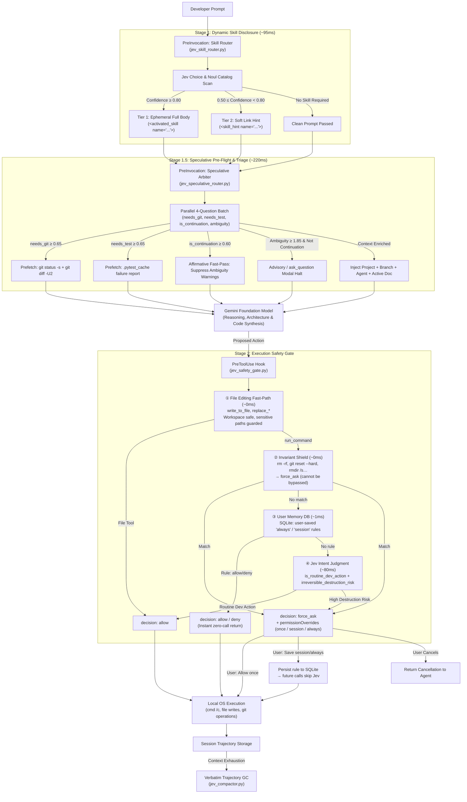

# Jev for Antigravity: Architecture & Technical Specification

> **Audience**: Hook Authors, Systems Architects & Framework Contributors  
> **Status**: Active Production Standard  
> **Target Harness**: Google Antigravity 2.0 / Native Lifecycle Hooks  

---

## 1. Problem: The System Two Control Bottleneck

Foundation models (Gemini, Claude, GPT) are designed for **System Two deliberation**: synthesizing code, analyzing multi-file architectures, and solving complex bugs. 

Forcing large generative models to manage low-level harness control flow introduces fatal architectural flaws:
* **Severe Latency Penalties**: Asking an LLM to evaluate whether a tool call is safe adds 2–6 seconds per tool invocation.
* **Non-Deterministic JSON Emitting**: Parsing generative text outputs into strict schemas suffers from hallucinated flags and syntax errors.
* **Confirmation Fatigue & Over-Gating**: Without stateful memory, generative guards repeatedly query the user for routine commands (`pytest`, `git status`).
* **Turn-1 Amnesia**: Static prompts force models into exploratory discovery loops before beginning real work.

---

## 2. Inspiration: Microkernels, eBPF & Branch Prediction

Modern operating systems never invoke userspace interpreters to arbitrate system calls. Instead, they use fast, in-kernel **eBPF probes** and **speculative execution pipelines**:
1. **Deterministic Fast-Paths**: Safe operations pass through in microseconds without hitting user space.
2. **Hardware Branch Prediction**: The CPU speculatively fetches instruction blocks before branches resolve.
3. **Layered Privilege Boundaries**: Only unverified or dangerous operations trigger user-mode context switches.

This repository adapts those principles into the agent harness: **Deterministic shields and Jev handle micro-decisions at machine speeds, while Gemini focuses exclusively on high-level reasoning.**

---

## 3. Solution: Machine-Native Semantic Control

**Jev** is TypeSafe AI's non-autoregressive decision model:
* **Sub-120ms P95 Latency**: Evaluates parallel question batches in 70–120ms.
* **$0.042 / 1M Input Tokens**: Free, unmetered structured outputs.
* **Native AI Primitives**: Calibrated `Choice` ($\le 255$ options), `Score` (2–10 ordered levels), and `Noul` (calibrated probabilities 0.0–1.0).

---

## 4. End-to-End Control Flow Architecture



---

## 5. Machine-Native Lifecycle Hooks Breakdown

### Hook 1: PreToolUse Safety Gate ([`jev_safety_gate.py`](../.agents/hooks/jev_safety_gate.py))
* **Matcher**: `run_command|write_to_file|replace_file_content|multi_replace_file_content`
* **Execution Latency**: 0ms (Shield/Fast-path) $\rightarrow$ 1ms (SQLite DB) $\rightarrow$ 80ms (Jev API).
* **3-Stage Priority Pipeline**:
  1. **Deterministic Invariant Shield**: Hard-blocks `git reset --hard`, `rmdir /s`, `git push --force`, `rm -rf`, `DROP DATABASE`. Non-bypassable.
  2. **SQLite Decision DB**: User-saved `always` (permanent) or `session` (conversation-scoped) rules. Pre-seeded with 23 safe-by-default developer patterns.
  3. **Jev Semantic Blast Radius**: Reached only for unknown commands. Evaluates `blast_radius ≥ 2` or `is_destructive ≥ 0.70`.

### Hook 2: PreInvocation Dynamic Skill Router ([`jev_skill_router.py`](../.agents/hooks/jev_skill_router.py))
* **Discovery Scope**: Discovers skills dynamically across workspace (`.agents/skills`), global (`~/.gemini/config/skills`), and installed plugins (`~/.gemini/config/plugins/*/skills`).
* **Two-Tier Progressive Disclosure**:
  * **Confidence $\ge 0.80$**: Injects full `SKILL.md` body ephemerally for the turn.
  * **$0.50 \le P < 0.80$**: Injects a lightweight 1-line soft hint with a file link to prevent token waste while maintaining discovery.

### Hook 3: PreInvocation Speculative Arbiter ([`jev_speculative_router.py`](../.agents/hooks/jev_speculative_router.py))
* **Latency**: ~220ms parallel 4-question batch.
* **Prefetch Actions**:
  * **Git Status & Diff**: Injects `git status -s` and diffs when `needs_git_diff ≥ 0.65`.
  * **Test Diagnostics**: Prefetches `.pytest_cache/lastfailed` when `needs_test_log ≥ 0.65`.
* **Ambiguity Arbitration**:
  * Scores prompt ambiguity (0–2 scale) while ingesting recent conversation recency (`Prior Turn Context`).
  * Suppresses warnings when `is_continuation ≥ 0.60`.

### Hook 4: Trajectory Compactor ([`jev_compactor.py`](../.agents/hooks/jev_compactor.py))
* **Algorithm**: Zero-rewrite verbatim compaction adapting `fast-jev-compaction`.
* **Mechanism**: Scores historical tool calls with dual Nouls (`call_needed`, `result_needed`).
* **Result**: Drops superseded outputs to 300-char receipts while preserving 100% of user discourse, file paths, and code edits verbatim.

### Hook 5: Knowledge Item Lifecycle Engine ([`jev_ki_engine.py`](../.agents/hooks/jev_ki_engine.py))
* **Pre-Flight Triage (Read Engine)**: Evaluates project `.agents/knowledge/` catalog in ~70ms; auto-mounts precedents on confidence $\ge 0.70$.
* **Autonomous Distillation (Write Engine)**: Synthesizes structured patterns from completed git commits or `/learn` commands with closed-loop deduplication.

---

## 6. SQLite Storage Schema (`safety_decisions.db`)

Located at `%USERPROFILE%\.gemini\config\safety_decisions.db`:

```sql
-- Saved permission rules
CREATE TABLE IF NOT EXISTS rules (
    id INTEGER PRIMARY KEY AUTOINCREMENT,
    tool_name TEXT NOT NULL,
    pattern TEXT NOT NULL,
    decision TEXT NOT NULL,       -- 'allow' or 'deny'
    scope TEXT NOT NULL,          -- 'always' or 'session'
    conversation_id TEXT,
    created_at TIMESTAMP DEFAULT CURRENT_TIMESTAMP,
    expires_at TIMESTAMP
);

-- Full security decision audit log
CREATE TABLE IF NOT EXISTS decision_log (
    id INTEGER PRIMARY KEY AUTOINCREMENT,
    tool_name TEXT NOT NULL,
    command TEXT NOT NULL,
    source TEXT NOT NULL,         -- 'critical_shield', 'saved_rule', 'jev_intent'
    decision TEXT NOT NULL,
    blast_radius INTEGER,
    confidence REAL,
    created_at TIMESTAMP DEFAULT CURRENT_TIMESTAMP
);

-- Speculative fan-out active learning telemetry
CREATE TABLE IF NOT EXISTS speculative_decisions (
    id INTEGER PRIMARY KEY AUTOINCREMENT,
    prompt TEXT NOT NULL,
    ambiguity_score REAL,
    is_continuation REAL,
    prefetched_git INTEGER,
    prefetched_test INTEGER,
    created_at TIMESTAMP DEFAULT CURRENT_TIMESTAMP
);
```

---

## 7. Architectural Invariants & Defensive Engineering

1. **Augment, Don't Handcuff**:
   * Hooks must never paralyze models with imperative tool bans (`DO NOT CALL TOOLS`). See [`system-one-balance-protocol.md`](../.agents/protocols/system-one-balance-protocol.md).
2. **Zero External Dependencies**:
   * All hooks use standard library Python (`urllib`, `json`, `pathlib`, `sqlite3`, `re`, `fnmatch`). No pip virtualenvs required.
3. **Deterministic Windows Invariant**:
   * All shell commands on Windows must use the `cmd /c` prefix to guarantee clean subshell termination and EOF signal delivery.
4. **Strict 3.5s Network Timeout & Fail-Open**:
   * Network requests to Jev are hard-capped at 3.5 seconds. If the endpoint stalls, the hooks fail open (`{"decision": "allow"}`) without blocking Antigravity.

---

## 8. Verification & Test Harnesses

| Test Target | Command | Verification Scope |
| :--- | :--- | :--- |
| **API Connectivity** | `cmd /c python test_jev.py` | Validates API key, endpoint routing, and Jev response typing. |
| **Compactor GC** | `cmd /c python tests\test_compactor.py` | Validates verbatim prose retention and tool output pruning. |
| **Speculative Arbiter** | `cmd /c python tests\test_speculative_router.py` | Validates ambiguity scoring and prefetch diff injection. |
| **Safety Resolution** | `cmd /c python %USERPROFILE%\.gemini\config\hooks\safety_db.py --test-cmd "cmd /c git reset --hard"` | Verifies Invariant Shield blocking. |
