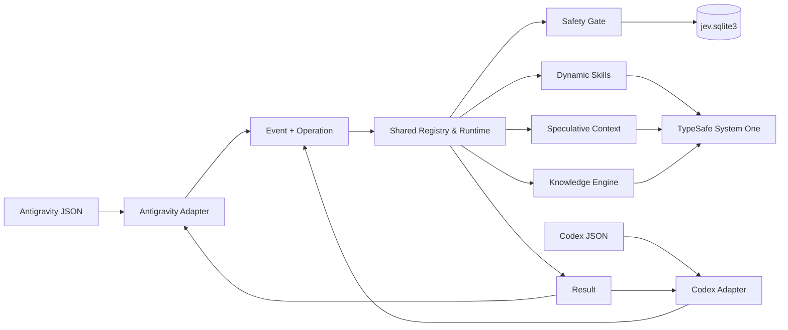

# Jev Machine-Native Semantic Control: Architecture Specification

> **Audience**: Hook authors, systems architects, and framework contributors
> **Status**: Production Standard (Unified Shared Runtime)
> **Harnesses**: Google Antigravity 2.0 & OpenAI Codex
> **Foundational Philosophy**: [The Philosophy of Jev](PHILOSOPHY.md)
> **Related Protocols**: [Documentation Standard](../.agents/protocols/documentation-standard-protocol.md) | [System One Balance](../.agents/protocols/system-one-balance-protocol.md)

---

## 1. Architecture Overview: Ports and Adapters

Jev decouples agentic coding harnesses from semantic evaluation logic using a **ports-and-adapters** design. Harnesses (Google Antigravity, OpenAI Codex) act as external ports. Thin adapters translate native JSON payloads into harness-neutral `Event` and `Operation` contracts. The shared core owns safety evaluation, skill selection, speculative prefetching, and audit persistence.


```mermaid
flowchart LR
    A[Antigravity JSON] --> AA[Antigravity Adapter]
    C[Codex JSON] --> CA[Codex Adapter]
    AA --> E[Event + Operation]
    CA --> E
    E --> R[Shared Registry & Runtime]
    R --> S[Safety Gate]
    R --> SK[Dynamic Skills]
    R --> P[Speculative Context]
    R --> K[Knowledge Engine]
    S --> DB[(jev.sqlite3)]
    SK --> J[TypeSafe System One]
    P --> J
    K --> J
    R --> O[Result]
    O --> AA
    O --> CA
```

### Architectural Guarantees:
- **Authority belongs to determinism**: Invariant checks (regex, path traversal, hard resets) run locally in under 1ms without network calls.
- **Sub-120ms P95 semantic turnaround**: Non-autoregressive primitives (`Choice`, `Score`, `Noul`) return structured probability distributions without text generation overhead.
- **Fail-open on advisory timeouts**: Advisory checks have bounded deadlines (3.5s). If a semantic call times out or fails, workspace mutations proceed unblocked.
- **Zero policy drift**: A single shared SQLite database (`jev.sqlite3`) and identical safety rules govern both Antigravity and Codex.

### Machine-Native IPC Wire Contract
The hook interface executes as a standard child process communicating via Unix/Windows pipes:
- **`stdin` (JSON)**: Ingests the native hook envelope (`hookEventName`, `toolCall`, `workspacePaths`, `conversationId`).
- **`stdout` (JSON)**: Emits normalized response payloads:
  - Antigravity: `{"decision": "allow" | "deny" | "force_ask", "reason": "...", "additionalContext": "..."}` or `{"injectSteps": [{"ephemeralMessage": "..."}]}`.
  - Codex: `{"hookSpecificOutput": {"hookEventName": "...", "permissionDecision": "allow" | "deny", "additionalContext": "..."}}`.
- **`stderr` (Plain Text)**: Strictly reserved for diagnostic telemetry, timing receipts, and emergency exceptions; never emits response JSON.
- **Process Exit Codes**: Code `0` indicates successful hook evaluation (even if the outcome is `deny`). Non-zero exit codes signal runtime crashes or CLI authorization errors.

---

## 2. Package Layout

The implementation root lives under `src/jev/`:

```text
src/jev/
  contracts.py       # Harness-neutral Event, Operation, Result, and Outcome definitions
  registry.py        # Central registration for FeatureSpecs and ToolSpecs
  runtime.py         # Lifecycle execution dispatcher
  core/
    safety.py        # Invariant Shield + blast radius evaluation
    skills.py        # Dynamic skill relevance ranking
    speculative.py   # Turn-1 diff and test log prefetching
    knowledge.py     # Repository Knowledge Item matching
    context.py       # Teleological 4-layer Context Envelope assembly (RFC-26)
    compaction.py    # Verbatim receipt context compactor
    semantic_lint.py # Architectural rule evaluation over git diffs
    verification.py  # API symbol and citation verification
  adapters/
    antigravity.py   # Translates Antigravity hook stdin/stdout JSON
    codex.py         # Translates OpenAI Codex hook payloads
  services/
    client.py        # Non-autoregressive TypeSafe / OpenRouter HTTP transport
    paths.py         # Cross-platform workspace path resolution
    storage.py       # Shared SQLite persistence & telemetry
  transports/
    mcp.py           # Shared MCP stdio server transport
  install/
    doctor.py        # Self-diagnostic engine
```

---

## 3. Portable Lifecycle Events

The runtime normalizes harness-specific triggers into portable lifecycle events:

| Event | Google Antigravity | OpenAI Codex | Description |
| :--- | :--- | :--- | :--- |
| `session.start` | *Unavailable* | `SessionStart` | Workspace and environment initialization. |
| `turn.before` | `PreInvocation` | `UserPromptSubmit` | Injects speculative diffs, skills, and knowledge into Turn 1. |
| `tool.before` | `PreToolUse` | `PreToolUse` | Intercepts proposed commands, file edits, and patches. |
| `tool.after` | *Reserved* | `PostToolUse` | Post-execution verification and telemetry logging. |
| `context.checkpoint` | Sidecar CLI command | `PreCompact` / `PostCompact` | Verbatim receipt pruning before context overflow. |
| `session.end` | *Reserved* | `SessionEnd` | Session cleanup and active learning checkpointing. |

Unknown or malformed inputs to safety hooks fail closed. Advisory hook errors fail open without injecting extra context.

---

## 4. Harness Capability & Behavioral Matrix

| Capability | Google Antigravity Binding | OpenAI Codex Binding | Implementing Module |
| :--- | :--- | :--- | :--- |
| **Safety Gate** | `PreToolUse` (renders interactive modal) | `PreToolUse` (emits permission deny) | `core/safety.py` |
| **Speculative Prefetch** | `PreInvocation` (injects prompt context) | `UserPromptSubmit` (`additionalContext`) | `core/speculative.py` |
| **Dynamic Skills** | Injects full body ($\ge 0.80$) or markdown link | Injects catalog ranking and hints | `core/skills.py` |
| **Knowledge Engine** | `PreInvocation` prompt injection | `SessionStart` & `UserPromptSubmit` | `core/knowledge.py` |
| **Context Envelope** | `PreInvocation` (assembles 4-layer state) | `UserPromptSubmit` (`additionalContext`) | `core/context.py` |
| **Output Verification** | `PreToolUse` non-blocking advisory context | `PreToolUse` `additionalContext` | `core/verification.py` |
| **Semantic Linting** | `prompt_user` advisory finding | `warn_user` advisory finding | `core/semantic_lint.py` |
| **Context Compactor** | Sidecar execution | Sidecar execution | `core/compaction.py` |
| **Audit Persistence** | `antigravity_events` view | `codex_events` view | `services/storage.py` |

### Key Transport Differences:
- **Interactive Approval**: Antigravity supports `"decision": "force_ask"`, prompting the developer directly in the IDE. Codex does not support interactive prompts at `PreToolUse`; conditional checks map to a clean denial with actionable reasoning.
- **Fail-Open Boundaries**: In both harnesses, workspace file mutations (`write_to_file`, `replace_*`, `apply_patch`) fail open if semantic inspection times out, ensuring developer flow is never blocked by network latency.

---

## 5. Safety Pipeline & Deterministic Invariants

When an agent proposes an action, the safety engine evaluates risks in strict order:

1. **Classification**: Identify operation type (`file_mutation`, `shell`, or `tool`). Path inputs are validated for containment against the workspace root and checked against sensitive system markers (`/.ssh/`, `/.aws/`, `id_rsa`, `system32`).
2. **Deterministic Invariant Shield**: Evaluated locally in $<1\text{ms}$ before any model call. If a pattern matches, execution is unconditionally denied:
   - `recursive_delete`: `rmdir /s`, `rd /s`, `rm -rf`, `rm --recursive`
   - `git_hard_reset`: `git reset --hard`
   - `git_force_clean`: `git clean -f`
   - `git_force_push`: `git push --force`, `git push -f`
   - `git_discard_all`: `git checkout -- .`, `git restore .`
   - `disk_destroy`: `format c:`, `diskpart`, `fdisk`, `mkfs`
   - `remote_pipe_shell`: `curl ... | bash`, `wget ... | sh`, `powershell | pwsh`
   - `database_destroy`: `DROP DATABASE`, `DROP SCHEMA`, `TRUNCATE TABLE`
3. **Rule Database Lookup**: Check SQLite for existing workspace-, session-, or pattern-scoped authorizations.
4. **Semantic Blast Radius**: If unclassified and client is configured, evaluate two parallel non-autoregressive `Noul` questions (routine intent vs irreversible risk).
5. **Outcome Mapping**: Aggregate results via strict precedence:
   $$\mathbf{Deny} > \mathbf{NeedsConfirmation} > \mathbf{Allow} > \mathbf{Abstain}$$

Semantic advice cannot override a deterministic denial.

### Atomic Claims & Replay Idempotency
To prevent race conditions, repeated execution loops, and double-spending of single-use grants:
- **Claim Key Construction**: Evaluated across `(harness, workspace_id, session_id, invocation_id, feature, phase)`.
- **Claim Leases**: A pending execution acquires an atomic lease in `invocations` with status `active` and a monotonic timestamp.
- **Duplicate Delivery**: Completed executions return the cached `result_json` immediately without re-running checks. Active duplicates yield a temporary safety denial rather than a race condition allowance.
- **Single-Use Atomicity**: Consuming a CLI authorization (`single_use` rule) and committing the decision completion occur within a single SQLite transaction.

---

## 6. SQLite Schema & Active Learning

The audit store (`%LOCALAPPDATA%\Jev\jev.sqlite3`) uses WAL mode on local filesystems with bounded busy timeouts.

| Table / View | Description |
| :--- | :--- |
| `schema_migrations` | Idempotent schema migration log. |
| `events` | Master audit log tagged by harness, workspace, session, and tool. |
| `antigravity_events` | Partitioned view filtering Antigravity executions. |
| `codex_events` | Partitioned view filtering Codex executions. |
| `rules` | Learned policy memory and single-use CLI authorizations. |
| `invocations` | Atomic claim keys preventing duplicate execution replay. |
| `semantic_lint_decisions` | Historical evaluation logs for architectural lint rules. |
| `semantic_lint_feedback` | Developer confirmations or false-positive ratings. |

---

## 7. Extension Contract

`registry.py` provides the central extension point:

### Adding a Lifecycle Hook Feature:
1. Implement a harness-neutral handler in `src/jev/core/`.
2. Register a `FeatureSpec` declaring events, priority, execution budget, and failure behavior.
3. Add replay unit tests. Adapters only require updates if a harness introduces a new transport mapping.

### Adding a Callable Tool:
1. Add a typed handler to `src/jev/tooling.py`.
2. Register a `ToolSpec` in `registry.py`.
3. The shared MCP transport (`transports/mcp.py`) automatically discovers and exposes the tool to both Antigravity and Codex without per-tool transport configuration.

---

## 8. Verification & Test Harness

```cmd
cmd /c python -m pytest -q
cmd /c python -m jev doctor --cwd .
cmd /c git diff --check
```

The test suite validates cross-harness equivalence, replay denial, atomic single-use rule consumption, malformed JSON handling, and deterministic invariant barriers without requiring live network access.
