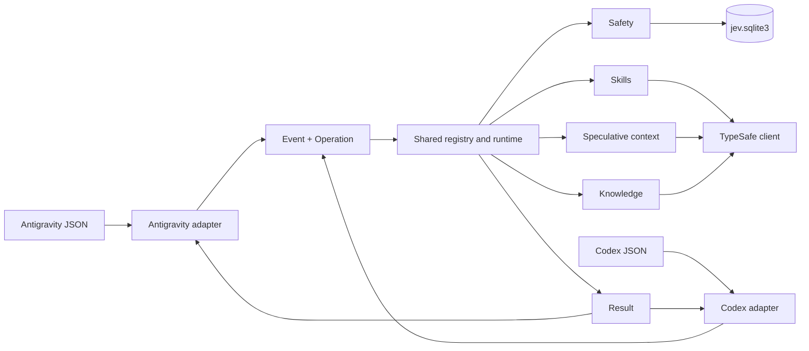

# Jev Shared Runtime: Architecture Specification

> **Audience**: hook authors, systems architects, and contributors
>
> **Status**: implemented
>
> **Harnesses**: Google Antigravity and OpenAI Codex

## 1. Problem

The original hook scripts mixed Antigravity event decoding, semantic policy, HTTP requests, filesystem paths, and SQLite access. Adding another harness at that layer would duplicate every feature and allow behavior to drift.

## 2. Inspiration

Ports and adapters provide the useful boundary: harness protocols are ports; adapters normalize events; shared feature handlers own behavior. A registry connects portable lifecycle events and callable tools to those handlers.

## 3. Solution

The package under `src/jev` is the implementation. `.agents/hooks` contains transition entry points and Antigravity registration. `.codex/hooks.json` invokes the installed package. Both paths reach the same runtime, feature registry, storage service, and TypeSafe client.

## 4. Concrete Flow


```mermaid
flowchart LR
    A[Antigravity JSON] --> AA[Antigravity adapter]
    C[Codex JSON] --> CA[Codex adapter]
    AA --> E[Event + Operation]
    CA --> E
    E --> R[Shared registry and runtime]
    R --> S[Safety]
    R --> SK[Skills]
    R --> P[Speculative context]
    R --> K[Knowledge]
    S --> DB[(jev.sqlite3)]
    SK --> J[TypeSafe client]
    P --> J
    K --> J
    R --> O[Result]
    O --> AA
    O --> CA
```

`contracts.py` defines `Event`, `Operation`, `Result`, and `Outcome`. Core modules never read native harness keys. Adapters never choose thresholds or safety policy.

## 5. Package Layout

```text
src/jev/
  contracts.py
  registry.py
  runtime.py
  core/
    safety.py
    skills.py
    speculative.py
    knowledge.py
    compaction.py
  adapters/
    antigravity.py
    codex.py
  services/
    client.py
    paths.py
    storage.py
  transports/mcp.py
  install/
    render.py
    doctor.py
```

## 6. Portable Events

The internal event kinds are:

| Event | Antigravity | Codex |
| --- | --- | --- |
| `session.start` | unavailable until verified | `SessionStart` |
| `turn.before` | `PreInvocation` | `UserPromptSubmit` |
| `tool.before` | `PreToolUse` | `PreToolUse` |
| `tool.after` | available to future registry features | `PostToolUse` when registered |
| `context.checkpoint` | explicit sidecar command | `PreCompact`/`PostCompact` when registered |
| `session.end` | unavailable until verified | `SessionEnd` when registered |

Unknown or malformed safety inputs fail closed. Advisory inputs fail without added context.

## 7. Harness capability matrix

The registry contains portable features. An adapter may expose a feature only when the native harness supplies its required event and output capability.

| Registry feature or transport | Antigravity binding | Codex binding | Owner |
| --- | --- | --- | --- |
| `safety` | `PreToolUse` for registered command and file tools | `PreToolUse` for `Bash`, `apply_patch`, and MCP tools | `core/safety.py` |
| `speculative` | `PreInvocation` | `UserPromptSubmit` | `core/speculative.py` |
| `skills` | `PreInvocation`, with progressive disclosure context | `UserPromptSubmit`, ranking and telemetry only | `core/skills.py` |
| `knowledge` | `PreInvocation` | `SessionStart` and `UserPromptSubmit` | `core/knowledge.py` |
| `compaction` | Explicit sidecar invocation | Explicit sidecar invocation | `core/compaction.py` |
| MCP tools | Optional stdio MCP registration | `.codex/config.toml` or user `config.toml` | `tooling.py` and `transports/mcp.py` |

The Codex adapter encodes `Outcome.NEEDS_CONFIRMATION` as a denial because Codex hooks support allow and deny at this boundary, not an interactive approval request. In contrast, the Antigravity adapter maps `NEEDS_CONFIRMATION` to `"decision": "force_ask"`, prompting the user directly in the IDE.

### Harness Behavioral Differences Matrix

| Lifecycle Boundary | Google Antigravity Behavior | OpenAI Codex Behavior |
| :--- | :--- | :--- |
| **`PreToolUse` Conditional Confirmation** | Emits `{"decision": "force_ask"}` rendering an interactive Allow/Deny modal in the chat UI. | Emits `{"permissionDecision": "deny"}` with explanation, requiring explicit authorization or prompt refinement. |
| **Internal Hook / Inspection Error** | **Workspace file mutations fail open** (`allow`). Shell commands emit `{"decision": "ask"}` allowing the user to approve execution in UI. Never freezes editor tools. | **Workspace file mutations fail open** (`allow`). Shell operations fail closed (`deny`) as Codex cannot prompt interactively at this hook boundary. |
| **`PreInvocation` / `UserPromptSubmit`** | Flat handler list. Injects ephemeral context hints with markdown links to canonical `.agents/skills/`. | Structured wrapper. Progressive disclosure ranking and telemetry; context injection bounded by `additionalContextLimit`. |
| **Transcript Context Extraction** | Reverse-parses Antigravity's `transcriptPath` JSONL stream when prompt is omitted (e.g. image/artifact uploads). | Ingests `prompt` directly; falls back to `transcript_path` when available. |


## 8. Safety Pipeline

The safety feature runs in this order:

1. Classify file mutation, shell operation, or structured tool invocation.
2. Deny deterministic invariants before any model call.
3. Check harness-, workspace-, session-, tool-, and operation-scoped rules.
4. Ask two independent Nouls for routine intent and irreversible risk when a client is configured.
5. Map `allow`, `needs_confirmation`, or `deny` through the active adapter.

Outcome aggregation uses `deny > needs_confirmation > allow > abstain`. Advice cannot weaken policy. TypeSafe failure omits semantic enrichment after deterministic checks; it never removes an established denial.

For file mutations, the core verifies resolved path containment and sensitive path markers. Codex `apply_patch` paths are extracted from its patch envelope rather than evaluated as shell text.

## 9. Decision Replay

`invocations` uses a claim key containing harness, workspace, session, agent, native invocation, feature, and phase. The operation digest and policy version validate a cached result.

- Completed duplicate delivery replays the stored result, including denial.
- An active duplicate returns a temporary denial rather than default allowance.
- An expired lease permits re-evaluation after a crash.
- A changed command or policy version cannot reuse an old allowance.
- Single-use rule consumption and result completion share one transaction.

## 10. Configuration Trust

Ordinary project settings are loaded from `jev.json`: `skill_roots`, `knowledge_roots`, `context_budget`, and `semantic_timeout_seconds`.

Trusted settings come only from user configuration or environment: `data_root`, `rules_db`, policy floors, and harness identity. Project attempts to set trusted keys are rejected and reported by `jev doctor`.

Relative roots resolve against the configuration file. Containment uses resolved `Path.relative_to`, which handles Windows case and separator behavior more safely than string prefix checks.

## 11. SQLite Schema

`jev.sqlite3` uses WAL on local filesystems and a bounded busy timeout. Network UNC paths do not enable WAL.

| Table or view | Purpose |
| --- | --- |
| `schema_migrations` | Idempotent schema history |
| `events` | Harness-tagged feature audit |
| `codex_events` | Codex-only audit view |
| `antigravity_events` | Antigravity-only audit view |
| `rules` | Trusted policy decisions and one-use grants |
| `invocations` | Atomic claims and result replay |
| `session_context` | Harness-isolated checkpoint state |
| `feedback` | Feedback tied to an exact event |

Legacy imports use SQLite's backup API and mark imported rules `antigravity` with `legacy_antigravity` provenance.

### Telemetry & Observability (RFC-25)

The shared runtime records lightweight decision metrics directly in `events`. `Storage.stats()` aggregates:
- Outcome distribution (`allow`, `deny`, `abstain`, `needs_confirmation`)
- Feature participation (`safety`, `skills`, `knowledge`, `speculative`)
- Average execution latency and per-harness event volume

Adapters inject a subtle HTML comment footer into `turn.before` responses (`<!-- jev-telemetry: ... -->`), giving live visibility into injected context items, outcome, and latency without polluting user-facing prompts. CLI access is provided via `cmd /c python -m jev stats`.

## 12. Extension Contract

`registry.py` is the shared extension surface.

To add a hook feature:

1. Implement a harness-neutral handler under `core/`.
2. Add one `FeatureSpec` with portable triggers, capabilities, priority, budget, and failure policy.
3. Add core and adapter replay tests. Adapter code changes only if the harness lacks a mapping for the portable event.

A feature that needs a native capability unavailable in one harness must declare the limitation in the capability matrix. Do not add a second harness-specific policy implementation.

To add a tool:

1. Add a typed handler to `tooling.py`.
2. Add one `ToolSpec` to `registry.py`.

The MCP transport loops over the registry, so it requires no per-tool edit. A skill needs only one canonical `.agents/skills/<name>/SKILL.md` source.

MCP is the shared tool transport. Codex exposes registered tools when its project or user configuration starts `python -m jev mcp`; Antigravity can expose the same tool catalog through its MCP registration. Tool handlers must not inspect native harness payloads.

## 13. Compaction Boundary

`core/compaction.py` creates a sidecar-safe checkpoint while preserving all user messages and recent turns. It does not rewrite active Codex transcripts. The transcript format is treated as an unstable observation source, not a writable API.

## 14. Failure Behavior

- Deterministic invariants run without network access.
- Optional semantic features have a monotonic deadline and bounded context budget.
- Audit failure cannot turn denial into allowance.
- Failed single-use authorization persistence returns denial.
- Hook stdout contains JSON only; diagnostics use stderr.
- Tests use temporary databases and disable provider calls by default.

## 15. Verification

```cmd
cmd /c python -m pytest -q
cmd /c python .agents\hooks\jev_dispatch.py doctor --cwd .
cmd /c git diff --check
```

The compatibility suite covers equivalent cross-harness decisions, harness-specific log views, denial replay, changed-operation invalidation, hostile project configuration, single-use consumption, malformed payloads, and the shared extension registry.

The detailed design and rollback plan remain in [RFC-24](../proposals/RFC-24_CORE_shared_harness_runtime.md).
