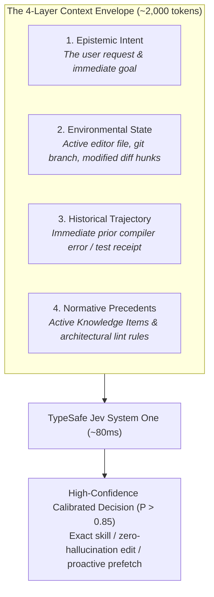
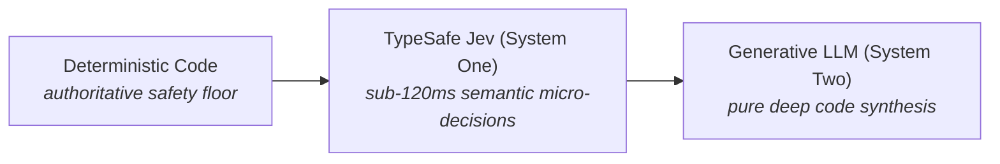

# The Philosophy of Jev: Machine-Native Semantic Control

> **Canonical Document**: `docs/PHILOSOPHY.md`  
> **Audience**: Systems architects, agent engineers, and AI developers  
> **Status**: Core Grounding Principles  
> **Related Protocol**: [System One Balance Protocol](../.agents/protocols/system-one-balance-protocol.md)  

---

## 1. The Core Axiom: Meaning is in the Context, Not in the Message

In linguistics and semiotics, words in isolation possess no inherent meaning. The utterance *"run it"* or *"fix the client"* is semantically vacuous without knowing whether the speaker is in a terminal, in an editor, looking at a broken unit test, or deploying to production. Meaning is always situated in the **context of the situation**.

In autonomous coding agents, **the exact same law governs every decision**:

$$\mathbf{Decision} = f\Big(\mathbf{Message},\ \mathbf{Context\ Envelope}\Big)$$

When an agent harness relies on the literal message alone, it falls into one of two systemic traps:
1. **Context Starvation (The "Bare Prompt" Trap)**:
   Evaluating decisions on the user's raw prompt string without environmental grounding. When asked *"is this command safe?"* or *"which skill is needed?"*, the model is forced to guess, causing low confidence ($P \sim 0.50$), hallucinated parameters, and unnecessary confirmation prompts.
2. **Context Flooding (The "Raw Dump" Trap)**:
   Dumping 40,000 tokens of raw bash logs, complete dependency graphs, and entire source files into the prompt. This triggers attention dilution, increases hallucination rates, and drags response latency from 100ms to 8 seconds.

### The Solution: The Calibrated Context Envelope
A decision is only as good as the **Context Envelope** fed into Jev's evaluation state. A high-signal Context Envelope is compact (1,000–3,000 tokens) and synthesized across four orthogonal layers:

---

## 2. Kahneman's Division of Labor: System One vs. System Two

Human cognition relies on two fundamentally different modes of thought (Daniel Kahneman, *Thinking, Fast and Slow*):
* **System 1 (Fast & Subconscious)**: Instant, non-deliberative reflexes (catching a falling cup, reading a billboard, dodging an obstacle). Executes in milliseconds with zero cognitive fatigue.
* **System 2 (Slow & Deliberative)**: Effortful, sequential reasoning (solving complex math, writing a novel, designing an algorithm). Slow, resource-intensive, and fatiguing.

Modern AI coding agents suffer from a fatal architectural flaw: **they delegate every micro-decision to heavy System Two generative models.** Pondering for 6 seconds with a 70B parameter autoregressive model to decide if `git status` is safe or if a domain skill should be loaded burns massive compute and creates sluggish agent UX.

### The Jev Division of Labor

* **Deterministic Code**: Owns the unbreachable safety floor (0ms regex invariants, hard permission checks, atomic file writes).
* **TypeSafe Jev (System One)**: Evaluates semantic micro-decisions in parallel in **70ms–120ms** ($0.042/1M input tokens, free unmetered output, guaranteed typing). Handles skill dispatch, speculative diff prefetching, knowledge triage, API symbol verification, and semantic code linting.
* **Primary Foundation Model (System Two)**: Focuses 100% of its attention and token budget on deep architectural planning and high-fidelity code synthesis.

---

## 3. Sub-120ms Non-Autoregressive Determinism

Large Language Models generate text autoregressively (token by token). This makes them inherently prone to:
* Schema parsing errors (JSON syntax mismatches).
* Hallucinated enumeration keys.
* Unpredictable latency variance (2 to 10 seconds).

**Jev** is a non-autoregressive decision model. Instead of predicting the next word, it evaluates candidate options directly against application state:
* **`Noul`**: Calibrated scalar probability ($0.0$ to $1.0$).
* **`Choice`**: Categorical selection across finite candidate sets ($\le 255$ options) with probability distributions.
* **`Score`**: Ordered rubric grading (2 to 10 calibrated levels).

Because outputs are structured mathematical distributions rather than free-form prose, Jev achieves **0% schema parsing failures** and consistent sub-120ms P95 turnaround.

---

## 4. The Anti-Bureaucracy Balance: Advice Must Not Paralyze

A common failure mode in AI governance is **confirmation fatigue**: wrapping every agent action in warnings, prompts, and modal approvals until the developer reflexively clicks "Allow All" without reading.

Jev enforces the **[System One Balance Protocol](../.agents/protocols/system-one-balance-protocol.md)**:
1. **Advisory is Non-Blocking**: Semantic checks (skill hints, output verification warnings, semantic lint findings) inject high-signal context into the turn. They do **not** lock tools, deny operations, or force interactive modal interruptions.
2. **Authority Belongs to Determinism**: Only hard deterministic safety invariants (e.g. recursive disk deletion, unverified hard resets) have the authority to halt execution or trigger blocking IDE modals.
3. **Fail-Open for Creativity**: When semantic providers encounter network timeouts or unexpected errors, file mutation tools fail open. An agent must never be locked out of writing code due to an advisory timeout.

---

## 5. Verbatim Preservation Over Lossy Summarization

When agent conversations exceed context limits, traditional systems invoke a generative LLM to "summarize" past turns. This introduces severe cognitive amnesia:
* Exact compiler error line numbers are discarded.
* Concrete shell command flags are generalized.
* Strict user constraints are subtly rewritten or dropped.

Jev treats context as an immutable event stream ([RFC-01](../proposals/RFC-01_CORE_verbatim_context_compactor.md)). Compaction works by **pruning transient execution debris** (truncating 5,000-line build outputs to 300-char receipts) while preserving **100% of user dialogue and file edits verbatim**.

---

## 6. Harness Portability: The Semantic Core is Independent

Coding harnesses (Google Antigravity, OpenAI Codex, Claude Code, Cursor) will continue to evolve, introduce new hook schemas, and change their transport protocols.

Jev treats harnesses as **transports**:
* Native protocols are external ports.
* Thin adapters translate native JSON into an immutable, harness-neutral `Event` and `Operation` contract ([RFC-24](../proposals/RFC-24_CORE_shared_harness_runtime.md)).
* The semantic core (`src/jev/core/`), skill catalog, active learning memory, and safety rules remain **100% unified and portable**.

Whether you work in Google Antigravity or OpenAI Codex, your safety floor, learned Knowledge Items, and architectural lint rules are identical, persistent, and portable across machines.

---

## Summary Matrix

| Dimension | The Traditional Agent Trap | The Jev System One Philosophy |
| :--- | :--- | :--- |
| **Meaning Formulation** | Relies on the raw prompt string alone (Context Starvation). | Constructs a structured, 4-layer **Context Envelope**. |
| **Cognitive Architecture** | Forces heavy System Two LLMs to make micro-decisions. | **Division of Labor**: Jev System One handles micro-decisions in <120ms. |
| **Typing & Reliability** | Autoregressive JSON generation with frequent schema parse errors. | Native non-autoregressive `Choice`, `Score`, and `Noul` with **0% parsing failure**. |
| **Agent Autonomy** | Heavy-handed confirmation modals paralyze developer flow. | **Non-blocking advisory balance**: semantic guidance informs; only deterministic code halts. |
| **Context Compaction** | Lossy generative summarization wipes out line numbers and flags. | **Verbatim receipt compaction** preserves 100% of code and conversation. |
| **Harness Strategy** | Rewriting custom hooks for every new IDE or CLI. | **Ports-and-Adapters runtime**: shared core across Antigravity and Codex. |
