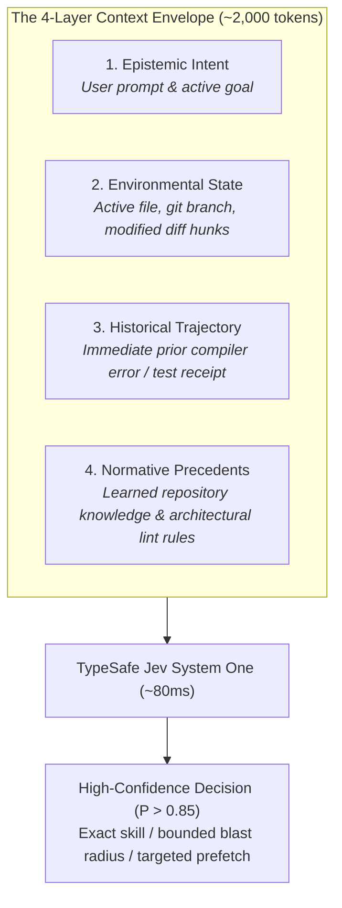
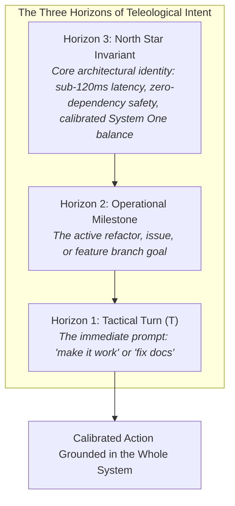
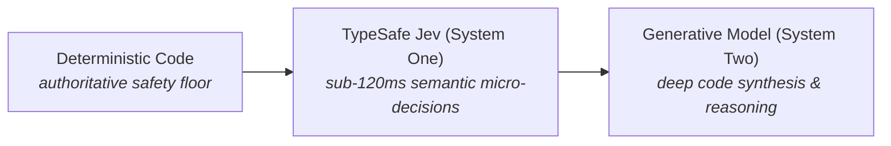

# The Philosophy of Jev: Machine-Native Semantic Control

> **Canonical Document**: `docs/PHILOSOPHY.md`
> **Audience**: Systems architects, agent engineers, and builders
> **Author**: Vasily Betin / TypeSafe AI Systems & Hook Architect
> **Related Protocols**: [Authorial Voice & Style](../.agents/protocols/style-protocol.md) | [System One Balance](../.agents/protocols/system-one-balance-protocol.md)

---

## 1. The Core Axiom: Meaning is in the Context, Not the Message

Isolated words carry zero semantic weight. The command *"run it"* or *"fix the client"* is completely hollow without knowing the physical state: are we in a bash terminal, in an active Python file, looking at a failed unit test, or deploying to a staging cluster?

Meaning is situated in physical and computational context:

$$\mathbf{Decision} = f\Big(\mathbf{Message},\ \mathbf{Context\ Envelope}\Big)$$

When an agent harness relies on the literal prompt alone, it falls into one of two systematic failure modes:

1. **Context Starvation (The Bare Prompt)**:
   Evaluating decisions on the user's raw string without environmental grounding. When asked *"is this command safe?"* or *"which skill should handle this?"*, the model guesses in the dark. Confidence collapses, parameters get hallucinated, and the harness falls back to nagging confirmation prompts.
2. **Context Flooding (The Raw Dump)**:
   Dumping 40,000 tokens of raw bash logs, entire dependency trees, and unrelated files into the prompt. Attention dilutes, reasoning degrades, and latency climbs from 100 milliseconds to 8 seconds.

### The Solution: The Calibrated Context Envelope
A reliable decision requires a compact, high-signal **Context Envelope** (typically 1,000 to 2,500 tokens) assembled across four physical layers:

---

## 2. Teleological Context: Steering by Compass, Not Dashboard

A critical blind spot in agentic AI systems is **local myopia** (tactical fixation).

When an agent or hook evaluates state based only on the immediate user turn ($T$), it falls into the trap of steering by the dashboard instead of the compass. For example, when asked to update documentation for dual-harness support, an agent without a preserved North Star Goal can easily treat that tactical task as the overall project objective, losing sight of the core purpose: building a fast, deterministic, calibrated Jev System One helper.

To prevent getting lost in immediate steps, the context sent to Jev and downstream agents must represent **Three Horizons of Intent**:

---

## 3. Division of Labor: Reflexes vs. Deliberation

Human physiology does not route high-frequency survival decisions through conscious reasoning. If you touch a scalding pan, a spinal reflex arc pulls your hand back in milliseconds. Conscious deliberation only begins seconds later.

Modern AI coding agents violate this division of labor. They force heavy, autoregressive foundation models (System Two) to deliberate on routine reflexes. Spending 6 seconds and 2,000 tokens with a 70-billion-parameter model to decide whether `git status` is safe or which skill file to read burns compute and stalls the developer's focus.

- **Deterministic Code**: Holds the inviolable safety floor (regex safety gates, file locks, atomic disk writes).
- **TypeSafe Jev (System One)**: Evaluates semantic micro-decisions in parallel within **70ms–120ms** at **$0.042 / 1M input tokens** with free unmetered output. Handles skill routing, speculative diff prefetching, symbol verification, and architectural code linting.
- **Foundation Model (System Two)**: Focuses its entire reasoning budget on architecture, logic, and code generation on Turn 1.

---

## 4. Non-Autoregressive Determinism

Standard LLMs generate text token by token. Because every token depends probabilistically on the last, autoregressive generation creates systematic defects: schema parsing failures (broken JSON syntax), hallucinated enumeration keys, and unpredictable latency spikes.

Rather than asking an LLM to generate unstructured text and hoping the output parses into valid JSON, TypeSafe models compute structured decisions directly over application state using native mathematical primitives:
- **`Noul`**: A calibrated scalar probability ($0.0$ to $1.0$).
- **`Choice`**: Categorical selection across finite candidate sets ($\le 255$ options) with normalized logit distributions.
- **`Score`**: Ordered rubric grading across calibrated levels.

Because outputs are structured mathematical matrices rather than generated prose, Jev eliminates schema parsing crashes and operates with consistent sub-120ms P95 turnaround.

---

## 5. Anti-Bureaucracy: Advice Must Not Paralyze

A fatal trap in software safety is **confirmation fatigue**. When an agent wrapper halts on every file read or pops an interactive modal for routine commands, developers stop reading and reflexively click *"Allow All"*. At that point, safety is an illusion.

Jev enforces the **[System One Balance Protocol](../.agents/protocols/system-one-balance-protocol.md)**:
1. **Semantic Advice is Non-Blocking**: Skill hints, output verification alerts, and semantic lint findings inject structured context into the prompt turn. They never lock tools or interrupt the developer with interactive modals.
2. **Authority Belongs to Determinism**: Only hard deterministic safety violations (recursive directory deletion, unverified hard resets) have the authority to block execution.
3. **Fail-Open for Creativity**: If semantic providers experience network timeouts or transient errors, file edits proceed unblocked. An agent must never be paralyzed while writing code because an advisory check took too long.

---

## 6. Verbatim Preservation Over Lossy Summarization

When agent conversations exceed context limits, common harnesses call a generative model to "summarize" earlier turns. This introduces severe amnesia:
- Exact line numbers in compiler errors disappear.
- Crucial shell flags and options get smoothed over.
- Explicit developer constraints are quietly rewritten into generic summaries.

In Jev, context is treated as an immutable event stream ([RFC-01](./proposals/RFC-01_CORE_verbatim_context_compactor.md)). Compaction works by **pruning transient execution debris** (collapsing 5,000 lines of raw compiler or test output into 300-character receipts) while preserving **100% of user dialogue, file edits, and architectural decisions verbatim**.

---

## 7. Harness Portability: The Semantic Core is Independent

IDEs and agent harnesses come and go—APIs change, hook payloads get reshuffled, and vendors introduce new formats. Your safety invariants, learned repository knowledge, and architectural lint rules should not be held hostage to a specific IDE.

Jev treats harnesses strictly as **external ports**:
- Native JSON messages are external inputs.
- Thin adapters translate inputs into an immutable, harness-neutral contract ([RFC-24](./proposals/RFC-24_CORE_shared_harness_runtime.md)).
- The semantic core (`src/jev/core/`), active learning databases, and safety rules remain **completely unified and portable**.

Whether working in Google Antigravity or OpenAI Codex, your safety floor, learned Knowledge Items, and architectural lint rules remain identical, persistent, and local to your environment.

---

## Core Comparison Matrix

| Dimension | The Traditional Agent Trap | The Jev Architecture |
| :--- | :--- | :--- |
| **Meaning Formulation** | Relies on bare prompt strings (Context Starvation). | Constructs a structured 4-layer **Context Envelope**. |
| **Cognitive Split** | Forces heavy System Two LLMs to evaluate routine checks. | **Division of Labor**: Jev System One handles micro-decisions in <120ms. |
| **Output Guarantees** | Autoregressive JSON with frequent parse errors. | Non-autoregressive `Choice`, `Score`, and `Noul` with **zero parse failures**. |
| **Developer Autonomy** | Modals interrupt every minor tool call (Confirmation Fatigue). | **Non-blocking advice**: hints inform; only hard deterministic rules halt. |
| **Context Compaction** | Lossy generative summarization wipes out line numbers and flags. | **Verbatim receipt compaction** preserves code and intent exactly. |
| **Harness Strategy** | Rewriting custom hooks for every IDE or CLI tool. | **Ports-and-adapters core**: shared implementation across Antigravity and Codex. |
