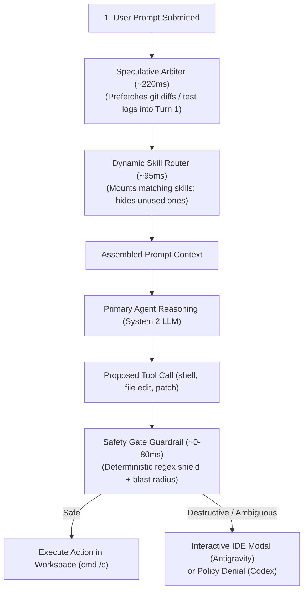

# Jev System One Control Layer: User Guide & Operational Manual

> **Audience**: Developers and engineers operating Google Antigravity or OpenAI Codex
> **Status**: Production Standard (Unified Shared Runtime)
> **Supported Platform**: Windows, Python 3.10+
> **Foundational Concepts**: [The Philosophy of Jev](PHILOSOPHY.md) | [Architecture Spec](ARCHITECTURE.md)

---

## 1. Quick Start (60 Seconds)

Get Jev installed and verified in your environment in three steps.

### Step 1: Install Package & Core Tools
From the repository root:
```cmd
cmd /c python -m pip install --user -e ".[mcp]"
cmd /c python -m jev doctor --cwd .
```

### Step 2: Configure Provider API Key in `.env`
Copy the environment template and set your API key in `.agents/.env` (or project root `.env`):
```cmd
cmd /c copy .agents\.env.example .agents\.env
```

Inside `.agents/.env`:
```ini
OPENROUTER_API_KEY=sk-or-v1-your_openrouter_api_key_here
```
*(Or set `TYPESAFE_API_KEY=your_typesafe_key_here` if connecting directly. Environment variables already present in your shell take priority).*

### Step 3: Run Self-Diagnostics
```cmd
cmd /c python -m jev doctor --cwd .
cmd /c python -m pytest -q
```

---

## 2. Connecting to Your Agent Harness

Jev uses a shared Python runtime (`src/jev/`). Connect it to your preferred harness:

### A. Google Antigravity Setup
Create directory junctions from Jev into your Antigravity user config directory (`%USERPROFILE%\.gemini\config`):

```cmd
cmd /c mklink /J "%USERPROFILE%\.gemini\config\hooks" "%CD%\.agents\hooks"
cmd /c mklink /J "%USERPROFILE%\.gemini\config\skills" "%CD%\.agents\skills"
cmd /c mklink /J "%USERPROFILE%\.gemini\config\protocols" "%CD%\.agents\protocols"
cmd /c mklink "%USERPROFILE%\.gemini\config\hooks.json" "%CD%\.agents\hooks.json"
```

Reload Antigravity: Press <kbd>Ctrl</kbd> + <kbd>Shift</kbd> + <kbd>P</kbd> $\rightarrow$ **`Developer: Reload Window`**.

### B. OpenAI Codex Setup
Codex discovers hooks automatically via the repository's [`.codex/hooks.json`](../.codex/hooks.json):
1. Open this repository as a trusted project in Codex.
2. Accept the hook review when prompted.
3. Restart Codex so `python -m jev` is available to hook processes.

---

## 3. The Everyday Execution Flow

When an agent runs in your workspace, Jev operates transparently at two key lifecycle phases:



> **Grounding Tip: Preserving Your Project's Compass**
> Create `.agents/GOAL.md` (or `.agents/project.md`) with 1–2 sentences defining your project's North Star. Jev automatically incorporates this into every Context Envelope, preventing the agent from suffering local myopia or losing sight of core architecture on multi-turn refactors.

---

## 4. Safety Gate Modals & Rule Authorizations

When an agent proposes an action with high blast radius (`rmdir /s`, unverified git resets, destructive database operations), Jev halts execution instantly.

### Antigravity Interactive Modals
In Antigravity, Jev renders an interactive dialog directly in your IDE:


You can select:
- **Allow Once**: Authorizes this single execution.
- **Save for Session**: Authorizes this command pattern for the duration of the current conversation.
- **Save Always**: Writes a permanent grant to SQLite so you are not interrupted for this pattern again.
- **Cancel**: Aborts the operation safely.

### Managing & Auditing Saved Approvals
To maintain full sovereignty over permanent rules created via "Save Always", inspect and prune them at any time:

```cmd
cmd /c python .agents\hooks\safety_db.py --list
cmd /c python .agents\hooks\safety_db.py --delete <rule_id>
```

### Codex Permissions
In Codex, high-risk actions receive a clean policy denial explaining the exact blast radius. You can authorize a one-time execution via the CLI:

```cmd
cmd /c python -m jev authorize --harness codex --tool Bash --command "your command" --workspace-id WORKSPACE_ID
```
Review the printed operation digest, then confirm:
```cmd
cmd /c python -m jev authorize --harness codex --tool Bash --command "your command" --workspace-id WORKSPACE_ID --confirm-digest DIGEST
```

---

## 5. Output Verification & Knowledge Capture

### A. Output & Citation Verification
To prevent models from inventing unexported API symbols or hallucinating method parameters, Jev verifies proposed edits against local files and Knowledge Items:

```cmd
cmd /c python -m jev verify --code "client.get_token()" --reference "API Reference: client.get_token() retrieves active auth token."
```

- In **Antigravity**, discrepancies inject an advisory warning into prompt context without interrupting execution.
- In **Codex**, warnings appear in `hookSpecificOutput.additionalContext`.
- Agents can also call the `verify_output` MCP tool before writing complex diffs.

### B. Capturing Precedents (`knowledge_learn`)
When you establish a project-specific pattern or resolve a tricky convention, teach it to Jev so future turns auto-mount it:

```cmd
cmd /c python -m jev learn --title "API Client Timeout" --content "Always set timeout=10 on HTTP requests in services/client.py"
```
Or instruct your agent: *"Save this convention using `knowledge_learn`."*

---

## 6. Semantic Code Linting & Rule Lifecycle

Semantic lint rules inspect staged code changes against architectural standards that traditional syntax linters miss (layer boundaries, repository patterns, abstraction leaks).

Rules live under `.agents/lint-rules/<rule-id>/`:
- `metadata.json`: defines the machine contract and target glob patterns.
- `artifacts/policy.md`: documents the architectural rationale.

### Setting Up Rules with `lint-architect`
You can invoke the built-in **`lint-architect`** skill ([`.agents/skills/lint-architect/SKILL.md`](../.agents/skills/lint-architect/SKILL.md)) to scan your tech stack and author initial architectural rules tailored to your project.

### Rule Promotion Lifecycle
To ensure rules do not paralyze developer flow:
1. **`observe`**: New rules always start in observe mode. They run silently, recording predictions and latency without notifying the user.
2. **Review Telemetry**: Inspect false-positive rates with `cmd /c python -m jev lint-stats`.
3. **`advisory`**: Once validated, promote the rule to advisory mode in `metadata.json`. Findings inject non-blocking advice into context (`prompt_user` or `warn_user`).
4. **`ci_enforced`**: Optional strict mode for CI/CD gates (`python -m jev lint` exits with code 1 on confirmed violations).

### Running the Linter
```cmd
cmd /c python -m jev lint --staged --harness antigravity
cmd /c python -m jev lint --base origin/main --harness codex
cmd /c python -m jev lint-feedback 42 confirmed_violation
cmd /c python -m jev lint-stats --rule lr_repository_boundary
```

---

## 7. Telemetry, Database & CLI Auditing

Jev stores local audit records in `%LOCALAPPDATA%\Jev\jev.sqlite3`. Prompts and commands are never stored in full; secrets and sensitive environment keys are redacted before writing to disk.

### Inspecting Latencies and Decisions
```cmd
cmd /c python -m jev stats
cmd /c python -m jev stats --harness codex
cmd /c python -m jev stats --json
```

### Reviewing Safety History
```cmd
cmd /c python .agents\hooks\safety_db.py --review --harness antigravity
cmd /c python .agents\hooks\safety_db.py --review --harness codex
```

---

## 8. Multi-Workspace Codex Configuration

To expose Jev MCP tools across all Codex workspaces on Windows:

1. Add this block to `%USERPROFILE%\.codex\config.toml`:
   ```toml
   [mcp_servers.jev]
   command = "python"
   args = ["-m", "jev", "mcp", "--harness", "codex"]
   startup_timeout_sec = 10
   tool_timeout_sec = 30
   ```
   Do not hardcode a global `cwd`: Codex launches the server inside the active workspace directory so Jev loads that repository's `.agents/skills`, `.agents/knowledge`, and `.agents/lint-rules`.

2. Verify registration:
   ```cmd
   cmd /c codex mcp list
   ```

---

## 9. Verification & Self-Test Suite

The offline test suite runs against isolated, temporary databases:

```cmd
cmd /c python -m pytest -q
```

To run live provider integration tests against OpenRouter / TypeSafe:
```cmd
cmd /c set JEV_RUN_LIVE_TESTS=1
cmd /c python -m pytest tests\test_speculative_router.py -q
```
