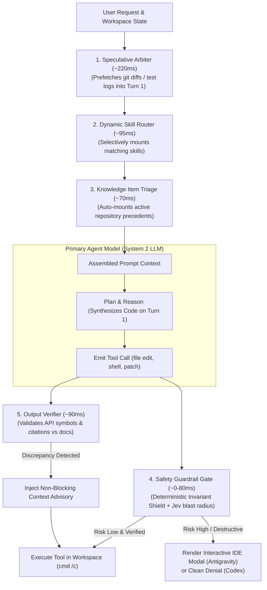

# Jev System One Control Layer: User Guide & Operational Manual

> **Audience**: Developers and engineers using Google Antigravity or OpenAI Codex  
> **Status**: Production Standard (Unified Shared Runtime)  
> **Supported Platform**: Windows, Python 3.10+  
> **Harnesses**: Google Antigravity 2.0 & OpenAI Codex  

---

## 1. Problem: The Fragility & Token Inefficiency of Generative Agents

Autonomous coding agent harnesses give generative foundation models (Gemini, Claude, GPT) direct local execution privileges: running shell commands, mutating files, and inspecting workspaces.

However, relying exclusively on heavy, autoregressive **System Two** models for every routine micro-decision creates severe friction:
* **Accidental Destructive Execution**: An innocent request like *"clean up old benchmarks"* can cause an agent to emit `cmd /c rmdir /s /q benchmarks` or `git reset --hard` before you can react.
* **Severe Token Bloat & Prompt Tax**: Advertising 50+ domain skills in prompts consumes 5,000–25,000 tokens on *every single turn*, dragging down model responsiveness and driving up API bills.
* **Turn-1 Latency & Amnesia**: Multi-turn sequential file search, git status queries, and test runs waste 3–5 turns of user time before actual code synthesis begins.
* **Hallucinated Interfaces & Broken Methods**: Models routinely invent plausible but nonexistent API signatures or unsupported parameters, trapping the agent in expensive 3–5 turn debugging loops.
* **Lossy Context Summaries**: Standard generative summarization deletes line numbers, compiler error codes, and verbatim user constraints when sessions grow long.

---

## 2. Inspiration: Biological Reflex Arcs & Microkernel Probes

In human biology, routine survival checks (pulling your hand from a hot stove or catching a falling glass) do not consult conscious deliberation. Sub-conscious, high-speed **reflex arcs** execute in milliseconds. Similarly, operating system kernels rely on lightweight **eBPF probes** to enforce privileges at hardware speeds rather than waking up heavy userspace processes.

An AI coding harness should not spend 5 seconds and 2,000 tokens pondering whether `git status` is safe or whether a method signature exists. Routine control flow, safety barriers, and semantic triage belong in a dedicated, high-speed **System One reflex layer**.

> **The Context Axiom**: *Meaning is in the context, not in the message.* Decisions cannot be made accurately on bare prompt strings alone. High-confidence System One micro-decisions require a situated **Context Envelope** assembling user intent, active editor file state, recent test/compiler receipts, and normative repository precedents. For the complete foundational rationale, see **[The Philosophy of Jev](PHILOSOPHY.md)**.

---

## 3. Solution: TypeSafe Jev Machine-Native Hooks

**Jev** is TypeSafe AI's non-autoregressive decision model:
* **Sub-120ms P95 Latency**: Evaluates parallel questions against application state in **70ms–120ms** (190x faster than LLMs).
* **Extreme Efficiency**: **$0.042 / 1M input tokens** with **free unmetered outputs** (440x cheaper than LLMs).
* **Guaranteed Typing**: Zero schema parsing failures across native `Choice`, `Score`, and `Noul` primitives.
* **Unified Dual-Harness Runtime**: One shared Python implementation ([`src/jev/`](../src/jev/)) powers **both Google Antigravity and OpenAI Codex** ([RFC-24](../proposals/RFC-24_CORE_shared_harness_runtime.md)) with zero policy drift.

### The Division of Labor
**Deterministic code enforces authoritative safety, Jev handles fast semantic micro-decisions, and primary foundation models focus purely on deep reasoning and code synthesis.**



---

## 4. Visual Production Proof

### A. The Safety Gate Intercept Modal
When an agent attempts a destructive command (`rmdir /s`, `git reset --hard`, or unverified script deletion), Jev halts execution instantly and renders an interactive confirmation modal in the IDE:


You can choose:
* **Allow Once**: Authorize this specific execution.
* **Save for Session**: Authorize this pattern for the rest of this conversation.
* **Save Always**: Save a permanent rule to SQLite so you are never asked again.
* **Cancel**: Abort the tool call safely.

### B. PreInvocation Speculative Pre-Flight Badge
Before primary reasoning starts, Jev speculatively evaluates the context and auto-prefetches git diffs or pytest diagnostics into Turn 1:


```text
> **Jev Speculative Pre-Flight**: Attached speculative evidence (git_prefetch (P=0.77) in 266ms).
```

### C. Dynamic Skill Activation Badge
Instead of advertising 30+ skills on every turn, Jev evaluates the prompt in **~95ms**, mounts only the exact qualifying skill from `.agents/skills/`, and renders an in-chat badge:

```text
> **Activated Skill**: `app-security`
```

---

## 5. Compatibility at a Glance

The core runtime is shared. Each harness contributes only event translation and output encoding.

| Capability | Google Antigravity | OpenAI Codex | Shared Implementation |
| :--- | :--- | :--- | :--- |
| **Safety policy** | `PreToolUse` (interactive modal) | `PreToolUse` (permissionDecision: deny) | `core/safety.py`; deterministic invariants always deny in both harnesses. |
| **Advisory context** | `PreInvocation` | `SessionStart` and `UserPromptSubmit` | `core/speculative.py` and `core/knowledge.py`. |
| **Skill selection** | Full body or soft-hint injection | Catalog ranking without body injection; Codex retains native discovery | `core/skills.py` reads `.agents/skills/`. |
| **Knowledge retrieval** | Advisory context at pre-invocation | Advisory context at session and prompt boundaries | `core/knowledge.py` reads `.agents/knowledge/`. |
| **Output verification** | `PreToolUse` advisory warning; `verify_output` tool | `PreToolUse` `additionalContext` warning; `verify_output` tool | `core/verification.py`; non-blocking API symbol and citation verification (RFC-07). |
| **Semantic linting** | Structured `prompt_user` finding; never denies tools | Structured `warn_user` finding; never denies tools | `core/semantic_lint.py` reads `.agents/lint-rules/`. |
| **Callable tools** | Standard stdio MCP transport | Registered through Codex MCP configuration | `tooling.py`, `registry.py`, and `transports/mcp.py`. |
| **Audit and rules** | `antigravity_events` view | `codex_events` view | One `jev.sqlite3` database with a harness field. |
| **Context compaction** | Explicit sidecar checkpoint | Explicit sidecar checkpoint | `core/compaction.py`; preserves 100% of code edits verbatim. |

> [!NOTE]
> **Harness Approval & Error Handling Differences**:
> - **Google Antigravity**: Supports interactive confirmation modals (`"decision": "force_ask"` or `"ask"`). If an operation requires developer review, Antigravity renders a confirmation dialog in the IDE. Workspace file mutations (`write_to_file`, `replace_*`) always fail open so editing code is never blocked by hook inspection glitches.
> - **OpenAI Codex**: Hooks at `PreToolUse` support `allow` or `deny` without an interactive modal. Jev maps conditional safety reviews to a clean denial with actionable reasoning, which can be retried or authorized via `jev authorize`.

---

## 6. Quick Start (60 Seconds)

### Step 1: Install Package & MCP Dependencies
From the repository root:
```cmd
cmd /c python -m pip install --user -e ".[mcp]"
cmd /c python -m jev doctor --cwd .
```

### Step 2: Configure Provider Key
Configure one provider in your user environment:

#### Option A: OpenRouter (Recommended)
```cmd
cmd /c setx OPENROUTER_API_KEY "sk-or-v1-your_openrouter_api_key_here"
```

#### Option B: Direct TypeSafe AI
```cmd
cmd /c setx TYPESAFE_API_KEY "your_typesafe_key_here"
```

Optional overrides include `TYPESAFE_ENDPOINT`, `JEV_MODEL`, `JEV_DATA_ROOT`, and `JEV_DB_PATH`. Project `jev.json` may configure skill roots, knowledge roots, context budget, and semantic timeouts. It cannot redirect trusted rule storage or weaken safety policy.

### Step 3: Run Self-Diagnostics & Tests
```cmd
cmd /c python -m jev doctor --cwd .
cmd /c python -m pytest -q
```

---

## 7. Enabling Google Antigravity

Link the canonical hooks and skills into Antigravity's global user configuration (`%USERPROFILE%\.gemini\config`):

```cmd
cmd /c mklink /J "%USERPROFILE%\.gemini\config\hooks" "%CD%\.agents\hooks"
cmd /c mklink /J "%USERPROFILE%\.gemini\config\skills" "%CD%\.agents\skills"
cmd /c mklink /J "%USERPROFILE%\.gemini\config\protocols" "%CD%\.agents\protocols"
cmd /c mklink "%USERPROFILE%\.gemini\config\hooks.json" "%CD%\.agents\hooks.json"
```

Reload Antigravity: Press <kbd>Ctrl</kbd> + <kbd>Shift</kbd> + <kbd>P</kbd> $\rightarrow$ **`Developer: Reload Window`**.

---

## 8. Enabling OpenAI Codex

The repository includes [`.codex/hooks.json`](../.codex/hooks.json) configuring `SessionStart`, `UserPromptSubmit`, and `PreToolUse`.

1. Open this repository as a trusted project in Codex.
2. Accept the hook review when prompted.
3. Restart Codex so `python -m jev` is available to its hook processes.

---

## 9. Output & Citation Verification (RFC-07)

Jev automatically intercepts file mutation operations (`replace_file_content` / `write_to_file` in Antigravity, and `apply_patch` in Codex) to verify proposed API calls and symbol usage against local file context and Knowledge Items. When an agent proposes calling an unexported method or contradicts documented APIs, Jev injects an advisory warning into context without blocking execution:

```cmd
cmd /c python -m jev verify --code "client.get_token()" --reference "API Reference: client.get_token() retrieves current token."
```

In Antigravity, advisories appear as prompt context. In Codex, advisories appear in `hookSpecificOutput.additionalContext`. Agents can also proactively call the `verify_output` MCP tool before writing large code changes.

---

## 10. Semantic Code Linting (RFC-08)

Semantic lint rules live under `.agents/lint-rules/<rule-id>/`: `metadata.json` defines the executable machine contract and `artifacts/policy.md` explains the architectural rationale. New rules start in `observe`; reviewed evidence supports an explicit Git change to `advisory` or `ci_enforced`.

```cmd
cmd /c python -m jev lint --staged --harness codex
cmd /c python -m jev lint --base origin/main --harness antigravity
cmd /c python -m jev lint-feedback 42 confirmed_violation
cmd /c python -m jev lint-stats --rule lr_repository_boundary
```

Antigravity findings request a user decision through `presentation: prompt_user`. Codex findings use `presentation: warn_user`. Neither presentation denies tools or instructs the primary model to stop. Only a committed `ci_enforced` rule can make `jev lint` exit with code 1.

Use the `lint-architect` skill ([`.agents/skills/lint-architect/SKILL.md`](../.agents/skills/lint-architect/SKILL.md)) to audit existing rules, analyze telemetry, and author project-specific architectural rules.

---

## 11. Data, Persistence & CLI Auditing

The default Windows database is `%LOCALAPPDATA%\Jev\jev.sqlite3`. It contains:
- `events`: all feature decisions with harness, workspace, session, and tool identity.
- `codex_events`: a view containing Codex records.
- `antigravity_events`: a view containing Antigravity records.
- `rules`: harness-scoped policy memory and one-use authorizations.
- `verification_decisions`: RFC-07 output verification audit logs.
- `semantic_lint_decisions`: RFC-08 semantic lint audit logs.

Prompts and commands are not stored in full by default. Diagnostic details are bounded and secret-like values are redacted.

### View Decision Telemetry & Latencies
```cmd
cmd /c python -m jev stats
cmd /c python -m jev stats --harness codex
cmd /c python -m jev stats --json
```

### Compatibility Database Review
```cmd
cmd /c python .agents\hooks\safety_db.py --review --harness codex
cmd /c python .agents\hooks\safety_db.py --review --harness antigravity
```

---

## 12. Manual One-Use Authorization

Invariant operations such as force push, recursive forced deletion, hard reset, disk formatting, and database destruction cannot be authorized through Jev.

For a conditionally denied operation, use the manual two-step CLI outside the agent tool surface:

```cmd
cmd /c python -m jev authorize --harness codex --tool Bash --command "your command" --workspace-id WORKSPACE_ID
```

The command prints an operation digest and saves nothing. Review the operation, then repeat with the displayed digest:

```cmd
cmd /c python -m jev authorize --harness codex --tool Bash --command "your command" --workspace-id WORKSPACE_ID --confirm-digest DIGEST
```

The grant is consumed atomically on the matching tool attempt. Native harness approvals and sandbox rules still apply.

---

## 13. Global Multi-Workspace Codex Setup

To expose Jev MCP tools across all Codex projects on your machine:

1. Add this block to `%USERPROFILE%\.codex\config.toml`:
   ```toml
   [mcp_servers.jev]
   command = "python"
   args = ["-m", "jev", "mcp", "--harness", "codex"]
   startup_timeout_sec = 10
   tool_timeout_sec = 30
   ```
   Do not set a global `cwd`: Codex starts the server in the active project directory so Jev can use that repository's `.agents/skills`, `.agents/knowledge`, and `.agents/lint-rules`.

2. Restart Codex, then verify the registration:
   ```cmd
   cmd /c codex mcp list
   ```

3. Shared MCP tools available:
   - `knowledge_search` & `knowledge_learn`
   - `skills_list`
   - `diagnostics_status`
   - `semantic_lint`, `semantic_lint_feedback`, `semantic_lint_stats`
   - `verify_output`

---

## 14. Verification & Self-Test Suite

The default test suite is offline and uses isolated temporary databases:

```cmd
cmd /c python -m pytest -q
```

Live TypeSafe regression tests require an explicit opt-in:

```cmd
cmd /c set JEV_RUN_LIVE_TESTS=1
cmd /c python -m pytest tests\test_speculative_router.py -q
```
