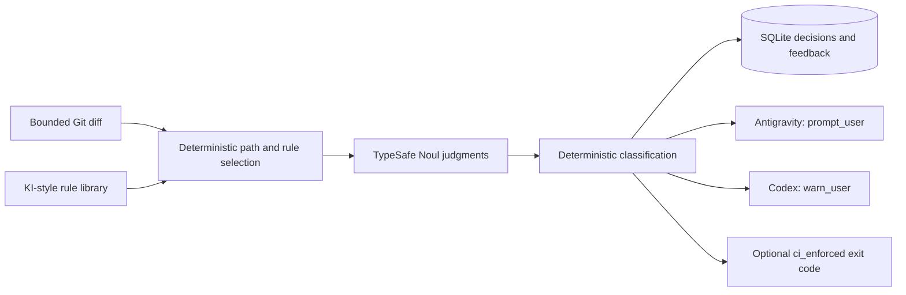

# RFC-08: Semantic Code Linting

> **Status**: Implemented MVP
>
> **Type**: `USE_CASE`
>
> **Harnesses**: Google Antigravity and OpenAI Codex
>
> **Implementation**: [`core/semantic_lint.py`](../../src/jev/core/semantic_lint.py), [rule library](../../.agents/lint-rules/), and [`services/storage.py`](../../src/jev/services/storage.py)
>
> **Related protocol**: [System One Balance](../../.agents/protocols/system-one-balance-protocol.md)

## 1. Problem

Static linters enforce syntax, formatting, and types, but project-specific architectural intent often remains in review comments. Examples include keeping database access behind repositories, preventing response DTOs from exposing persistence entities, and placing shared harness behavior in `src/jev/` instead of adapters.

These checks need semantic judgment, traceable policy versions, and evidence about whether each rule produces useful results.

## 2. Solution

Jev evaluates a bounded Git diff against repository semantic rules. Each applicable rule asks one narrow TypeSafe Noul question. Deterministic code owns path selection, thresholds, rule severity, presentation, persistence, and CI exit behavior.



Semantic findings never enter lifecycle outcome aggregation. They cannot deny tools, invoke `force_ask`, prohibit discovery, or replace the primary model's judgment.

## 3. Rule Library

Rules follow the Knowledge Item layout:

```text
.agents/lint-rules/<rule-id>/
  metadata.json
  artifacts/
    policy.md
    examples.md
```

`metadata.json` is the executable contract:

```json
{
  "id": "lr_repository_boundary",
  "version": 2,
  "title": "Repository boundary",
  "domain": "architecture",
  "status": "active",
  "mode": "advisory",
  "level": "error",
  "question": "Does this diff introduce persistence access outside a repository?",
  "review_threshold": 0.6,
  "violation_threshold": 0.82,
  "include": ["src/**/*.py"],
  "exclude": ["src/**/repositories/**", "tests/**"]
}
```

Stable IDs preserve history. Increment `version` when meaning, scope, or thresholds change. `disabled` and `deprecated` rules are not evaluated. Git review remains the authority for rule changes.

## 4. Progressive Enforcement

| Mode | Behavior |
| --- | --- |
| `observe` | Record decisions without showing findings. Use for calibration. |
| `advisory` | Return a calibrated finding without restricting the agent. |
| `ci_enforced` | Behave like advisory mode and return CLI exit code 1 for a violation. |

New rules should begin in `observe`. Reviewed decisions can justify an explicit Git change to `advisory` or `ci_enforced`. Jev may show statistics but never promotes or rewrites a rule automatically.

Confidence maps deterministically to `pass`, `review`, or `violation`. Repository policy supplies severity; the model does not generate a global architectural severity score.

## 5. Harness Behavior

The evaluator is shared. Trusted MCP launch configuration supplies harness identity.

| Harness | Finding presentation | Effect on model autonomy |
| --- | --- | --- |
| Antigravity | `presentation: prompt_user` asks the UI or calling agent to obtain a developer decision. | No tool denial or imperative instruction. |
| Codex | `presentation: warn_user` displays the same evidence as a warning. | No tool denial or forced confirmation. |

This distinction does not use the safety adapter's `needs_confirmation` outcome. Deterministic safety remains the only authoritative operation gate.

## 6. Diff and Failure Boundaries

The collector invokes Git with an argument array and no shell. It supports staged changes or an explicit base commit, disables external diff and text conversion, rejects conflicting modes, bounds diff size, and records truncation. Findings cite repository-relative paths and evaluated hunk ranges rather than model-generated line claims.

Secret-like values are redacted before provider requests and database details. Missing credentials or provider errors return `status: unavailable`; they are never reported as a clean pass. An empty diff returns `pass` without a provider request.

## 7. Decision and Feedback Storage

`semantic_lint_decisions` records:

- exact rule ID, version, and content digest;
- harness and workspace identity;
- diff digest, path, and hunk range;
- probability, classification, mode, latency, and truncation/redaction flags.

`semantic_lint_feedback` references an exact decision. Supported labels are `confirmed_violation`, `false_positive`, `missed_violation`, `acceptable_exception`, `rule_unclear`, `fixed`, and `dismissed`.

This feature-specific evidence uses the existing shared SQLite database. It does not reactivate the postponed OpenTelemetry and exporter work in RFC-25.

## 8. Interfaces

CLI:

```cmd
cmd /c python -m jev lint --staged --harness codex
cmd /c python -m jev lint --base origin/main --harness antigravity
cmd /c python -m jev lint-feedback 42 confirmed_violation
cmd /c python -m jev lint-stats --rule lr_repository_boundary
```

Shared MCP tools:

- `semantic_lint`
- `semantic_lint_feedback`
- `semantic_lint_stats`

The registry exposes each tool once. Both harnesses use the same handler and database schema.

## 9. Implemented Scope and Deferred Work

The MVP implements KI-style rule discovery, bounded staged/base diff collection, Noul evaluation, progressive modes, harness-specific presentation, decision logging, exact feedback, CLI commands, shared MCP registration, and the canonical `lint-architect` skill ([`.agents/skills/lint-architect/SKILL.md`](../../.agents/skills/lint-architect/SKILL.md)) for stack-tailored rule curation.

SARIF output, automatic PR comments, baseline files, calibration dashboards, and automatic rule generation remain deferred. Latency must be measured on representative diffs before publishing a performance guarantee.

## 10. Verification

Tests cover Antigravity and Codex presentation, observe-mode non-interference, exact feedback linkage, rule statistics, invalid thresholds, provider absence, registry exposure, and the shared runtime. All provider calls are mocked in the default suite.
