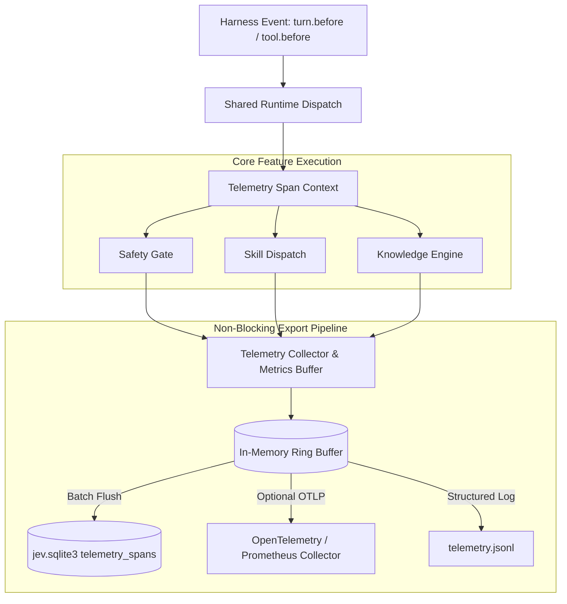

# RFC-25: Harness-Neutral Telemetry Module & Observability Pipeline

> **Category**: CORE
> **Status**: Partially Implemented — Postponed
> **Target Lifecycle**: Harness Core / Post-Turn / Cross-Lifecycle
> **Scope**: Standardized telemetry collection, OpenTelemetry export, latency/cost profiling, and harness-scoped observability for Antigravity and Codex.
> **Planning Decision**: The existing SQLite event statistics and CLI summary are sufficient for the current project stage. Do not select this RFC during implementation-candidate reviews unless the user explicitly reactivates telemetry work.

---

## 1. Problem

As Jev evolves into a cross-harness System One control plane (supporting both Google Antigravity and OpenAI Codex), visibility into decision latency, token economics, fallback rates, and safety interventions is fragmented:

1. **Silent Latency Degenerations**: Jev operates under strict latency budgets (sub-120ms P95). When remote TypeSafe or OpenRouter inference degrades or network jitter spikes, developers lack end-to-end trace spans measuring where milliseconds were spent (e.g., SQLite claim vs. JSON RPC round-trip vs. AST traversal).
2. **Untracked Cost and Token ROI**: Speculative fan-out, skill routing, and knowledge retrieval claim token efficiency ($0.042/1M tokens vs. LLM $15/1M), but there is no uniform telemetry module tracking actual tokens consumed, prompt reduction ratios, or estimated dollar savings over time.
3. **Audit Isolation vs. Telemetry Export**: While SQLite persistence (`jev.sqlite3`) records raw event rows in `events`, this storage is optimized for local replay and deterministic guardrails—not structured observability, Prometheus/OpenTelemetry ingestion, or automated performance regression alerting.
4. **Harness Disparity**: Antigravity and Codex emit different telemetry metadata (turn IDs, tool call IDs, agent IDs). Without a normalized telemetry module, telemetry schemas diverge between harnesses.

---

## 2. Inspiration

Modern microkernel operating systems and cloud-native service meshes separate the **control plane** (authoritative decisions) from the **telemetry plane** (asynchronous, non-blocking metrics and distributed tracing):

- **eBPF & OpenTelemetry**: High-performance kernel tracing tools capture probe timings in sub-microsecond rings without blocking syscall execution. Similarly, Jev's telemetry pipeline must run out-of-band or with near-zero overhead ($\le 1\text{ms}$).
- **Kahneman's Calibrated Self-Observation**: A reflex system must monitor its own calibration drift. If Jev Noul probabilities consistently cluster around 0.50 (high uncertainty), telemetry should signal the need for rule tuning or model refinement.

---

## 3. Solution

RFC-25 introduces `src/jev/core/telemetry.py` and a first-class `TelemetryService` inside the shared harness runtime.

Key architectural invariants:
- **Zero Critical-Path Overhead**: Telemetry generation never blocks safety gates or tool execution. Metrics accumulation happens in-memory with asynchronous background batch flushes to SQLite / OTLP endpoints.
- **Harness-Agnostic Event Contracts**: Extends `jev.contracts` with standard telemetry spans, counter metrics, and timing histograms tagged with harness identity (`antigravity` vs `codex`), workspace ID, and session ID.
- **Privacy & Secret Redaction**: Reuses `storage.redact` to guarantee that tokens, API secrets, sensitive file paths, and private prompt payloads are never leaked into exportable metrics or distributed traces.
- **Fail-Safe Isolation**: An error in the telemetry module, trace exporter, or metrics database fails completely open without degrading core safety or advisory routing.

---

## 4. Concrete Example

### 4.1 Distributed Trace Span Representation

When an agent invokes a tool (e.g., `run_command` executing `git status`), Jev records an end-to-end trace span tree:

```text
[Trace: 8f9a2b10-turn-42] (total: 104.2ms, outcome: ALLOW)
├── jev.runtime.dispatch (104.2ms)
│   ├── jev.storage.claim [sqlite_wal] (1.1ms)
│   ├── jev.core.safety [deterministic_invariants] (0.2ms)
│   ├── jev.client.noul_intent [typesafe_api] (98.4ms, tokens: 48)
│   └── jev.storage.record_event (4.5ms, async)
└── [Metrics Updated]:
    - jev_evaluations_total{feature="safety",harness="antigravity",outcome="allow"} += 1
    - jev_latency_ms_bucket{le="120",feature="safety"} += 1
    - jev_tokens_consumed_total{model="jev-1.13"} += 48
```

### 4.2 Before / After Telemetry Telemetry Table

| Capability | Before (RFC-24 Storage Only) | After (RFC-25 Telemetry Module) |
| :--- | :--- | :--- |
| **Storage Target** | Single local SQLite file (`jev.sqlite3`) | SQLite ring buffer + optional OpenTelemetry / JSON-L metrics exporter |
| **Trace Granularity** | Single `duration_ms` per top-level feature | Fine-grained hierarchical spans (storage claim, client RPC, AST parse) |
| **Token Tracking** | Unmetered estimate only | Exact prompt/completion token tracking & System One cost aggregation |
| **Overhead** | Synchronous SQLite write on event completion | Asynchronous non-blocking buffer flush ($< 0.5\text{ms}$ dispatch overhead) |
| **Query & Inspection** | Manual SQL queries on `events` table | CLI `jev telemetry --summary` & `diagnostics_status` tool integration |

---

## 5. Technical Specification

### 5.1 Architecture & Pipeline Layout



### 5.2 Module Placement & Contracts

```text
src/jev/
  core/
    telemetry.py                 # Telemetry collector, metric counters, span context manager
  services/
    telemetry_exporter.py        # SQLite writer, OTLP exporter, and file sink
  tooling.py                     # Added `telemetry_summary` tool
```

#### New Contract Definitions (`src/jev/contracts.py`)

```python
@dataclass(frozen=True)
class MetricDatum:
    name: str
    value: float
    unit: str
    tags: Mapping[str, str] = field(default_factory=dict)
    timestamp: float = field(default_factory=time.time)

@dataclass
class TelemetrySpan:
    trace_id: str
    span_id: str
    parent_span_id: str | None
    name: str
    feature: str
    harness: Harness
    start_time: float
    end_time: float = 0.0
    duration_ms: float = 0.0
    attributes: dict[str, Any] = field(default_factory=dict)
    status: str = "ok"
    error: str = ""
```

### 5.3 SQLite Schema Extensions (`jev.sqlite3`)

```sql
CREATE TABLE IF NOT EXISTS telemetry_spans (
    id INTEGER PRIMARY KEY AUTOINCREMENT,
    trace_id TEXT NOT NULL,
    span_id TEXT NOT NULL UNIQUE,
    parent_span_id TEXT,
    harness TEXT NOT NULL,
    workspace_id TEXT NOT NULL,
    session_id TEXT NOT NULL,
    name TEXT NOT NULL,
    feature TEXT NOT NULL,
    duration_ms REAL NOT NULL,
    tokens_in INTEGER DEFAULT 0,
    tokens_out INTEGER DEFAULT 0,
    cost_usd REAL DEFAULT 0.0,
    status TEXT NOT NULL,
    error TEXT NOT NULL DEFAULT '',
    attributes_json TEXT NOT NULL DEFAULT '{}',
    created_at TEXT NOT NULL DEFAULT CURRENT_TIMESTAMP
);

CREATE INDEX IF NOT EXISTS idx_telemetry_trace
    ON telemetry_spans(trace_id);
CREATE INDEX IF NOT EXISTS idx_telemetry_harness_feature
    ON telemetry_spans(harness, feature, created_at);
```

### 5.4 Standard Metric Catalog

1. `jev_invocations_total`: Counter by `harness`, `feature`, `outcome`.
2. `jev_latency_ms`: Histogram (buckets: 5, 20, 50, 80, 120, 200, 500, 1000).
3. `jev_tokens_in_total`: Cumulative tokens passed to TypeSafe/OpenRouter API.
4. `jev_tokens_out_total`: Cumulative output tokens received.
5. `jev_cost_usd_total`: Cumulative dollar cost based on model pricing ($0.042/1M input).
6. `jev_cache_hit_ratio`: Rate of safety/speculative claims resolved via SQLite replay.
7. `jev_semantic_timeout_total`: Counter of decisions exceeding deadline and falling back.

### 5.5 CLI & Diagnostics Integration

Extend `src/jev/__main__.py` and `diagnostics_status`:

```cmd
cmd /c python -m jev telemetry --summary --since 24h
cmd /c python -m jev telemetry --export otlp --endpoint http://localhost:4318
```

Output:
```text
Jev System One Telemetry Summary (Past 24h)
=====================================================
Harness:            Antigravity (842 turns) | Codex (119 turns)
Total Decisions:    1,241
Latency (P50/P95):  68.2ms / 112.4ms (Budget: 120ms) [PASS]
Timeout Fallbacks:  0 (0.00%)
Tokens Consumed:    32,480 tokens ($0.00136 USD)
Tokens Saved:       ~412,000 prompt tokens (92.7% reduction)
Safety Overrides:   3 confirmations requested, 0 hard denies
```

---

## 6. Implementation Rollout & Milestones

> **Postponed**: Further telemetry spans, exporters, percentile reporting, and observability tooling are intentionally out of scope. Preserve the implemented event statistics and CLI commands; resume the remaining milestones only after an explicit project decision.

1. **Phase 1: In-Memory Span Tracing & SQLite Sink** (Partially Implemented)
   - High-level telemetry aggregation added via `Storage.stats()` and event outcome tracking in `jev.sqlite3`.
   - Lightweight telemetry footers embedded into Antigravity and Codex harness responses (`<!-- jev-telemetry: ... -->`).
   - Detailed hierarchical `telemetry_spans` table reserved for full OpenTelemetry / profiling rollout.

2. **Phase 2: Diagnostics & CLI Tooling** (Partially Implemented)
   - CLI command `jev stats` / `jev telemetry` implemented with summary and `--json` export.
   - Cross-harness filtering (`--harness antigravity|codex`) supported.

3. **Phase 3: Optional OpenTelemetry Exporter** (Pending)
   - Provide non-blocking OTLP HTTP/protobuf streaming if `opentelemetry-sdk` is optionally present in the environment; fail open if absent.
