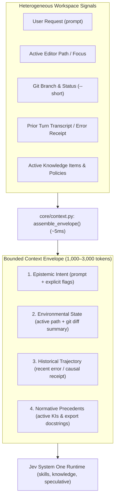
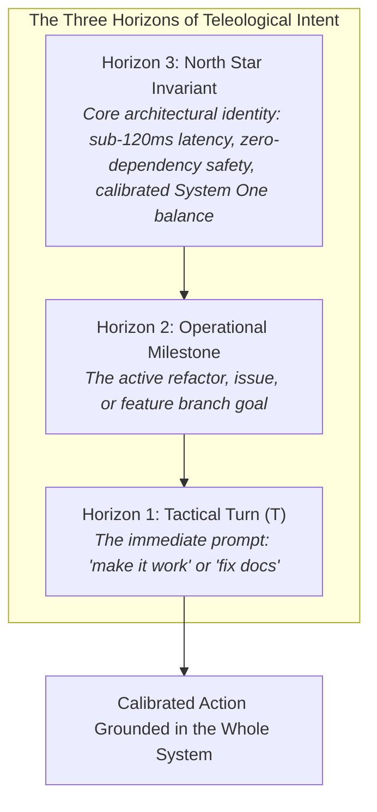

# RFC-26: Machine-Native Context Envelope & Multi-Modal State Assembly

> **Category**: `CORE`
> **Status**: Implemented
> **Target Lifecycle**: `PreInvocation` (`turn.before`) & `PreToolUse` (`tool.before`)
> **Harnesses**: Google Antigravity and OpenAI Codex
> **Implementation**: [`core/context.py`](../../src/jev/core/context.py) & [`runtime.py`](../../src/jev/runtime.py)
> **Related Protocol**: [System One Balance Protocol](../../.agents/protocols/system-one-balance-protocol.md)
> **Grounding Philosophy**: [The Philosophy of Jev](../PHILOSOPHY.md)

---

## 1. Problem

Autonomous coding agents frequently receive brief, continuation, or underspecified prompts from developers:
- *"Fix the bug"*
- *"Make it faster"*
- *"Run tests"*
- *"Refactor the auth handler"*

When agent hooks pass these bare prompt strings directly to decision models (e.g., skill routers, safety gates, or knowledge matchers), the evaluation suffers from **Context Starvation**:
1. **Low Decision Confidence**: Jev evaluates a 3-word prompt in a vacuum, yielding ambivalence ($P \approx 0.45 - 0.60$) where a decisive threshold ($\ge 0.80$) was needed.
2. **False Negative Skill Routing**: A developer asking *"fix the auth handler"* misses the `app-security` skill because the prompt lacked security keywords, even though the uncommitted diff touches JWT verification logic.
3. **The Inverse Trap (Context Flooding)**: Naive attempts to fix this dump 30,000+ tokens of raw bash logs and full repository file trees into the decision state, ballooning evaluation latency from 80ms to 4+ seconds.

---

## 2. Inspiration

In semiotics and functional linguistics (Ludwig Wittgenstein, M.A.K. Halliday), words have no inherent meaning in isolation: **meaning is situated in the context of the situation**.

In biological cognition, the brain does not interpret language in an acoustic void. Words are merged continuously with **proprioception** (body state, physical orientation), **environmental cues** (visual horizon, objects in hand), and **immediate memory** (last action performed).

Translating this to agent systems: Jev System One micro-decisions must evaluate **Context Envelopes**, not bare prompt strings.

---

## 3. Solution: The 4-Layer Context Envelope

RFC-26 introduces a lightweight, bounded **Context Envelope** assembled automatically before any System One decision is evaluated:



### The 4 Layers of the Context Envelope:
1. **Epistemic Intent**: The raw user request stripped of redundant IDE metadata.
2. **Environmental State**: The physical workspace reality: active file path, current git branch, and modified git status summary (bounded to 500 chars).
3. **Historical Trajectory**: The causal trigger of the current turn: the immediate prior error, failed test assertion, or tool receipt (bounded to 400 chars).
4. **Normative Precedents**: Relevant Knowledge Items and library signature stubs.

### Mitigating Local Myopia: The 3 Horizons of Intent

This architecture strikes at the central failure mode of agentic AI systems: **local myopia** (also called tactical fixation).

When an agent or hook evaluates state based only on the immediate user turn ($T$), it falls into the trap of steering by the dashboard instead of the compass. For example, when asked to update documentation for dual-harness support, an agent without a preserved North Star Goal could easily treat that tactical task as the overall project objective, losing sight of the core purpose: building a fast, deterministic, calibrated Jev System One helper.

To prevent getting lost in immediate steps, the context sent to Jev and downstream agents must represent **Three Horizons of Intent**:



---

## 4. Concrete Example & Impact

### Before: Context Starvation on Continuation Turns
1. Developer: *"Fix the broken test."*
2. Bare Prompt passed to Skill Dispatcher: `"Fix the broken test."`
3. Jev Result:
   - `skills.suggest` evaluates blind. No keyword matches `app-security`.
   - Confidence: `0.38`. Skill withheld.
   - Foundation model plans without domain guidelines and repeats deprecated API patterns.

### After: RFC-26 Context Envelope Assembly
1. Developer: *"Fix the broken test."*
2. Context Envelope assembled in 4.2ms:
   ```text
   Prompt: Fix the broken test.
   Active file: tests/test_token_refresh.py
   Branch: feature/jwt-renewal
   Uncommitted: M src/auth/jwt.py, M tests/test_token_refresh.py
   Recent error: AssertionError: token expired signature mismatch
   ```
3. Jev Result:
   - `skills.suggest` evaluates the enriched envelope in 88ms.
   - `app-security` confidence scores **0.93** (High confidence).
   - Knowledge Item `KI-04: JWT Renewal Invariants` auto-mounted on Turn 1.
4. Foundation model fixes the issue on Turn 1 without exploratory roundtrips.

---

## 5. Technical Specification & Implementation

### B. Data Contract (`ContextEnvelope`)

```python
@dataclass(frozen=True)
class ContextEnvelope:
    prompt: str
    project_goal: str = ""        # Horizon 3: Project North Star (auto-discovered)
    session_objective: str = ""   # Horizon 2: Milestone Objective (genesis prompt)
    active_path: str = ""         # Horizon 1: Physical environment
    git_branch: str = ""
    git_status_summary: str = ""
    prior_context: str = ""       # Horizon 1: Recent turn trajectory
    last_error: str = ""          # Horizon 1: Immediate causal trigger

    def to_semantic_string(self) -> str:
        """Renders high-signal state string for Jev System One questions (<= 4,000 chars)."""
        ...

    def to_telemetry(self) -> dict[str, Any]:
        """Returns compact, privacy-preserving context telemetry for SQLite auditing."""
        return {
            "has_project_goal": bool(self.project_goal),
            "has_session_objective": bool(self.session_objective),
            "has_error_anchor": bool(self.last_error),
            "has_git_status": bool(self.git_status_summary),
            "branch": self.git_branch,
            "active_file": Path(self.active_path).name if self.active_path else "",
            "semantic_prompt_chars": len(self.to_semantic_string()),
        }
```

### C. Automated Discovery & Zero-Friction Cascades

1. **Horizon 3 (Project North Star)**:
   - Evaluates a cascading fallback across common industry conventions:
     - Dedicated project files in root, `docs/`, `.agents/`, or `.github/`: `GOAL.md`, `PRD.md`, `VISION.md`, `PROJECT.md`, `docs/GOAL.md`, `docs/PRD.md`, `docs/VISION.md`, `.agents/GOAL.md`.
     - Harness rule files: `GEMINI.md` or `AGENTS.md` (persona / mission line).
     - Standard package manifests: `pyproject.toml` (`[project].description`) or `package.json` (`description`).
     - Standard documentation: `README.md` intro line following `#`.
     - Fallback: Workspace directory name.
   - Requires zero user configuration, zero mandatory PRD files, and executes in $< 0.5\text{ms}$.
2. **Horizon 2 (Session Objective)**:
   - Scans the session transcript from genesis for the initial `USER_INPUT` that created the trajectory.
   - Retains the overarching mission across 20+ turns, completely eliminating conversation amnesia and tactical drift during terse follow-ups.

### D. Comparative Evaluation & Edge Cases

| Scenario / Edge Case | Legacy Payload Sent to Jev | Legacy Decision Outcome | Teleological Context Envelope Sent | Teleological Decision Outcome |
| :--- | :--- | :--- | :--- | :--- |
| **Terse follow-up**<br/>`"audit it"` | `{"request": "audit it"}` | Weak/Ambivalent match ($P \approx 0.40$). Ambiguous target. | `Active Objective: Audit semantic rules...` + `Active file: context.py` | **High confidence ($\ge 0.85$)** routed to `lint-architect` & `context-architect`. |
| **Compiler / Test Failure**<br/>`"fix the failure"` | `{"request": "fix the failure"}` | No match ($P = 0.00$). Total context starvation. | `Recent error: ValueError: Duplicate...` + `Active file: semantic_lint.py` | **Confidence 0.88**. Immediately targets root error without roundtrips. |
| **Tactical Follow-up**<br/>`"update docs"` | `{"request": "update docs"}` | Tactical Fixation: Treats docs as isolated whole project. | `Project: Jev hook architecture` + `Active Objective: Dual-harness runtime` | Calibrated: Treats documentation as supporting runtime implementation. |

### E. Assembly Latency, Privacy, and Audit Persistence

1. **Sub-5ms Assembly Budget**: Pure local filesystem, regex, and `git status --short` with `timeout=0.15`. Zero network calls, zero LLM calls during envelope assembly.
2. **Strict Bounded Size**: The rendered semantic string is capped at 4,000 characters (~1,000 tokens), preventing context bloat.
3. **Deterministic Secret Redaction**: All paths, prompts, and status lines pass through `redact()` before entering evaluation payloads.
4. **Lightweight Audit Telemetry**: SQLite audit logs persist compact context telemetry (`has_project_goal`, `has_session_objective`, `has_error_anchor`, `semantic_prompt_chars`) inside `events.details`, enabling offline model calibration and telemetry without storing proprietary code or unredacted transcripts.
