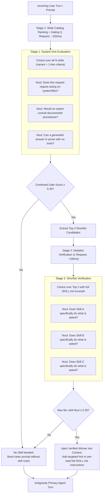

# Proposal B: Dynamic Skill Dispatcher & Progressive Loader

## 1. Problem Statement

Antigravity supports an extensible skills system:
- Global skills (`~/.gemini/config/skills/`, plugin skills)
- Workspace skills (`.agents/skills/`)
- Builtin skills (`agy-customizations`, `antigravity-guide`, etc.)

Currently, all available skills are advertised in the system prompt on every agent turn under `<skills>`:
```markdown
Available skills:
- agy-customizations (path): Comprehensive guide...
- antigravity-guide (path): Provides a comprehensive guide...
- ponytail (path): Switch ponytail intensity level...
- ponytail-audit (path): Audit the whole repo for over-engineering...
...
```

### The Scaling Bottleneck
1. **Context Waste**: As an ecosystem grows to 50–200 skills, listing them all consumes 5,000–20,000 prompt tokens on every single turn.
2. **Loss of Discrimination**: Truncating skill descriptions to fit token budgets causes the LLM to choose lookalike skills incorrectly (empirical error rate ~16.8%).
3. **Needless Activations**: When a task requires no skill (e.g., standard coding or basic queries), having a long skill list encourages the LLM to guess and load a skill anyway (~9.8% false positive rate).

---

## 2. Core Idea: Two-Stage Progressive Disclosure via Jev

Inspired by the TypeSafe [Skill Suggestion Cookbook](https://docs.typesafe.ai/cookbooks/skill_suggestion.md), we replace static, all-at-once skill prompt dumping with a **fast, progressive 2-stage gating pipeline**:



---

## 3. How It Works in Detail

### Stage 1: Wide Ranking + Intent Gating
In a single fast Jev call (~150ms):
1. **Wide `Choice` Question**:
   - `instructions`: *"Which of these skills, if any, is the right one to load to help with the user's latest request?"*
   - `criteria`: A dictionary mapping all skill names to their 1-line descriptions.
2. **Three Intent Gating `Noul` Questions**:
   - `acts_on_system`: *"Is the assistant being asked to act on the user's files, accounts, or services, rather than only explain?"*
   - `documented_procedure`: *"Would a careful expert consult a specific documented procedure or tool-specific commands?"*
   - `prose_suffices` (inverted): *"Could a knowledgeable generalist satisfy this in prose with no tools or specialized guides?"*

If the average gate score is $< 0.30$, the pipeline halts immediately: **no skill is loaded, saving the agent from needless lookups.**

### Stage 2: Deep Shortlist Verification
If the gate passes:
- Take the top 3 skills from the Stage 1 `Choice` probabilities.
- Read their full `SKILL.md` frontmatter and initial instruction body (up to 700 characters each).
- Send Stage 2 request to Jev:
  - A `Choice` question over the 3 candidates with their detailed bodies.
  - One absolute `Noul` question per candidate: `fits::<skill_name>`.
- If the best candidate's fit is $\ge 0.30$, that skill is selected as the winner.

---

## 4. Antigravity Integration Modes

### Mode 1: Context Injection (Soft Suggestion)
Inject a dynamic block into the prompt before the user request:
```markdown
<skill_relevance>
Relevant to the current request: ponytail-audit. Ignore this if it does not fit what the user actually asked for.
</skill_relevance>
```
The agent maintains full autonomy, but its attention is immediately directed to the correct skill.

### Mode 2: Zero-Roster Pre-Loading (Hard Optimization)
- Completely remove the static `<skills>` block containing 50+ skill summaries from the system prompt.
- When Jev selects a skill with `confidence > 0.85`, the harness **automatically reads and injects that skill's full instructions into the system prompt for that turn only**.
- When no skill is selected, **0 skill tokens are sent to the LLM**, maximizing context space for project files and reasoning.

---

## 5. Performance Benchmarks & Impact

Based on the Hermes Agent 182-skill benchmark:

| Metric | Without Jev (Standard LLM) | With Jev Progressive Dispatcher | Relative Improvement |
| :--- | :--- | :--- | :--- |
| **Wrong Skill Loaded** | 16.8% | **7.3%** | **2.3x fewer errors** |
| **Needless Skill Loaded** | 9.8% | **4.0%** | **2.5x fewer false positives** |
| **Prompt Overhead** | 10k–30k tokens every turn | **0 to 1k tokens** (only when relevant) | **90%+ token reduction** |
| **Latency Added** | N/A | **150ms–250ms total** | Negligible compared to 3-10s LLM turn |
