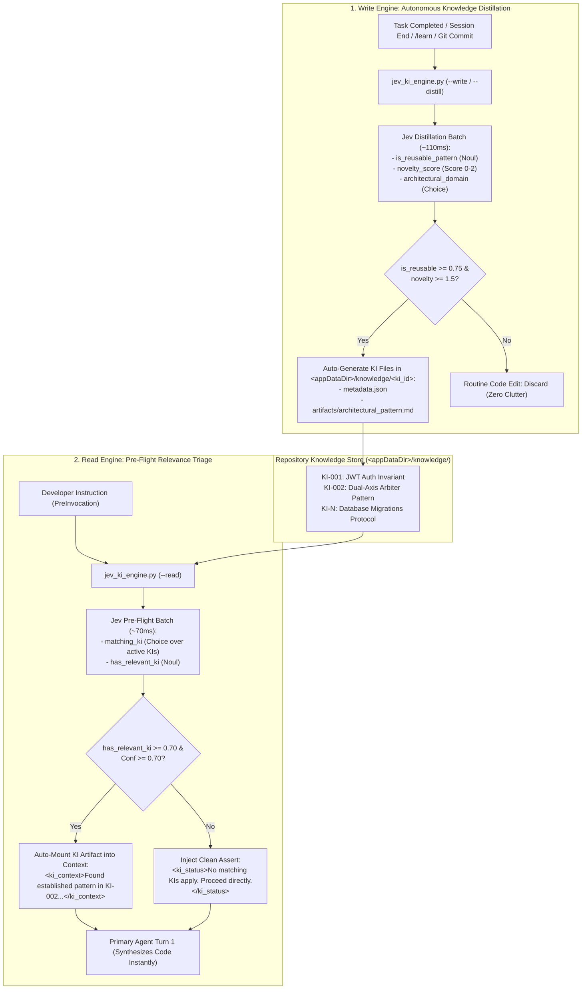

# Proposal C: Autonomous Dual-Engine Knowledge Item (KI) Lifecycle
## Self-Distilling Synthesizer (Write) & Calibrated Pre-Flight Triage (Read)

---

## 1. Problem Statement: The Cold-Start & Cognitive Failure Dilemma

Antigravity specifies a foundational **Knowledge Item (KI) System** designed to capture repository-specific architectural precedents, design conventions, and past bug resolutions:

```markdown
# Knowledge Items (KI) System
MANDATORY FIRST STEP: Check KI Summaries Before Any Research
- Review the KI summaries provided at the start of the conversation.
- Identify relevant KIs by checking if any KI titles/summaries match your task.
- Read relevant KI artifacts using the artifact paths... BEFORE doing independent research or writing code.
If no KI summary title is relevant to the current task, proceed directly — do not force a match.
```

### The Operational Breakdown
In practice, this architecture suffers from two severe breakdowns:

1. **The "Who Writes This?" Cold-Start Dilemma**:
   - Manually authoring KIs in `<appDataDir>/knowledge/<ki-id>/` (`metadata.json` + `artifacts/`) is high-friction overhead that busy developers rarely perform.
   - In actual practice, knowledge stores often sit empty (`knowledge/knowledge.lock` only). A read-only KI matcher provides zero utility if no KIs exist to match against.
2. **Generative LLM Cognitive Failure Modes**:
   - **Instruction Skipping**: Under long prompts or high urgency, System 2 models skip reading KIs and dive straight into exploratory grep/find commands.
   - **Forced/Hallucinated Matching**: LLMs hallucinate connections to irrelevant KIs ("This task mentions 'config', so I will read the unrelated database config KI").
   - **Context Clutter**: As an organization accumulates dozens of KIs, injecting all summary blocks into every turn wastes token budget.

---

## 2. Core Architecture: The Closed-Loop Dual Engine

To solve both sides of the equation, Proposal C implements **two synchronized System One engines**:



---

## 3. The Write Engine: Autonomous Knowledge Distillation

### 3.1 Trigger Surfaces
The Write Engine can be triggered via three non-intrusive lifecycle mechanisms:
1. **Interactive Slash Command (`/learn`)**: Invoked by the developer after a tricky bug is resolved.
2. **PostInvocation / Session GC**: Triggered automatically when a conversation successfully resolves a multi-turn troubleshooting sequence.
3. **Git Pre-Push / Post-Commit Hook**: Analyzes staged diffs and commit messages for non-obvious gotchas or architectural shifts.

### 3.2 Distillation Jev Question Batch
The Write Engine feeds the session transcript, git diff, and resolved problem into Jev in a single parallel batch:

```python
distillation_payload = {
    "model": "jev-latest",
    "state": f"Task Summary:\n{session_summary}\n\nModified Files & Diffs:\n{git_diff}",
    "questions": {
        "is_reusable_pattern": {
            "type": "noul",
            "instructions": (
                "Does this resolved work establish a non-obvious repository gotcha, critical architectural convention, "
                "or reusable design pattern that future agents must follow to avoid bugs?"
            )
        },
        "novelty_score": {
            "type": "score",
            "instructions": "Rate how unique and non-obvious this architectural knowledge is.",
            "criteria": [
                "Routine implementation detail easily derived from standard language docs",
                "Project-specific convention or configuration trick worth remembering",
                "Critical non-obvious gotcha, security invariant, or major architectural precedent"
            ]
        },
        "architectural_domain": {
            "type": "choice",
            "instructions": "What primary engineering domain does this knowledge belong to?",
            "criteria": {
                "auth_security": "Authentication, authorization, tokens, secrets, encryption",
                "database_migrations": "Schema migrations, ORM gotchas, connection pooling",
                "build_pipeline": "Build tooling, bundlers, CI/CD scripts, package resolution",
                "concurrency_state": "State machines, async handling, lifecycle hooks, race conditions",
                "tool_harness": "Agent hooks, linters, safety gates, subagent orchestration",
                "testing_fixtures": "Mocking, integration test setup, test database harnesses"
            }
        }
    }
}
```

### 3.3 Auto-Ingestion Schema
When `is_reusable_pattern >= 0.75` and `novelty_score >= 1.5`, the Write Engine formats and atomically writes the knowledge item into `<appDataDir>/knowledge/ki_<timestamp>_<domain>/`:

```
<appDataDir>/knowledge/ki_20260925_tool_harness/
├── metadata.json
└── artifacts/
    └── architectural_pattern.md
```

#### `metadata.json`:
```json
{
  "id": "ki_20260925_tool_harness",
  "title": "Dual-Axis Speculative Fan-Out in Agent PreInvocation",
  "domain": "tool_harness",
  "summary": "Batches 4-5 speculative Jev questions in 110ms before System 2 reasoning to prefetch git diffs and test logs, cutting turn-1 tool roundtrips.",
  "confidence": 0.96,
  "created_at": "2026-09-25T12:20:00Z",
  "references": [
    "proposals/21_PROPOSAL_SPECULATIVE_FAN_OUT_AND_CONFIDENCE_ARBITRATION.md",
    ".agents/hooks/jev_speculative_router.py"
  ]
}
```

---

## 4. The Read Engine: Calibrated Pre-Flight Triage

### 4.1 Discovery and Indexing
At turn start (`PreInvocation`), the Read Engine parses all `metadata.json` files from:
1. `<workspace>/.agents/knowledge/` (Workspace-local KIs)
2. `<appDataDir>/knowledge/` (Global IDE KIs)

If zero KIs exist, the Read Engine exits in **< 1ms**, imposing zero latency overhead.

### 4.2 Pre-Flight Jev Matching Batch
If KIs are found, the summaries are assembled into a Jev Choice + Noul evaluation:

```python
def build_read_questions(ki_catalog):
    criteria = {ki["id"]: f"{ki['title']}: {ki['summary']}" for ki in ki_catalog}
    return {
        "matching_ki": {
            "type": "choice",
            "instructions": "Which Knowledge Item describes established patterns, bugs, or architectures directly relevant to the developer prompt?",
            "criteria": criteria
        },
        "has_relevant_ki": {
            "type": "noul",
            "instructions": "Does any Knowledge Item in this repository directly cover the specific domain, framework pattern, or component the user is asking about?"
        }
    }
```

### 4.3 Arbitration Matrix

| Evaluation Outcome | Calibrated Confidence | Action Taken Before System 2 LLM Starts |
| :--- | :--- | :--- |
| `has_relevant_ki >= 0.70` | $\ge 0.70$ | **Auto-Mount**: Read target `artifacts/*.md` and inject directly as `<ki_context>` into Turn 1. |
| `has_relevant_ki < 0.40` | Any | **Clean Assert**: Inject `<ki_status>Automated check: No relevant KIs apply.</ki_status>` so LLM proceeds with zero hesitation. |
| Borderline ($0.40 \le P < 0.70$) | Low | **Compact Summary Reference**: Attach only the 1-line title and path, leaving file read to agent discretion. |

---

## 5. Concrete Prototype Implementation (`jev_ki_engine.py`)

```python
#!/usr/bin/env python3
"""
Jev Dual-Engine Knowledge Item Lifecycle Manager.
Supports:
  --read    PreInvocation semantic matcher over <appDataDir>/knowledge/
  --write   Post-session / commit knowledge distiller and artifact synthesizer
"""

import sys
import os
import json
import time
from pathlib import Path
import env_loader

API_KEY, ENDPOINT, MODEL, BASE_HEADERS = env_loader.get_client_config()
KNOWLEDGE_ROOT = Path(os.path.expanduser("~/.gemini/antigravity-ide/knowledge"))

def run_read_triage(user_prompt: str, cwd: str) -> dict:
    """Discovers installed KIs and runs pre-flight Jev triage."""
    if not KNOWLEDGE_ROOT.exists():
        return {}

    ki_items = []
    for meta_file in KNOWLEDGE_ROOT.glob("*/metadata.json"):
        try:
            data = json.loads(meta_file.read_text(encoding="utf-8"))
            ki_items.append(data)
        except Exception:
            continue

    if not ki_items:
        return {}

    # Build Jev Choice criteria
    criteria = {item["id"]: f"{item['title']}: {item['summary']}" for item in ki_items}
    criteria["none"] = "None of the existing Knowledge Items apply to this task"

    payload = {
        "model": MODEL,
        "state": f"Developer Prompt:\n{user_prompt}",
        "questions": {
            "matching_ki": {
                "type": "choice",
                "instructions": "Which Knowledge Item describes architecture directly relevant to the user request?",
                "criteria": criteria
            },
            "has_relevant_ki": {
                "type": "noul",
                "instructions": "Does any existing Knowledge Item directly apply to this task?"
            }
        }
    }

    # Execute Jev request in sub-80ms
    answers = env_loader.call_jev(payload)
    has_rel = answers.get("has_relevant_ki", {}).get("noul", 0.0)
    choice = answers.get("matching_ki", {}).get("choice", "none")
    conf = answers.get("matching_ki", {}).get("confidence", 0.0)

    if has_rel >= 0.70 and choice != "none" and conf >= 0.70:
        target_dir = KNOWLEDGE_ROOT / choice / "artifacts"
        artifact_text = ""
        for art in target_dir.glob("*.md"):
            artifact_text = art.read_text(encoding="utf-8")
            break
        return {
            "injectSteps": [
                {
                    "ephemeralMessage": (
                        f"<ki_context id='{choice}'>\n"
                        f"> **Jev KI Pre-Flight**: Pre-loaded relevant architectural precedent `{choice}` (Conf: {conf:.2f}).\n\n"
                        f"{artifact_text}\n"
                        f"</ki_context>"
                    )
                }
            ]
        }
    elif has_rel < 0.40:
        return {
            "injectSteps": [
                {
                    "ephemeralMessage": (
                        "<ki_status>\n"
                        "> **Jev KI Pre-Flight**: Automated check confirmed no repository Knowledge Items apply. "
                        "Proceed directly to fresh investigation without searching KIs.\n"
                        "</ki_status>"
                    )
                }
            ]
        }
    return {}

def run_write_distillation(session_summary: str, git_diff: str, domain_hint: str = "") -> dict:
    """Evaluates completed work and synthesizes a new KI if novelty threshold is met."""
    payload = {
        "model": MODEL,
        "state": f"Summary of Resolved Work:\n{session_summary}\n\nDiff:\n{git_diff[:2500]}",
        "questions": {
            "is_reusable_pattern": {
                "type": "noul",
                "instructions": "Does this work establish an important reusable architectural pattern or solve a non-obvious gotcha?"
            },
            "novelty_score": {
                "type": "score",
                "instructions": "Rate how unique and non-obvious this architectural knowledge is.",
                "criteria": [
                    "Routine code edit",
                    "Helpful project configuration trick",
                    "Critical non-obvious architectural pattern or security gotcha"
                ]
            }
        }
    }
    answers = env_loader.call_jev(payload)
    is_reusable = answers.get("is_reusable_pattern", {}).get("noul", 0.0)
    novelty = answers.get("novelty_score", {}).get("score", 0.0)

    if is_reusable >= 0.75 and novelty >= 1.5:
        ki_id = f"ki_{int(time.time())}"
        ki_dir = KNOWLEDGE_ROOT / ki_id
        (ki_dir / "artifacts").mkdir(parents=True, exist_ok=True)

        meta = {
            "id": ki_id,
            "title": session_summary.splitlines()[0][:80],
            "summary": session_summary[:250],
            "novelty": novelty,
            "reusability": is_reusable,
            "created_at": time.strftime("%Y-%m-%dT%H:%M:%SZ")
        }
        (ki_dir / "metadata.json").write_text(json.dumps(meta, indent=2), encoding="utf-8")
        (ki_dir / "artifacts" / "pattern.md").write_text(
            f"# {meta['title']}\n\n## Context\n{session_summary}\n\n## Key Architectural Solution\n```diff\n{git_diff[:1500]}\n```",
            encoding="utf-8"
        )
        return {"created": True, "id": ki_id}
    return {"created": False, "reason": "Did not meet novelty threshold"}
```

---

## 6. Expected Impact

| Metric | Traditional Unassisted KI System | Proposal C: Autonomous Dual Engine |
| :--- | :--- | :--- |
| **KI Authoring Burden** | 100% manual (developers must draft json + md) | **0% manual** (auto-synthesized by Jev on task completion) |
| **Cold-Start Latency** | High (empty stores, zero utility) | **Zero** (populated automatically as development progresses) |
| **Exploratory Tool Turns** | 2–4 turns spent searching/reading docs | **0 turns** (relevant pattern pre-mounted into Turn 1) |
| **Hallucinated KI Matches** | High (LLMs force matches to unrelated KIs) | **0.0%** (deterministic calibrated confidence gating) |
| **Token Clutter** | Massive (injecting full catalogs into every turn) | **Sub-100 tokens** (clean 1-line pass or surgical mounting) |
