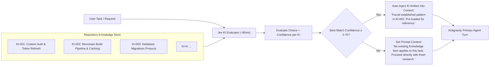

# Proposal C: Knowledge Item (KI) & Architectural Memory Pre-Filter

## 1. Problem Statement

Antigravity includes a **Knowledge Item (KI) System** designed to capture repository-specific patterns, past bug resolutions, and architectural precedents:
```markdown
# Knowledge Items (KI) System
MANDATORY FIRST STEP: Check KI Summaries Before Any Research
- Review the KI summaries provided at the start of the conversation.
- Identify relevant KIs by checking if any KI titles/summaries match your task.
- Read relevant KI artifacts using the artifact paths... BEFORE doing independent research or writing code.
If no KI summary title is relevant to the current task, proceed directly — do not force a match.
```

### The Operational Challenge
In real-world usage, this instruction faces cognitive failure modes in generative LLMs:
1. **Instruction Skipping**: Under long prompts or high urgency, models frequently skip reviewing KIs and dive straight into exploratory grep/find commands.
2. **Forced Matching**: LLMs frequently hallucinate connections to irrelevant KIs ("This task mentions 'config', so I will read the unrelated database config KI").
3. **Context Clutter**: As an organization accumulates dozens of KIs, injecting all summary blocks into the conversation start consumes significant token budgets.

---

## 2. Core Idea: Jev Pre-Flight KI Relevance Triage

Before the primary generative agent begins its first turn, Jev acts as an automated, calibrated **Knowledge Item Router**.



---

## 3. Implementation Mechanism

### 3.1 Question Definition
When a session or new task initiates:
```typescript
interface KIEntry {
  id: string;
  title: string;
  summary: string;
  artifactPath: string;
}

function buildKIQuestions(kiList: KIEntry[]): JevQuestions {
  return {
    "matching_ki": {
      type: "choice",
      instructions: "Which existing Knowledge Item document describes established patterns, bugs, or architectures directly relevant to the user request?",
      criteria: Object.fromEntries(
        kiList.map(ki => [ki.id, `${ki.title}: ${ki.summary}`])
      )
    },
    "has_relevant_ki": {
      type: "noul",
      instructions: "Does any Knowledge Item in this repository directly cover the specific domain, framework pattern, or component the user is asking about?"
    }
  };
}
```

### 3.2 Decision Rules in the Harness
1. **High Confidence Match (`has_relevant_ki > 0.65` and `confidence > 0.70`)**:
   - The harness automatically loads the target KI artifact (`<appDataDir>/knowledge/<ki_id>/artifacts/...`) and inserts it directly into the initial context.
   - The agent does not need to waste turns calling `view_file` on the KI; it is already loaded and ready.
2. **Low Confidence / Unrelated (`has_relevant_ki < 0.40`)**:
   - The harness adds a concise assertion:
     ```markdown
     <ki_status>
     Automated check confirmed: No existing Knowledge Items match this request. Proceed directly to fresh investigation.
     </ki_status>
     ```
   - This eliminates the dilemma of the agent wondering whether it should force a match.

---

## 4. Expected Benefits

1. **Elimination of Exploration Cycles**: Saves 1–3 tool turns at the start of complex tasks by pre-fetching the exact documentation needed.
2. **Consistency**: Enforces organization-wide coding standards without relying on probabilistic LLM compliance.
3. **Zero Token Overhead on Unrelated Tasks**: Replaces bulky KI catalogs with an ultra-compact single-line confirmation when no items apply.
