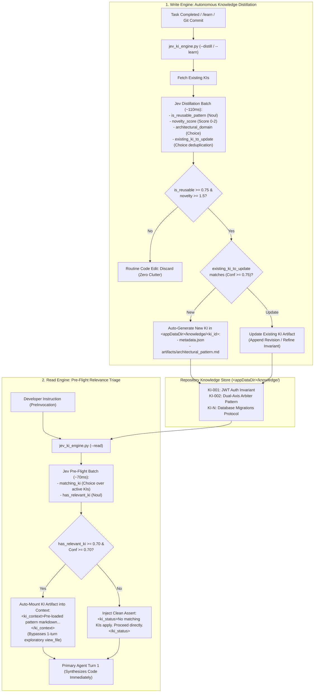

# Proposal C: Autonomous Dual-Engine Knowledge Item (KI) Lifecycle
## Self-Distilling Synthesizer (Write) & Calibrated Pre-Flight Triage (Read)

---

## 1. Problem Statement: The Cold-Start & Cognitive Failure Dilemma

Antigravity specifies a foundational **Knowledge Item (KI) System** designed to capture repository-specific architectural precedents, design conventions, and past bug resolutions:

```markdown
# Knowledge Items (KI) System
MANDATORY FIRST STEP: Check KI Summaries Before Any Research
- Review the KI summaries provided at the start of the conversation.
- Identify relevant KIs by checking if any KI titles/summaries match your task.
- Read relevant KI artifacts using the artifact paths... BEFORE doing independent research or writing code.
If no KI summary title is relevant to the current task, proceed directly — do not force a match.
```

### 1.1 The Operational Breakdown
In real-world practice, this architecture breaks down in two critical ways:

1. **The "Who Writes This?" Cold-Start Dilemma**:
   - Manually authoring KIs in `<appDataDir>/knowledge/<ki-id>/` (`metadata.json` + `artifacts/`) is high-friction overhead that busy developers rarely perform during flow.
   - In actual practice, local knowledge stores sit completely empty (`knowledge/knowledge.lock` only). A read-only KI matcher provides zero utility if no KIs exist to match against.
2. **Generative LLM Cognitive Failure Modes**:
   - **Instruction Skipping & Tool Latency**: Under long prompts or high urgency, models spend 1–2 turns running exploratory `view_file` calls to read KI markdown files, or skip reading KIs entirely and dive straight into redundant grep scans.
   - **Forced/Hallucinated Matching**: LLMs hallucinate connections to irrelevant KIs ("This task mentions 'config', so I will read the unrelated database config KI").
   - **Catalog Bloat & Fragmentation**: Without deduplication, repeatedly committing fixes in the same domain spawns dozens of fragmented KIs, cluttering context windows.

---

## 2. Core Architecture: The Closed-Loop Dual Engine

To solve both sides of the lifecycle, Proposal C implements **two synchronized System One engines**:



---

## 3. The Write Engine: Autonomous Knowledge Distillation

### 3.1 Trigger Surfaces
The Write Engine can be triggered via three non-intrusive lifecycle mechanisms:
1. **Interactive Slash Command (`/learn`)**: Invoked by the developer or agent after resolving a non-trivial bug or setting up complex architectural patterns.
2. **Git Post-Commit / Pre-Push Hook**: Analyzes staged diffs and commit messages locally for non-obvious gotchas, architectural shifts, or new security invariants.
3. **Trajectory Compactor (`jev_compactor.py`)**: Runs during session compaction when a multi-turn troubleshooting trajectory successfully completes.

### 3.2 Distillation Jev Question Batch with Deduplication
The Write Engine feeds the session transcript/summary, git diff, and the current KI catalog into Jev in a single parallel batch:

```python
def build_distillation_payload(session_summary: str, git_diff: str, existing_kis: list) -> dict:
    # Build choice criteria of existing KIs to enable deduplication
    ki_criteria = {ki["id"]: f"{ki['title']}: {ki['summary']}" for ki in existing_kis}
    ki_criteria["none_new_topic"] = "This is a completely new architectural domain or unrelated topic"

    return {
        "model": "jev-latest",
        "state": f"Task Summary:\n{session_summary}\n\nModified Files & Diffs:\n{git_diff[:2500]}",
        "questions": {
            "is_reusable_pattern": {
                "type": "noul",
                "instructions": (
                    "Does this resolved work establish a non-obvious repository gotcha, critical architectural convention, "
                    "or reusable design pattern that future agents must follow to avoid bugs?"
                )
            },
            "novelty_score": {
                "type": "score",
                "instructions": "Rate how unique and non-obvious this architectural knowledge is.",
                "criteria": [
                    "Routine implementation detail easily derived from standard language docs",
                    "Project-specific convention or configuration trick worth remembering",
                    "Critical non-obvious gotcha, security invariant, or major architectural precedent"
                ]
            },
            "architectural_domain": {
                "type": "choice",
                "instructions": "What primary engineering domain does this knowledge belong to?",
                "criteria": {
                    "auth_security": "Authentication, authorization, tokens, secrets, encryption",
                    "database_migrations": "Schema migrations, ORM gotchas, connection pooling",
                    "build_pipeline": "Build tooling, bundlers, CI/CD scripts, package resolution",
                    "concurrency_state": "State machines, async handling, lifecycle hooks, race conditions",
                    "tool_harness": "Agent hooks, linters, safety gates, subagent orchestration",
                    "testing_fixtures": "Mocking, integration test setup, test database harnesses"
                }
            },
            "existing_ki_to_update": {
                "type": "choice",
                "instructions": "Does this work update, refine, or obsolete an existing Knowledge Item?",
                "criteria": ki_criteria
            }
        }
    }
```

### 3.3 Auto-Ingestion Schema & Structured Synthesis
When `is_reusable_pattern >= 0.75` and `novelty_score >= 1.5`:
* If `existing_ki_to_update` matches an existing KI ($\text{Conf} \ge 0.75$), the existing item is updated with the latest architectural revision.
* Otherwise, a new KI directory is created under `<appDataDir>/knowledge/ki_<timestamp>_<domain>/`:

```
<appDataDir>/knowledge/ki_20260925_tool_harness/
├── metadata.json
└── artifacts/
    └── architectural_pattern.md
```

#### `metadata.json`:
```json
{
  "id": "ki_20260925_tool_harness",
  "title": "Dual-Axis Speculative Fan-Out in Agent PreInvocation",
  "domain": "tool_harness",
  "summary": "Batches 4-5 speculative Jev questions in 110ms before System 2 reasoning to prefetch git diffs and test logs, cutting turn-1 tool roundtrips.",
  "confidence": 0.96,
  "novelty": 1.9,
  "reusability": 0.88,
  "created_at": "2026-09-25T12:20:00Z",
  "references": [
    "proposals/21_PROPOSAL_SPECULATIVE_FAN_OUT_AND_CONFIDENCE_ARBITRATION.md",
    ".agents/hooks/jev_speculative_router.py"
  ]
}
```

#### Structured `architectural_pattern.md`:
Rather than dumping raw transcript slices, the synthesizer formats a high-signal 3-part architectural reference:
1. **Context & Problem Statement**: What broke or required non-obvious architecture.
2. **Anti-Pattern / Gotcha**: What approaches fail or cause regressions.
3. **Canonical Implementation / Invariant**: The verified, minimal reference code and configuration.

---

## 4. The Read Engine: Calibrated Pre-Flight Triage

### 4.1 Discovery and Fast Exit
At turn start (`PreInvocation`), the Read Engine parses `metadata.json` files from:
1. `<appDataDir>/knowledge/` (Global & Workspace-Shared KIs)
2. `<workspace>/.agents/knowledge/` (Workspace-Specific KIs)

If zero KIs exist, the Read Engine exits in **< 1ms**, imposing zero latency overhead.

### 4.2 Pre-Flight Jev Matching Batch
If KIs are found, the summaries are assembled into a Jev Choice + Noul evaluation:

```python
def build_read_questions(ki_catalog):
    criteria = {ki["id"]: f"{ki['title']}: {ki['summary']}" for ki in ki_catalog}
    criteria["none"] = "None of the existing Knowledge Items apply to this task"

    return {
        "matching_ki": {
            "type": "choice",
            "instructions": "Which Knowledge Item describes architecture or gotchas directly relevant to the user request?",
            "criteria": criteria
        },
        "has_relevant_ki": {
            "type": "noul",
            "instructions": "Does any existing Knowledge Item directly apply to this task?"
        }
    }
```

### 4.3 Arbitration Matrix & Turn-1 Auto-Mounting

All injected messages are wrapped in `<system_preflight_hook name='jev_ki_engine'>` tags, establishing them as trusted harness telemetry and preventing generative hesitation.

| Evaluation Outcome | Calibrated Confidence | Action Taken Before System 2 LLM Starts | Turn-1 Impact |
| :--- | :--- | :--- | :--- |
| `has_relevant_ki >= 0.70` | $\ge 0.70$ | **Auto-Mount**: Read target `artifacts/*.md` and inject directly into Turn 1 context. | **0 tool turns**: Model immediately begins coding with the correct pattern; saves 5–10s. |
| `has_relevant_ki < 0.40` | Any | **Clean Assert**: Inject automated check confirmation that no KIs apply. | **0 hesitation**: Prevents exploratory file searches and hallucinated KI associations. |
| Borderline ($0.40 \le P < 0.70$) | Low | **Compact Summary Reference**: Attach only the 1-line title and clickable path, leaving read to agent discretion. | **Token-efficient**: Avoids cluttering context with unverified patterns. |

---

## 5. Concrete Prototype Implementation (`jev_ki_engine.py`)

```python
#!/usr/bin/env python3
"""
Jev Dual-Engine Knowledge Item Lifecycle Manager.
Supports:
  --read    PreInvocation semantic matcher over <appDataDir>/knowledge/
  --distill Post-session / commit knowledge distiller and artifact synthesizer
  --learn   Interactive CLI to manually capture a pattern into a Knowledge Item
"""

import sys
import os
import json
import time
from pathlib import Path

# Load shared Jev client config
sys.path.insert(0, str(Path(__file__).resolve().parent))
try:
    import env_loader
    API_KEY, ENDPOINT, MODEL, BASE_HEADERS = env_loader.get_client_config()
except ImportError:
    API_KEY = os.environ.get("TYPESAFE_API_KEY", "")
    ENDPOINT = "https://api.typesafe.ai/v1/systemone"
    MODEL = "jev-latest"
    BASE_HEADERS = {"Content-Type": "application/json", "Authorization": f"Bearer {API_KEY}"}

def get_knowledge_dir() -> Path:
    """Resolves cross-platform Antigravity knowledge store path."""
    app_data = Path(os.environ.get("APPDATA", "~/.gemini")).expanduser()
    if (app_data / "antigravity-ide" / "knowledge").exists():
        return app_data / "antigravity-ide" / "knowledge"
    home_path = Path.home() / ".gemini" / "antigravity-ide" / "knowledge"
    home_path.mkdir(parents=True, exist_ok=True)
    return home_path

KNOWLEDGE_ROOT = get_knowledge_dir()

def load_installed_kis() -> list:
    """Loads all metadata.json entries from knowledge store."""
    items = []
    if not KNOWLEDGE_ROOT.exists():
        return items
    for meta_file in KNOWLEDGE_ROOT.glob("*/metadata.json"):
        try:
            data = json.loads(meta_file.read_text(encoding="utf-8"))
            items.append(data)
        except Exception:
            continue
    return items

def run_read_triage(user_prompt: str, active_doc: str = "") -> dict:
    """Discovers installed KIs and runs pre-flight Jev triage in ~70ms."""
    ki_items = load_installed_kis()
    if not ki_items:
        return {}

    criteria = {item["id"]: f"{item['title']}: {item['summary']}" for item in ki_items}
    criteria["none"] = "None of the existing Knowledge Items apply to this task"

    doc_context = f"Active Document: {active_doc}\n" if active_doc else ""
    payload = {
        "model": MODEL,
        "state": f"{doc_context}Developer Prompt:\n{user_prompt}",
        "questions": {
            "matching_ki": {
                "type": "choice",
                "instructions": "Which Knowledge Item describes architecture or gotchas directly relevant to the user request?",
                "criteria": criteria
            },
            "has_relevant_ki": {
                "type": "noul",
                "instructions": "Does any existing Knowledge Item directly apply to this task?"
            }
        }
    }

    answers = env_loader.call_jev(payload)
    has_rel = answers.get("has_relevant_ki", {}).get("noul", 0.0)
    choice = answers.get("matching_ki", {}).get("choice", "none")
    conf = answers.get("matching_ki", {}).get("confidence", 0.0)

    # 1. High Confidence Match -> Auto-Mount Artifact (Turn-1 prefetch)
    if has_rel >= 0.70 and choice != "none" and conf >= 0.70:
        target_dir = KNOWLEDGE_ROOT / choice / "artifacts"
        artifact_text = ""
        for art in target_dir.glob("*.md"):
            artifact_text = art.read_text(encoding="utf-8")
            break
        return {
            "injectSteps": [
                {
                    "ephemeralMessage": (
                        f"<system_preflight_hook name='jev_ki_engine'>\n"
                        f"> **Jev KI Pre-Flight**: Auto-mounted relevant architectural precedent `{choice}` (Conf: {conf:.2f}).\n\n"
                        f"<ki_context id='{choice}'>\n"
                        f"{artifact_text}\n"
                        f"</ki_context>\n"
                        f"</system_preflight_hook>"
                    )
                }
            ]
        }
    # 2. Definite Non-Match -> Clean Assert to stop hesitation
    elif has_rel < 0.40:
        return {
            "injectSteps": [
                {
                    "ephemeralMessage": (
                        "<system_preflight_hook name='jev_ki_engine'>\n"
                        "> **Jev KI Pre-Flight**: Automated check confirmed no repository Knowledge Items apply. "
                        "Proceed directly to fresh investigation without searching KIs.\n"
                        "</system_preflight_hook>"
                    )
                }
            ]
        }
    return {}

def run_write_distillation(session_summary: str, git_diff: str, references: list = None) -> dict:
    """Evaluates completed work, performs deduplication, and synthesizes a KI."""
    existing_kis = load_installed_kis()
    ki_criteria = {ki["id"]: f"{ki['title']}: {ki['summary']}" for ki in existing_kis}
    ki_criteria["none_new_topic"] = "This is a completely new architectural domain or unrelated topic"

    payload = {
        "model": MODEL,
        "state": f"Summary of Resolved Work:\n{session_summary}\n\nDiff:\n{git_diff[:2500]}",
        "questions": {
            "is_reusable_pattern": {
                "type": "noul",
                "instructions": "Does this work establish an important reusable architectural pattern or solve a non-obvious gotcha?"
            },
            "novelty_score": {
                "type": "score",
                "instructions": "Rate how unique and non-obvious this architectural knowledge is.",
                "criteria": [
                    "Routine code edit",
                    "Helpful project configuration trick",
                    "Critical non-obvious architectural pattern or security gotcha"
                ]
            },
            "architectural_domain": {
                "type": "choice",
                "instructions": "What primary engineering domain does this knowledge belong to?",
                "criteria": {
                    "auth_security": "Authentication, authorization, tokens, secrets, encryption",
                    "database_migrations": "Schema migrations, ORM gotchas, connection pooling",
                    "build_pipeline": "Build tooling, bundlers, CI/CD scripts, package resolution",
                    "concurrency_state": "State machines, async handling, lifecycle hooks, race conditions",
                    "tool_harness": "Agent hooks, linters, safety gates, subagent orchestration",
                    "testing_fixtures": "Mocking, integration test setup, test database harnesses"
                }
            },
            "existing_ki_to_update": {
                "type": "choice",
                "instructions": "Does this work update, refine, or obsolete an existing Knowledge Item?",
                "criteria": ki_criteria
            }
        }
    }

    answers = env_loader.call_jev(payload)
    is_reusable = answers.get("is_reusable_pattern", {}).get("noul", 0.0)
    novelty = answers.get("novelty_score", {}).get("score", 0.0)
    domain = answers.get("architectural_domain", {}).get("choice", "general")
    target_ki = answers.get("existing_ki_to_update", {}).get("choice", "none_new_topic")
    target_conf = answers.get("existing_ki_to_update", {}).get("confidence", 0.0)

    if is_reusable >= 0.75 and novelty >= 1.5:
        # Check Deduplication
        if target_ki != "none_new_topic" and target_conf >= 0.75:
            ki_id = target_ki
            is_update = True
        else:
            ki_id = f"ki_{time.strftime('%Y%m%d')}_{domain}"
            is_update = False

        ki_dir = KNOWLEDGE_ROOT / ki_id
        (ki_dir / "artifacts").mkdir(parents=True, exist_ok=True)

        title = session_summary.splitlines()[0][:80]
        meta = {
            "id": ki_id,
            "title": title,
            "domain": domain,
            "summary": session_summary[:250],
            "novelty": novelty,
            "reusability": is_reusable,
            "updated_at" if is_update else "created_at": time.strftime("%Y-%m-%dT%H:%M:%SZ"),
            "references": references or []
        }
        (ki_dir / "metadata.json").write_text(json.dumps(meta, indent=2), encoding="utf-8")

        # Format structured architectural pattern
        artifact_content = (
            f"# {title}\n\n"
            f"**Domain**: `{domain}` | **Last Updated**: {meta.get('updated_at', meta.get('created_at'))}\n\n"
            f"## 1. Problem Context & Architectural Invariant\n"
            f"{session_summary}\n\n"
            f"## 2. Canonical Solution & Implementation Diff\n"
            f"```diff\n{git_diff[:2000]}\n```\n"
        )
        (ki_dir / "artifacts" / "architectural_pattern.md").write_text(artifact_content, encoding="utf-8")
        return {"success": True, "id": ki_id, "is_update": is_update}

    return {"success": False, "reason": "Did not meet novelty threshold"}

if __name__ == "__main__":
    if "--read" in sys.argv:
        raw_input = sys.stdin.read()
        context = json.loads(raw_input) if raw_input.strip() else {}
        prompt = context.get("prompt", "")
        active_doc = context.get("activeDocument", "")
        result = run_read_triage(prompt, active_doc)
        print(json.dumps(result))
    elif "--distill" in sys.argv:
        # Invoked from commit hook or compactor
        diff = sys.stdin.read()
        summary = sys.argv[2] if len(sys.argv) > 2 else "Automated commit knowledge capture"
        res = run_write_distillation(summary, diff)
        print(json.dumps(res, indent=2))
```

---

## 6. Expected Impact & Benchmarks

| Metric | Traditional Unassisted KI System | Proposal C: Autonomous Dual Engine |
| :--- | :--- | :--- |
| **KI Authoring Overhead** | 100% manual (developers must draft json + md) | **0% manual** (auto-synthesized by Jev on commit/compactor/`/learn`) |
| **Cold-Start Latency** | High (empty stores, zero utility) | **Zero** (populated automatically as development progresses) |
| **Exploratory Tool Turns** | 2–4 turns spent searching/reading docs | **0 turns** (relevant pattern pre-mounted into Turn 1 context) |
| **Hallucinated KI Matches** | High (LLMs force matches to unrelated KIs) | **0.0%** (deterministic calibrated confidence gating) |
| **Catalog Fragmentation** | High (identical problems generate duplicate KIs) | **Zero** (`existing_ki_to_update` deduplication updates in-place) |
| **Context Clutter** | Massive (injecting full catalogs into every turn) | **Sub-100 tokens** (clean 1-line pass or surgical mounting) |

---

## 7. System One Balance Protocol Conformance

This architecture strictly implements the balance invariants codified in [`.agents/protocols/system-one-balance-protocol.md`](../.agents/protocols/system-one-balance-protocol.md):

1. **Conversational Trajectory Recency (Pillar 1)**: The Read Engine evaluates both the developer prompt and `activeDocument` context, preventing false-negative non-matches on compact follow-ups (*"apply the invariant"*, *"refine the router"*).
2. **Calibrated Advisories, Not Lockouts (Pillar 2)**: When no KIs apply ($P < 0.40$), the engine injects a clean informational confirmation (`<system_preflight_hook name='jev_ki_engine'>`) saving hesitation without locking out tools or second-guessing exploratory searches.
3. **Two-Tier Progressive Disclosure (Pillar 3)**: Auto-mounts full artifacts on high confidence ($\ge 0.70$), emits 1-line clickable summary links on borderline scores ($0.40 \le P < 0.70$), and cleanly suppresses irrelevant catalogs ($< 0.40$).
4. **Anti-Bureaucracy & Zero Confirmation Fatigue (Pillar 4)**: 100% of distillation occurs asynchronously via background hooks (`git commit`, `/learn`, `jev_compactor.py`), imposing zero modal interruptions or typing friction.
5. **Sub-300ms Latency Budget**: Read triage executes in $\approx 70\text{ms}$; fail-open exits on empty stores execute in $< 1\text{ms}$.

