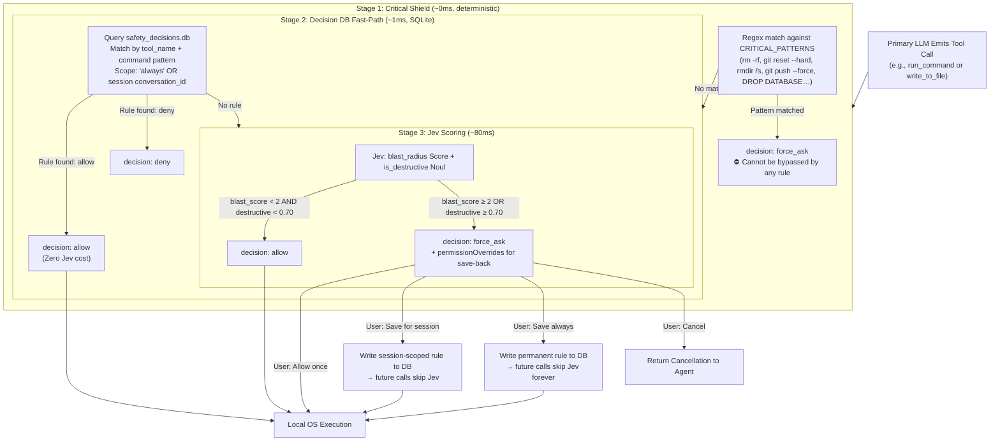

# Proposal D: Pre-Execution Safety Guardrail & Tool Disambiguation

## 1. Problem Statement

Antigravity gives the agent direct local execution access via `run_command` (`cmd /c` on Windows), `replace_file_content`, and background daemon management (`manage_task`).

While autonomous execution is essential for productivity, it introduces distinct risks:
1. **Destructive Shell Operations**: Accidental `git reset --hard`, deleting unversioned files, running long-running blocking processes, or overwriting critical configs.
2. **Ambiguous Tool Arguments**: Choosing between subtle flags (e.g. should a daemon run in background, should `AllowMultiple` be true on replace, should a search be regex or literal).
3. **Repetitive Friction**: Jev scoring `git commit` or file saves as medium-risk on every call, triggering unnecessary `force_ask` modals for routine, reversible operations.

---

## 2. Core Architecture: 3-Stage Decision Pipeline

The production implementation uses a **layered, ordered pipeline** that resolves the vast majority of decisions without calling Jev at all, reserving the model only for genuinely unknown operations.



---

## 3. Stage 1: Critical Shield

A set of hard-coded regex patterns identifies operations that **always** require developer confirmation — regardless of any saved rules:

| Category | Patterns |
|:--- |:--- |
| Recursive deletion | `rmdir /s`, `rd /s`, `del /s`, `rm -rf`, `rm --recursive` |
| Destructive git | `git reset --hard`, `git clean -f`, `git push --force`, `git checkout -- .` |
| Disk operations | `format C:`, `diskpart`, `fdisk`, `mkfs` |
| Database drop | `DROP DATABASE`, `DROP SCHEMA`, `TRUNCATE TABLE` |

These patterns are **not overridable** — `save_decision()` refuses to store an `allow` rule for any critical match, raising a `ValueError`.

---

## 4. Stage 2: Decision Database (`safety_decisions.db`)

A local SQLite database (`~/.gemini/config/safety_decisions.db`) stores approval rules with two scopes:

| Scope | Lifetime | Use Case |
|:--- |:--- |:--- |
| `always` | Permanent | Routine operations that should never interrupt the agent |
| `session` | Single conversation (`conversationId`) | Operations allowed in context but not universally |

### Pre-seeded Default Rules (23 rules on first init)

All standard git workflow operations and file mutation tools are pre-approved permanently:

```
git status*, git diff*, git log*, git show*      → always allow
git add*, git commit*, git push, git push origin*
git pull*, git fetch*, git checkout*, git switch*
git branch*, git stash*, git merge*
npm test*, npm run *, pytest*, uv run *
write_to_file:           * → always allow
replace_file_content:    * → always allow
multi_replace_file_content: * → always allow
```

### Pattern Matching

Rules use glob-style prefix matching on the command string (after stripping `cmd /c` wrappers):
- `git commit*` matches `git commit -m "any message"`
- `git push origin *` matches `git push origin main`
- `*` on a tool matches all invocations of that tool

### CLI Interface

```cmd
:: List all user-saved rules
cmd /c python .agents/hooks/safety_db.py --list

:: Add a permanent allow rule
cmd /c python .agents/hooks/safety_db.py --allow "docker compose*" --tool run_command

:: Add a session-scoped rule
cmd /c python .agents/hooks/safety_db.py --allow "git push --tags" --scope session --conversation abc123

:: Test how any command resolves
cmd /c python .agents/hooks/safety_db.py --test-cmd "cmd /c git reset --hard HEAD~1"

:: Clear all rules
cmd /c python .agents/hooks/safety_db.py --clear-all
```

---

## 5. Stage 4: Jev Intent Judgment

Only unknown commands that pass the Invariant Shield **and** have no existing user rule reach Jev. Rather than brittle blast-radius thresholds, Jev evaluates semantic intent directly:

```python
questions = {
    "is_routine_dev_action": {
        "type": "noul",
        "instructions": (
            "Is this a standard, routine development activity such as running tests, "
            "building, linting, installing packages, checking git status, staging, "
            "committing code, pushing branch updates, or running local scripts?"
        )
    },
    "irreversible_destruction_risk": {
        "type": "noul",
        "instructions": (
            "Does this command irreversibly destroy unrecoverable data, wipe disk state "
            "without backup, drop databases, or overwrite remote history?"
        )
    }
}
```

**Policy:**
- Routine dev action (`routine >= 0.70` and `destruction_risk < 0.40`) → `allow` silently.
- High destruction risk (`destruction_risk >= 0.50`) or non-routine anomaly → `force_ask` with `permissionOverrides`:
  - `command(...)` — allow just this invocation
  - `session:command(...)` — save for current session
  - `always:command(...)` — save permanently to SQLite DB

---

## 6. Integration Test Results

Running `tests/test_gate_integration.py` against all cases:

```
[     allow]  write_to_file / replace_*                   ← Fast-path (workspace safe)
[ force_ask]  write_to_file on ~/.ssh/id_rsa              ← Guarded sensitive path
[     allow]  run_command: git commit / status / add      ← Jev Intent (routine dev)
[     allow]  run_command: pytest / npm run / cargo       ← Jev Intent (routine dev)
[ force_ask]  run_command: git reset --hard / push -f     ← Invariant Shield
[ force_ask]  run_command: rmdir /s / rm -rf              ← Invariant Shield
[     allow]  run_command: custom tool                    ← User Memory SQLite
```

Zero Jev API calls needed for any of the above — all resolved via deterministic shield or DB lookup.

---

## 7. Benefits vs. Original Design

| Concern | Original (Jev-only) | New (3-Stage Pipeline) |
|:--- |:--- |:--- |
| `git commit` blocked | Yes — blast_score ~1.67 triggered ask | No — DB fast-path, 0ms |
| `write_to_file` blocked | Yes — Jev scored it ambiguously | No — DB always-allow |
| `git reset --hard` blocked | Inconsistent — Jev might score ~2.27 | Always — Critical Shield |
| `rmdir /s /q` blocked | Yes, when Jev available | Always — Critical Shield (even offline) |
| Session save-back | No | Yes — rule persisted to SQLite |
| Permanent save-back | No | Yes — rule persisted to SQLite |
| Works offline | No — Jev call fails open | Yes — Shield + DB work without API |
| Audit trail | Debug log only | `decision_log` table in SQLite |

---

## 8. Files

| File | Purpose |
|:--- |:--- |
| [`jev_safety_gate.py`](../.agents/hooks/jev_safety_gate.py) | Main hook — 3-stage pipeline entry point |
| [`safety_db.py`](../.agents/hooks/safety_db.py) | Decision DB + Critical Shield — standalone module |
| [`tests/test_gate_integration.py`](../tests/test_gate_integration.py) | End-to-end pipeline integration test |
| [`tests/test_gate_eval.py`](../tests/test_gate_eval.py) | Jev blast-radius scoring evaluation harness |
