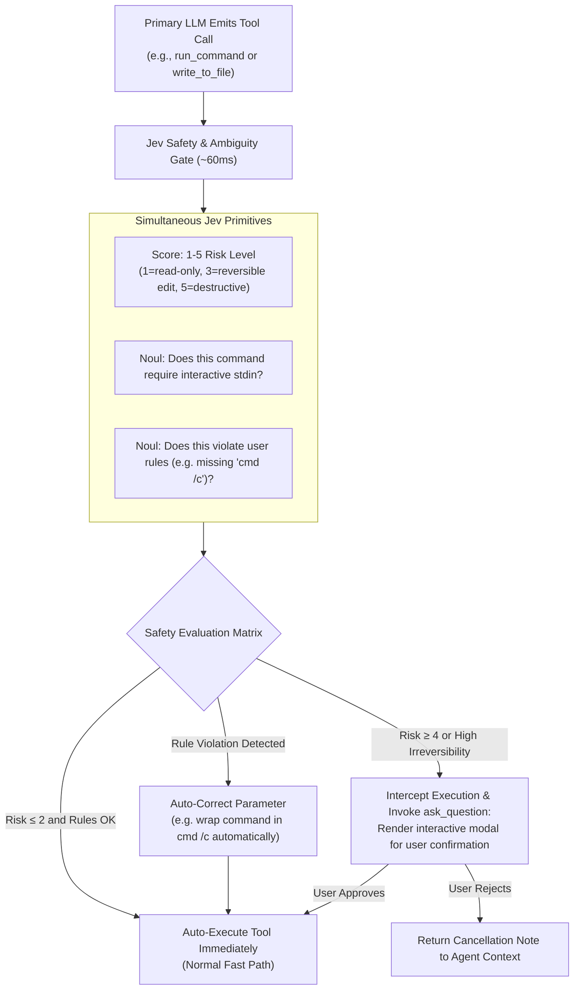

# Proposal D: Pre-Execution Safety Guardrail & Tool Disambiguation

## 1. Problem Statement

Antigravity gives the agent direct local execution access via `run_command` (`cmd /c` on Windows), `replace_file_content`, and background daemon management (`manage_task`).

While autonomous execution is essential for productivity, it introduces distinct risks:
1. **Destructive Shell Operations**: Accidental `git reset --hard`, deleting unversioned files, running long-running blocking processes, or overwriting critical configs.
2. **Ambiguous Tool Arguments**: Choosing between subtle flags (e.g. should a daemon run in background, should `AllowMultiple` be true on replace, should a search be regex or literal).
3. **Flaky Generative Function Calling**: Generative models streaming JSON occasionally generate invalid schemas or miss mandatory constraints, resulting in runtime tool failures.

---

## 2. Core Idea: Fast Calibrated Guardrail & Argument Verifier

Using Jev's `Score` and `Confidence` primitives, this proposal inserts a **sub-100ms verification gate** right before high-impact tool execution.



---

## 3. Concrete Antigravity Applications

### 3.1 Destructive Action Detection (The Safety Gate)
Whenever `run_command` is proposed, Jev evaluates the command against the current workspace context:

```typescript
const safetyQuestions = {
  risk_level: {
    type: "score",
    instructions: "Rate the risk level and potential irreversibility of this shell command.",
    criteria: [
      "Pure inspection or read-only (e.g., git status, dir, npm list)",
      "Standard development task (e.g., npm test, tsc, git checkout new-branch)",
      "State modification (e.g., npm install, git commit, file touch)",
      "High impact (e.g., git reset, killing active tasks, database schema drop)",
      "Critical / Potentially destructive (e.g., rm -rf, del /f /s /q, git clean -fdx)"
    ]
  },
  violates_platform_rules: {
    type: "noul",
    instructions: "On this Windows system, does this command violate the rule requiring 'cmd /c' wrapper or launch an unmanaged interactive shell?"
  }
};
```

**Policy Response:**
- **Risk 1–3**: Executed synchronously with zero delay.
- **Risk 4–5**: Intercepted by the harness. The harness triggers the native `ask_question` tool with choices:
  - *"Proceed with command: `<command>`"*
  - *"Cancel and ask agent to choose a safer alternative"*

### 3.2 Closed-Set Argument Resolution (Function Calling Pattern)
For tools with enumerated or boolean arguments (such as `MatchPerLine`, `CaseInsensitive`, `IsRegex` in `grep_search`, or `IsDaemon` in `run_command`), Jev can resolve natural language requests directly into closed-set arguments with calibrated confidence.

For instance, when determining whether a process is a daemon:
```typescript
const daemonQuestion = {
  type: "noul",
  instructions: "Is this process intended to run continuously in the background (like a dev server or file watcher) rather than terminate on its own?"
};
```
If `noul > 0.85`, set `IsDaemon = true`, avoiding the frequent pitfall where the agent accidentally blocks the shell on dev servers.

---

## 4. Expected Benefits

1. **Safety with Zero Latency Penalty**: Evaluation takes 50–70ms, completely imperceptible to the user compared to the multiple seconds taken by agent reasoning.
2. **Deterministic Rule Enforcement**: Enforces environment constraints (like Windows shell handling) reliably, catching accidental slips before shell errors occur.
3. **Confidence-Gated Escalation**: User interruption occurs only when genuine danger or ambiguity exists, keeping non-destructive autonomous tasks running smoothly.
