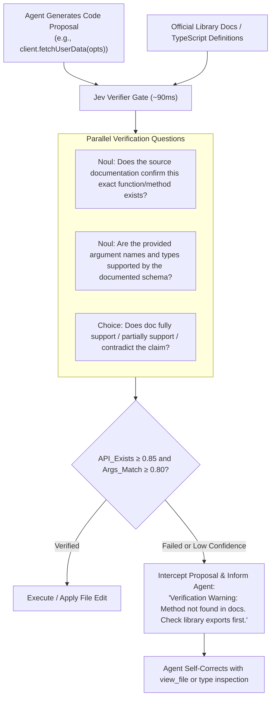

# Use Case: Universal Output Verification & Citation Checking

## 1. Problem Statement

Coding agents and generative LLMs frequently hallucinate:
- **API Signatures**: Inventing nonexistent parameters, methods, or module names that look plausible (e.g. `client.auth.getTokenWithRefresh()` when only `client.get_token()` exists).
- **Misquoted Citations**: Referencing documentation lines, guidelines, or Knowledge Items that do not actually support the agent's claim.
- **Silent Failures**: The agent writes code with hallucinated APIs, attempts to run it, fails with runtime `TypeError` or `AttributeError`, and spends 3–5 expensive turns debugging its own hallucination.

---

## 2. Core Idea: Fast Dual-Document Verification with Jev

Before the agent proposes code modifications to the user or environment, Jev acts as an automated, sub-100ms **citation and method verifier**:
- Takes the **generated code snippet** and the **source library documentation / types** as state.
- Evaluates whether the proposed API call is faithfully supported by the documentation.



---

## 3. Specification & Questions

```typescript
const verificationQuestions = {
  method_supported_by_docs: {
    type: "noul",
    instructions: "Does the provided documentation or type definition confirm that the specified method or function exists and is valid?"
  },
  arguments_match_spec: {
    type: "noul",
    instructions: "Are the arguments passed in the code snippet compatible with the documented parameters and their expected types?"
  },
  support_level: {
    type: "choice",
    instructions: "How strongly does the source document support the code or claim being made?",
    criteria: {
      "fully_supported": "The document explicitly documents this exact API, method signature, or rule.",
      "extrapolated": "The document mentions related concepts but not this specific method signature.",
      "contradicted": "The document explicitly specifies a different method, signature, or deprecation."
    }
  }
};
```

---

## 4. Architectural Value

1. **Halts Hallucination Loops Early**: Stops broken code from being saved to the filesystem before errors trigger.
2. **Saves Debugging Turns**: Eliminates 2–4 rounds of test/fail/re-edit cycles caused by invented APIs.
3. **Guarantees Compliance with Official Docs**: Ensures generated code strictly aligns with the codebase's pinned dependency versions.
