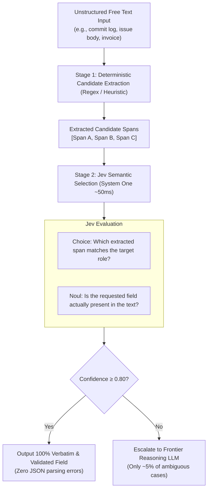

# Use Case: Structured Data Extraction (SDE) Cascades

## 1. Problem Statement

Extracting structured data (e.g. entities, parameters, dates, commit SHAs, file paths, monetary values) from messy free text is a common agent requirement.

Traditional approaches encounter persistent failure modes:
1. **Generative LLM Parsing ("Return JSON")**:
   - High token overhead (streaming entire JSON structures token-by-token).
   - Frequent schema failures (escaped quotes, trailing commas, markdown fences ` ```json `).
   - High risk of hallucinations (LLM subtly rewrites or normalizes a value instead of extracting it verbatim).
2. **Pure Regex / Heuristics**:
   - Fast, but lacks semantic understanding (e.g., regex finds 10 different date formats in an invoice or 5 different URLs in a GitHub issue, but cannot tell which one is the *deployment target*).

---

## 2. Core Idea: The 2-Stage SDE Cascade

This pattern combines the speed and precision of regex extraction with Jev's semantic classification:



1. **Stage 1 (Local Regex / Heuristics)**:
   - Extract candidate tokens into a list: `['https://api.v1.prod.com', 'https://staging.dev.internal', 'https://github.com']`.
2. **Stage 2 (Jev Semantic Choice)**:
   - Jev evaluates a `Choice` primitive over the candidate list:
     - *"Which of these URLs is the production deployment endpoint mentioned in the incident report?"*
   - Also evaluates a companion `Noul`: *"Is a production endpoint clearly specified?"*
3. **Stage 3 (Typed Deterministic Resolution)**:
   - Your code extracts the verbatim span chosen by Jev. No generative LLM is needed for 95% of cases.
   - If confidence is low or Jev reports that the field is absent, fallback to a reasoning LLM.

---

## 3. Specification & Code Pattern

```typescript
import { TypeSafeClient, choice, noul } from 'typesafe-sdk';

interface SDECascadeResult<T> {
  value: T | null;
  confidence: number;
  extractedVerbatim: boolean;
}

async function extractProductionUrl(
  text: string,
  client: TypeSafeClient
): Promise<SDECascadeResult<string>> {
  // Stage 1: Regex candidate extraction
  const urlRegex = /https?:\/\/[^\s"'<>]+/g;
  const candidates = Array.from(new Set(text.match(urlRegex) || []));
  
  if (candidates.length === 0) {
    return { value: null, confidence: 1.0, extractedVerbatim: false };
  }
  
  if (candidates.length === 1) {
    // Quick single-candidate confirmation
    const verify = await client.systemOne({
      state: text,
      questions: {
        is_prod: noul({
          instructions: `Does ${candidates[0]} represent the active production endpoint?`
        })
      }
    });
    return {
      value: verify.answers.is_prod.noul >= 0.7 ? candidates[0] : null,
      confidence: verify.answers.is_prod.noul,
      extractedVerbatim: true
    };
  }

  // Stage 2: Jev Choice among candidate spans
  const result = await client.systemOne({
    state: text,
    questions: {
      chosen_url: choice({
        instructions: "Which extracted URL is designated as the active production endpoint?",
        criteria: Object.fromEntries(candidates.map(url => [url, `Extracted candidate: ${url}`]))
      }),
      is_specified: noul({
        instructions: "Is a production endpoint explicitly declared in the input text?"
      })
    }
  });

  const winner = result.answers.chosen_url.choice;
  const isPresent = result.answers.is_specified.noul >= 0.6;
  const confidence = result.answers.chosen_url.confidence;

  return {
    value: isPresent ? winner : null,
    confidence: confidence,
    extractedVerbatim: true
  };
}
```

---

## 4. Architectural Value

1. **100% Verbatim Accuracy**: The extracted value is guaranteed to be an exact substring from the source document (no hallucinated characters).
2. **Speed & Throughput**: Runs in ~50ms per document, enabling batch processing of thousands of records per second.
3. **10x Cost Reduction**: Eliminates 90% of expensive generative LLM calls typically used for structured information extraction.
