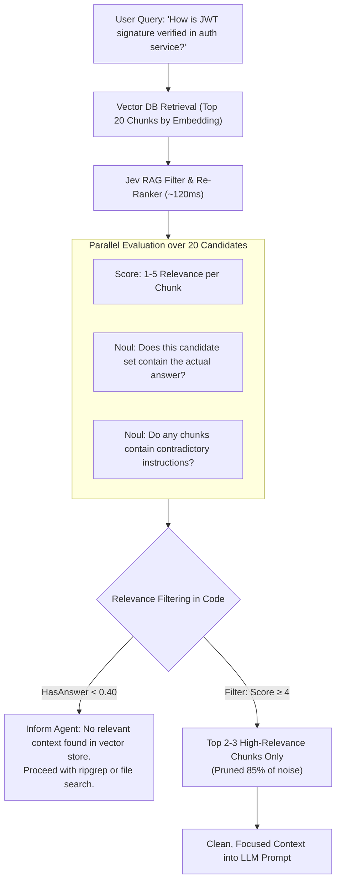

# Use Case: RAG Re-Ranking & Context Noise Elimination

## 1. Problem Statement

In Retrieval-Augmented Generation (RAG) and semantic codebase search:
- Vector databases (Chroma, Pinecone, Qdrant) retrieve passages using cosine similarity of embeddings.
- Top-K results frequently include **distractor passages** that share keywords or topics but contain no factual relevance to the user's specific query.
- Stuffing 10–20 retrieved chunks into the LLM context:
  - Consumes significant token context.
  - Causes "lost in the middle" attention degradation.
  - Increases hallucination rates as the generative model attempts to synthesize irrelevant chunks.

Traditional cross-encoders (like Cohere Rerank or BGE-Reranker) help, but:
- They return relative scores without semantic calibration.
- They cannot answer boolean gating questions (e.g. *"Does this passage actually contain an answer, or should we abort?"*).

---

## 2. Core Idea: Jev Semantic Re-Ranking & Dual Filtering

In a single fast API call (~100–180ms), Jev evaluates all retrieved candidate passages in parallel against the user query:
1. **Passage Scoring (`Score`)**: Rates each passage on a 1–5 relevance scale against the query.
2. **Answer Presence Gate (`Noul`)**: Evaluates whether the retrieved set contains sufficient facts to answer the question.
3. **Contradiction Detection (`Noul`)**: Flags whether any retrieved passages contradict each other.



---

## 3. Specification & Questions

```typescript
function buildRerankQuestions(chunks: { id: string; content: string }[], query: string) {
  const questions: Record<string, any> = {
    has_sufficient_context: {
      type: "noul",
      instructions: `Do the provided passages collectively contain the factual information needed to definitively answer: "${query}"?`
    }
  };

  for (const chunk of chunks) {
    questions[`score_${chunk.id}`] = {
      type: "score",
      instructions: `Rate how directly this passage answers the query: "${query}".`,
      levels: {
        "1": "Completely irrelevant or off-topic.",
        "2": "Mentions related keywords/entities but provides no helpful answer.",
        "3": "Provides background context or peripheral information.",
        "4": "Directly explains part of the required answer.",
        "5": "Definitive, exact, and complete answer to the query."
      }
    };
  }

  return questions;
}
```

---

## 4. Empirical Performance (from TypeSafe Legal / RAG Benchmarks)

Testing over the CLERC legal queries benchmark:
- BM25 Baseline: Top-1 Accuracy = **5%**, Top-10 Accuracy = **38%**.
- After Jev Re-Ranking: Top-1 Accuracy rose to **18%** (3.6x improvement), and Top-10 rose to **62%**.
- Context reduction: Pruned **70%–85% of non-essential tokens** before the generative model was invoked.
