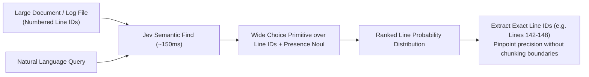

# Use Case: Line-by-Line Semantic Document Search

## 1. Problem Statement

Developers frequently need to locate specific clauses, logic lines, or error triggers in massive single files:
- Long configuration files (Kubernetes manifests, terraform files).
- Massive log dumps (10,000-line test or container logs).
- Legal agreements, service contracts, or regulatory compliance docs.

Standard grep searches fail when the user's query is semantic rather than literal:
- Query: *"Where does the contract limit liability for indirect damages?"*
- Regex search: Fails unless the exact phrase matches.
- Vector search on chunks: Loses exact line numbers and surrounding syntax context.

---

## 2. Core Idea: Fast Jev Line ID Scoring

In a single request, Jev can score hundreds of line IDs against a natural language query using a wide `Choice` primitive:
- **Input State**: The document with numbered line markers (`L001: ...`, `L002: ...`).
- **Jev Choice**: Directs probabilities across all line IDs simultaneously.
- **Companion Noul**: Determines whether the file actually addresses the query.



---

## 3. Specification & Code Pattern

```typescript
import { TypeSafeClient, choice, noul } from 'typesafe-sdk';

interface LineMatch {
  lineId: string;
  probability: number;
}

async function semanticFindLine(
  documentText: string,
  query: string,
  client: TypeSafeClient
): Promise<{ matches: LineMatch[]; found: boolean }> {
  // Split into numbered lines or line blocks
  const lines = documentText.split('\n');
  const lineCriteria: Record<string, string> = {};
  
  lines.forEach((line, idx) => {
    const lineId = `L${idx + 1}`;
    lineCriteria[lineId] = line.slice(0, 120); // snippet
  });

  const response = await client.systemOne({
    state: documentText,
    questions: {
      target_line: choice({
        instructions: `Which line directly addresses or answers: "${query}"?`,
        criteria: lineCriteria
      }),
      document_contains_answer: noul({
        instructions: `Does this document contain information that answers or addresses: "${query}"?`
      })
    }
  });

  const found = response.answers.document_contains_answer.noul >= 0.5;
  const probabilities = response.answers.target_line.probabilities;

  // Sort top matching line IDs by probability
  const matches = Object.entries(probabilities)
    .sort(([, a], [, b]) => b - a)
    .slice(0, 5)
    .map(([lineId, probability]) => ({ lineId, probability }));

  return { matches, found };
}
```

---

## 4. Architectural Value

1. **Exact Line-Level Targeting**: Delivers precise line coordinates directly to file viewing or editing tools (`view_file` with `StartLine`/`EndLine`).
2. **Zero Ingestion/Indexing Latency**: Does not require building vector indices or running embedding models in advance; works dynamically on any file loaded into memory.
3. **Calibrated Absence Detection**: If the query topic is not present in the document, `document_contains_answer` drops low, preventing hallucinated line jumps.
