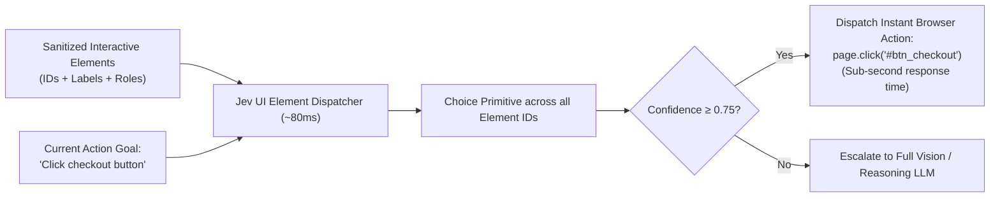

# Use Case: Autonomous UI Navigation (Fast Click & Element Selection)

## 1. Problem Statement

Autonomous browser agents (such as Antigravity's `browser_subagent` or Playwright agents) interact with complex web pages by:
- Dumping the interactive accessibility tree or HTML DOM.
- Asking a generative LLM: *"Which button should I click next to achieve the goal?"*
- Waiting 3–10 seconds for the LLM to stream a chain-of-thought paragraph before outputting the click command.

This creates severe UX and operational friction:
- **Painfully Slow Interaction**: A multi-step flow (e.g. login $\rightarrow$ navigate $\rightarrow$ fill form $\rightarrow$ submit) takes 30–60 seconds.
- **Flaky CSS Selectors**: Generative models frequently invent nonexistent selectors or hallucinate button IDs.

---

## 2. Core Idea: Fast Sub-100ms Action Selection with Jev

Instead of asking a generative LLM to think aloud, Jev maps user intent directly to sanitized DOM element IDs using a `Choice` primitive:
- **Input State**: Sanitized interactive element roster (e.g. `{"btn_submit": "Submit Order", "link_cancel": "Cancel", "inp_email": "Email Address input"}`).
- **Jev Choice**: Selects the target element ID with calibrated probabilities in ~80ms.
- **Companion Noul**: Evaluates whether the requested action is currently possible on the page.



---

## 3. Specification & Questions

```typescript
const uiSelectionQuestions = {
  target_element: {
    type: "choice",
    instructions: "Which interactive element should be clicked or focused to fulfill the current action goal?",
    criteria: {
      "btn_login": "Button: Sign in to your account",
      "link_forgot_pwd": "Link: Reset forgotten password",
      "inp_user": "Input: Username or Email address",
      "inp_pwd": "Input: Password field",
      "btn_google_oauth": "Button: Continue with Google"
    }
  },
  action_is_viable_on_page: {
    type: "noul",
    instructions: "Does the current page contain the appropriate controls to complete the requested goal right now?"
  }
};
```

---

## 4. Architectural Value

1. **Fluid Real-Time Web Automation**: Reduces per-step browser latency from 5+ seconds down to ~200ms (including DOM capture).
2. **Deterministic Targeting**: The selected element ID is guaranteed to be one of the existing DOM elements provided in the criteria (no hallucinated CSS selectors).
3. **Graceful Fallback**: If `action_is_viable_on_page` is low, the agent avoids clicking random buttons and correctly detects that the page hasn't loaded or an error modal has appeared.
