# Use Case: Predictive ML Feature Extraction (Converting Free Text to Continuous Signals)

## 1. Problem Statement

Traditional supervised machine learning models (e.g. CatBoost, XGBoost, Random Forest, logistic regression) excel at tabular predictions (e.g., predicting customer churn, bug severity, commit regression risk, lead conversion).

However, high-value signals are often trapped in unstructured text:
- Git commit messages and PR discussions.
- Customer support ticket bodies and chat logs.
- Code review comments and bug reports.

Common methods to bridge text to tabular models suffer from major flaws:
- **TF-IDF / Bag of Words**: High dimensionality, lacks semantic comprehension.
- **Dense Text Embeddings (768 or 1536 dims)**: Opaque, uninterpretable, easily overfit small tabular datasets, and computationally expensive to compute in real time.
- **LLM Prompting**: Generative text cannot be directly fed into gradient-boosted trees without parsing.

---

## 2. Core Idea: Jev Calibrated Probabilities as Numeric ML Features

Jev outputs continuous probabilities ($0.0$ to $1.0$) from `Noul` questions and scalar values from `Score` questions. These numbers serve as **interpretable, dense, semantic features** that can be directly appended as new numeric columns into tabular datasets:

```mermaid
flowchart LR
    RawText["Unstructured Text<br/>(e.g., Git commit message + PR comments)"] --> JevFeatureExtractor["Jev Feature Extractor (~70ms)"]
    
    subgraph JevSignals ["Calibrated Continuous Features"]
        F1["feat_urgency: Noul (0.0 - 1.0)"]
        F2["feat_scope_risk: Score (1 - 5)"]
        F3["feat_test_adequacy: Noul (0.0 - 1.0)"]
        F4["feat_sentiment_frustration: Score (1 - 5)"]
    end
    JevFeatureExtractor --> JevSignals
    
    JevSignals --> TabularRow["Enriched Feature Row:<br/>[lines_changed, num_files, feat_urgency, feat_scope_risk, ...]"]
    
    TabularRow --> MLModel["CatBoost / XGBoost Predictive Regressor<br/>(Predicts: Bug Regression Risk / Churn Probability)"]
```



---

## 3. Specification & Example Feature Definitions

For a predictive regression model forecasting whether a pull request will cause a production incident:

```typescript
const prRiskFeatures = {
  urgency_signal: {
    type: "noul",
    instructions: "Does the PR description indicate that this is a rushed, hotfix, or emergency patch written under time pressure?"
  },
  touches_critical_core: {
    type: "noul",
    instructions: "Does the commit summary indicate changes to authentication, cryptography, database migrations, or financial transactions?"
  },
  developer_confidence: {
    type: "score",
    instructions: "Rate the level of confidence and thoroughness expressed by the author in the PR description.",
    levels: {
      "1": "Extremely uncertain, work-in-progress, asking for help.",
      "2": "Tentative, noted untested edge cases.",
      "3": "Standard confidence, standard test notes.",
      "4": "Thoroughly tested, documented edge cases.",
      "5": "Rigorous proof, comprehensive automated test coverage provided."
    }
  },
  reverts_prior_change: {
    type: "noul",
    instructions: "Does this PR roll back or undo a previous commit or feature?"
  }
};
```

---

## 4. Architectural Value

1. **Directly Feedable to Gradient Boosted Trees**: Jev features are native floating-point numbers (`float64`), perfectly suited for tree splits in CatBoost or LightGBM.
2. **Full Interpretability & SHAP Values**: Unlike 1536-dimensional embedding vectors, feature importances (e.g. `urgency_signal` having high SHAP value) provide clear, explainable business and engineering insights.
3. **Autoresearch Loops**: Teams can run automated feature discovery loops—proposing new Jev questions, computing their correlation against held-out ground truth, and retaining only questions that measurably improve model validation metrics.
