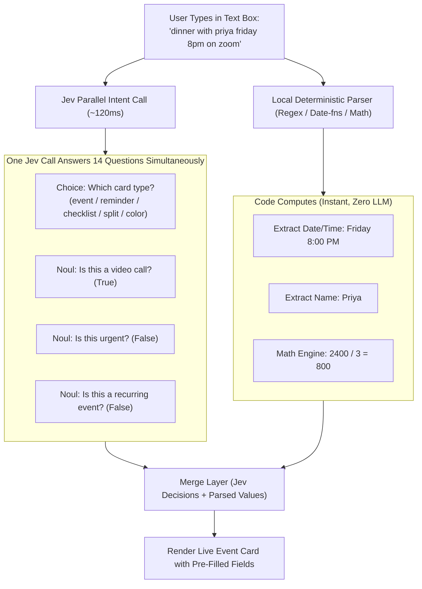

# Case Study: Shapeshift (Dynamic Real-Time UI Morphing)

## 1. Overview

[Shapeshift](https://github.com/anishfn/shapeshift) (by Anish Agrawal) is an open-source demonstration of real-time semantic UI transformation powered by TypeSafe AI's **Jev** model.

### Core Concept: "An input that becomes what you mean"
Instead of forcing users to select forms, click dropdowns, or wait for streaming LLM responses, a single text input field morphs dynamically into the appropriate interactive UI card as the user types:

```text
"dinner with priya friday 8pm on zoom"  →  Event card (Friday, 8 PM, Video Call)
"buy milk, eggs, bread and coffee"      →  Interactive Shopping Checklist
"split 2400 between 3"                  →  Bill Splitter Card (₹800 / person)
"minecraft diamond"                     →  Color Picker / Swatch (#4AEDD9)
"remind me to pay rent tomorrow urgent" →  Urgent Reminder with notification time
```

---

## 2. Architectural Pattern: "Jev Decides, Code Computes"

Shapeshift demonstrates the optimal division of labor between AI and deterministic code:



### Key Architectural Strengths
1. **Parallel Question Fan-Out**: In a single HTTP request (~120ms), Jev answers 14 typed questions at once. Adding more questions costs virtually no extra latency or context degradation.
2. **Deterministic Code Handles Calculations**: Dates, times, numbers, currency conversion, and arithmetic are **never delegated to an LLM**. Deterministic parsers compute exact values.
3. **Resilient Offline Fallback**: If the network drops or `TYPESAFE_API_KEY` is absent, Shapeshift transparently falls back to local keyword heuristics.
4. **Latency Display**: Directly displays latency in the UI (e.g. `jev-1.13.0: 114ms`), proving that semantic AI decisions can occur within human perception thresholds (<150ms).

---

## 3. Implications for Antigravity & Agent Workflows

The Shapeshift pattern translates directly to coding harnesses and developer tools:

### Application A: Dynamic Slash Command & Modal Morphing
Instead of requiring developers to memorize dozens of slash commands (`/goal`, `/plan`, `/schedule`, `/grill-me`, `/learn`):
- The agent chat box can run a background Jev fan-out as the user types.
- If the user types *"Run this test suite overnight and don't stop until all 42 tests pass"*, the input box automatically highlights `/goal` and configures the autonomy settings.

### Application B: Interactive Tool Argument Cards
When an agent calls an interactive tool (e.g. `ask_question`), Jev can pre-select the recommended radio button or pre-fill complex parameters based on conversational context, allowing the developer to confirm with a single keystroke.
