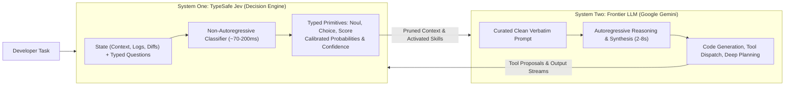
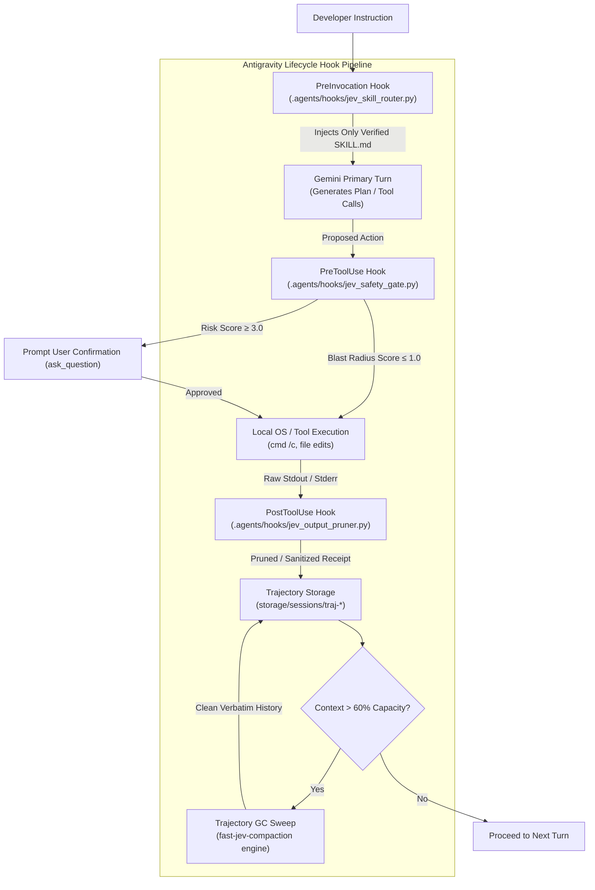

# Machine-Native Semantic Control: Evaluating TypeSafe Jev for Skill Routing, Tool Optimization, and Context Compaction in Google Antigravity

Language model harnesses have historically relied on monolithic autoregressive decoders to execute both deliberative planning and low-level control flow. In long-horizon agentic workflows, this reliance introduces operational fragility: autoregressive models are computationally expensive, exhibit stochastic output formatting, and suffer from severe context degradation during multi-turn task execution. The introduction of TypeSafe AI's **Jev** marks a structural pivot toward machine-native **"System One"** decision models. Rather than generating conversational prose token-by-token, Jev evaluates unstructured state against typed schemas and emits calibrated probabilities in a single forward pass.

Concurrently, open-source implementations such as Tamara Tran's `fast-jev-compaction` have demonstrated that replacing lossy language-model summarization with deterministic, score-driven context pruning preserves crucial operational artifacts—such as file paths, precise error messages, and shell syntax—verbatim. Analyzing the mechanics of Jev, deconstructing the `fast-jev-compaction` pipeline, and examining the architectural topology of Google Antigravity reveals concrete integration pathways to optimize skill selection, dynamic tool calling, and context garbage collection across developer workflows.

---

## 1. Architecture of System One Decision Models and TypeSafe Jev

TypeSafe AI—founded by former OpenAI researcher Diogo Almeida, Erik Gafni, and Sasha Sheng—developed Jev to resolve an impedance mismatch in AI software design: while frontier models excel at human-facing prose, production software requires deterministic, low-latency, and strictly typed branching logic. Drawing a conceptual parallel to Daniel Kahneman’s dual-process theory, Jev is engineered as an artificial **"System One"**: a fast, non-generative, heuristic judgment engine, leaving slow, deliberative, generative reasoning (**"System Two"**) to frontier autoregressive models. The model's moniker derives from the 19th-century economist William Stanley Jevons; the Jevons paradox suggests that radical efficiency gains in machine judgment will exponentially expand the deployment frequency of semantic evaluations in code.

In this division of computational labor, System Two generative decoders handle open-ended semantic synthesis, free-form code drafting, and high-level architectural planning, operating within latency envelopes of several seconds and at premium token price tiers. Conversely, System One models function entirely as non-autoregressive decision layers embedded within program flow. They evaluate bounded, high-frequency operational micro-questions—such as validating tool safety, assessing route eligibility, and filtering context noise—returning typed results in hundreds of milliseconds at nominal cost.



### Architectural Primitives and Sampling Mechanics
Unlike standard generative transformers that sample sequentially across an open vocabulary, Jev evaluates a provided application state concurrently across predefined decision heads. The inference engine guarantees schema conformance by construction: because the model physically cannot sample tokens outside the schema boundaries, the structural syntax error rate is mathematically **0.0%**.

The model runtime exposes three fundamental typed primitives:
1. **The `Noul` Primitive**: Represents a binary semantic decision operator, returning the Bernoulli probability $P(\text{condition}=\text{true}) \in [0.0, 1.0]$. Because the emitted scalar directly captures the underlying epistemic certainty of a Boolean state, a separate confidence score is omitted. In execution logic, the Noul operator serves as a probabilistic predicate for standard `if` statements.
2. **The `Choice` Primitive**: Executes categorical classification over an explicitly bounded set of up to 255 discrete options. Rather than merely outputting the winning label, the runtime returns the selected label, the complete probability distribution across all configured options, and a derived distribution concentration confidence metric $C \in [0.0, 1.0]$. In application control flow, Choice maps natively to pattern-matching blocks and multi-target routing dispatchers.
3. **The `Score` Primitive**: Acts as an ordinal projection mechanism that positions an input state along an ordered rubric comprising between 2 and 10 descriptive levels. Rather than rounding to discrete integers, Jev returns a probability-weighted continuous expectation value across the defined levels:
   $$\bar{S} = \sum_{i=0}^{K-1} i \cdot P(L_i)$$
   alongside the full discrete probability distribution, the rubric legend, and an associated confidence metric. In software architectures, Score functions as a continuous evaluation metric for prioritizing execution queues, sorting candidate resources, and establishing numeric escalation boundaries.

### Training Methodology and Epistemic Calibration
Standard frontier models trained via Reinforcement Learning from Human Feedback (RLHF) tend to produce overconfident, sycophantic predictions tuned for human conversational approval. Jev bypasses RLHF in favor of **Reinforcement Learning for Calibrated Decisions (RLCD)**. RLCD optimizes the model's loss landscape specifically for empirical calibration: if Jev outputs a confidence score of 0.95, the empirical error rate across a large sample asymptotically approaches five percent. This calibration allows downstream deterministic code to construct automated safety boundaries: executions proceed autonomously when confidence exceeds a strict threshold, while low-confidence edge cases are routed to human review or higher-order reasoning models.

### Economic and Latency Profile
Jev exhibits an asymmetric pricing structure designed for continuous invocation loops: input tokens are billed at **$42 per billion tokens ($0.042 per million tokens)**, while output tokens are unmetered and free. Execution latency ranges between **70 ms and 500 ms**, operating approximately 5× to 18× faster than lightweight autoregressive models (such as GPT-5 Luna or Claude Haiku) and up to 193× faster than frontier reasoning models on identical classification workloads.

| Architectural Dimension | TypeSafe Jev (System One) | Frontier Autoregressive LLMs (System Two) |
| :--- | :--- | :--- |
| **Primary Execution Modality** | Non-autoregressive parallel evaluation | Autoregressive sequential token generation |
| **Output Taxonomy** | Closed typed primitives (`Noul`, `Choice`, `Score`) | Open-ended strings, free-form prose, arbitrary JSON |
| **Type Invalidation Rate** | **0.0%** (conformance enforced by construction) | 0.58% to 45.5% (syntax errors / malformed JSON) |
| **Confidence Metric** | Epistemically calibrated probabilities via RLCD | Uncalibrated logits, verbalized overconfidence |
| **Inference Latency** | **70 ms – 500 ms** (independent of query count) | 1,000 ms – 30,000 ms (linear in output tokens) |
| **Pricing Baseline** | **$0.042 / MTok input; $0.00 output** | $0.25 to $15.00 / MTok input; metered output |
| **Operational Boundaries** | Incapable of arithmetic, prose generation, or explanation | Computationally inefficient for narrow semantic branching |

---

## 2. Verbatim Context Pruning: Deconstructing `fast-jev-compaction`

In agentic coding harnesses, the standard mechanism for mitigating context exhaustion is summarization. When an agent's history approaches the context limit, an LLM is prompted to compress previous messages into an abridged summary narrative. This pattern precipitates the **"Funes Trap"**—named after Jorge Luis Borges' character who could not forget, yet could not abstract without losing essential detail. Lossy summarization strips compiler flags, file paths, exact line offsets, and bash error codes, replacing critical operational data with paraphrased generalities. Subsequent turns often fail because the agent loses the precise technical grounding required to generate correct code diffs.

Tamara Tran’s `fast-jev-compaction` resolves this breakdown through non-generative context pruning. Rather than rewriting text, the system uses Jev to classify and drop obsolete execution traces, keeping all surviving artifacts byte-for-byte verbatim.

### Algorithmic Execution Pipeline
1. **Call Pairing & Boundary Definition**:
   - Scans the conversation transcript and correlates each `tool_use` event with its corresponding `tool_result` via `tool_use_id`.
   - Protects invariant context boundaries: the root prompt (`messages[0]`) and a trailing window of recent conversational history (configured via `preserveRecentMessages`, default: 6) are pinned and bypass evaluation.
2. **Progressive Token Fitting Ladder**:
   - To fit the state into `maxStateTokens` (default: 25,000), `fast-jev-compaction` executes a staged degradation ladder:
     1. Replace `tool_result` bodies with single-line structural placeholders (e.g. `ok, 4213 chars (omitted)`).
     2. Sequentially truncate tool input arguments from 1,000 to 200 and then 60 characters.
     3. Abridge long conversational texts to head and tail segments.
     4. Collapse older non-pinned messages into omission markers.
     5. Summarize runs of historical tool calls into single-line manifests.
3. **Dual-Noul Scoring per Unpinned Tool Pair**:
   - $Q_1$ (**Call Persistence**): Does knowing this tool was invoked with its input still matter for next steps?
   - $Q_2$ (**Verbatim Result**): Does the full textual output need to stay verbatim, or is re-running practical?
4. **Three-Tier Deterministic Decision Rule**:
   - If $P(Q_2) \ge \tau_{\text{keep}}$ (default 0.5): Retain call and full output verbatim.
   - If $P(Q_2) < \tau_{\text{keep}}$ and $P(Q_1) \ge \tau_{\text{keep}}$: Retain call metadata, truncate result to `truncateHeadChars` (300 chars) + re-run notice.
   - If both $< \tau_{\text{keep}}$: Purge tool call and result pair entirely.
5. **Reconstruction & Fallback**:
   - Empty message shells are removed, and the clean verbatim transcript is returned.
   - If Jev encounters an API error or fails to achieve `minReductionRatio` (default 0.25), the system safely aborts to the default summarizer.

| Runtime Parameter | Default Setting | Operational Semantics | Failure / Boundary Handling |
| :--- | :--- | :--- | :--- |
| `keepThreshold` | 0.5 | Decision threshold $\tau$ for retaining calls or full results | Raising $\tau$ forces aggressive pruning; lowering favors over-retention |
| `preserveRecentMessages` | 6 messages | Recency tail pinned from evaluation | Protects immediate causal loop of active subtasks |
| `truncateHeadChars` | 300 chars | Retained prefix length when a result is truncated | Appends explicit warning that output was abridged |
| `maxStateTokens` | 25,000 tokens | Maximum context allocated to transcript history | Triggers multi-stage ladder; aborts to fallback if exceeded |
| `maxRequestTokens` | 30,000 tokens | Request ceiling for state plus batched questions | Partitions question sets into concurrent HTTP calls |
| `minReductionRatio` | 0.25 (25%) | Minimum required context size reduction | If reduction <25%, falls back to standard summary |

---

## 3. Structural Anatomy of the Google Antigravity Architecture

Google Antigravity coordinates frontier Gemini foundation models, terminal sidecars, sandboxed filesystems, and subagent trees across the Antigravity IDE, CLI, desktop workspace, and Python SDK.

### Progressive Disclosure Skills Framework
- Skills are packaged in modular directories containing a `SKILL.md` file along with optional executable scripts, code templates, and references.
- `SKILL.md` frontmatter defines the skill name (enforced as a lowercase gerund like `testing-code`) and a third-person descriptive trigger string.
- At initialization, Antigravity indexes only frontmatter descriptions into system context. Only upon an active match is the full instruction body (<500 lines) hydrated.
- Scopes: Workspace scope (`.agents/skills/`) or Global user scope (`~/.gemini/config/skills/`).

### Lifecycle Hooks and Interception Points
Configured via `.agents/hooks.json` or instantiated via the SDK, Antigravity provides 5 deterministic lifecycle interception hooks:
1. `PreInvocation`: Fires immediately before compiling and dispatching prompt state to the primary model; allows injecting ephemeral messages or reconfiguring active context.
2. `PreToolUse`: Intercepts action proposals after model inference but before local system execution (supporting regex matchers like `run_command|write_to_file`); evaluates safety policies (`commandExecutionPolicy`), permitting, prompting, or denying execution.
3. `PostToolUse`: Executes immediately upon tool completion, receiving exit codes, stdout, stderr, and duration; enables redacting sensitive tokens or compressing verbose logs before trajectory entry.
4. `PostInvocation`: Fires following model turn receipt; enables immediate verification of plans or diffs.
5. `Stop`: Intercepts agent termination to tear down sidecars, release locks, and finalize telemetry.

State persistence in the SDK is maintained on disk: setting `save_dir="./storage/sessions"` records trajectories into subdirectories labeled `traj-*` under a stable `conversation_id`.

---

## 4. Strategic Proposals & Harness Integration Roadmap



### Phase 1: Pre-Invocation Skill Routing & Prompt Assembly
- **Hook Configuration**:
  ```json
  {
    "enabled": true,
    "PreInvocation": [
      {
        "command": "cmd /c python .agents/hooks/jev_skill_router.py"
      }
    ]
  }
  ```
- **Execution Flow**:
  1. The hook script ingests the user instruction and parses all `SKILL.md` frontmatter from workspace and global locations.
  2. Dispatches parallel `Noul` queries or a single wide `Choice` to Jev to score each skill's relevance in ~100ms.
  3. Returns an `injectSteps` array with `ephemeralMessage` objects loading only the Markdown instructions of qualifying skills ($P \ge 0.70$).
  4. Non-relevant skills remain unhydrated, saving 5,000–20,000 prompt tokens.

### Phase 2: Execution Safety & Stream Pruning Middleware
- **Hook Configuration**:
  ```json
  {
    "PreToolUse": [
      {
        "matcher": "run_command|write_to_file|replace_file_content",
        "command": "cmd /c python .agents/hooks/jev_safety_gate.py"
      }
    ],
    "PostToolUse": [
      {
        "matcher": "run_command|grep_search|view_file",
        "command": "cmd /c python .agents/hooks/jev_output_pruner.py"
      }
    ]
  }
  ```
- **PreToolUse (Safety Gate)**:
  - Evaluates proposed commands against an ordered blast-radius rubric:
    - Level 0: Read-only inspection with zero persistent state mutation.
    - Level 1: Idempotent local mutation with automated rollback.
    - Level 2: Non-idempotent mutation or network interaction requiring isolation.
    - Level 3: High-risk operation (recursive deletions, credential access, environment modifications).
  - If $\bar{S} \le 1.0$ with $C > 0.90$, auto-approves execution.
  - If risk is elevated, exits with status code 1 to halt execution deterministically and trigger interactive user confirmation.
- **PostToolUse (Stream Pruner)**:
  - Intercepts completed output streams exceeding 1,000 characters.
  - If Jev classifies a test or build execution as completely successful, collapses the stream to a concise receipt (`[Test Suite Passed: 482 tests OK; 12,410 log characters omitted]`).
  - If failures exist, Jev identifies the failure boundary, preserving the exact stack trace and error assertions verbatim.

### Phase 3: Trajectory Garbage Collection Engine
- When session context reaches 60% of capacity:
  1. Ingests active trajectory from `save_dir="./storage/sessions/traj-*"`.
  2. Pins `messages[0]` and the trailing recency window (6 messages).
  3. Replaces unpinned results with structural summaries (`ok, N chars omitted`).
  4. Dispatches parallel dual-Noul evaluations across all unpinned calls.
  5. Surviving calls/results stay 100% verbatim; partially needed results truncated to `truncateHeadChars` (300 chars); obsolete calls purged.
  6. Overwrites trajectory file with cleaned history.

| Lifecycle Hook / Phase | Matcher Target | Jev Task Definition | Failure & Fallback Policy |
| :--- | :--- | :--- | :--- |
| **PreInvocation** | Global (all turns) | Score active turn against candidate `SKILL.md` frontmatter | Fallback: Load standard baseline skills without dynamic filtering |
| **PreToolUse** | `run_command \| write_.*` | Score mutation risk and classify blast radius | Fallback: Fail-closed; require manual user confirmation |
| **PostToolUse** | `run_command \| grep_search` | Identify non-failing logs or redundant search lines | Fallback: Preserve full stdout unedited if Jev times out |
| **Trajectory Compaction** | Context overflow trigger (>60%) | Dual-Noul keep/drop evaluation over tool calls | Fallback: Trigger Antigravity's standard LLM summarizer |

---

## 5. Defensive Engineering & Operational Failure Modes

1. **Epistemic Ambiguity Handling**:
   - When Jev returns probabilities in the uncertain range ($0.40 \le P \le 0.60$) or when `Choice` queries produce flat distributions ($C < 0.65$), the harness enforces conservative defaults: tool outputs are preserved rather than pruned, and shell executions require manual operator approval.
2. **Prompt Injection Mitigation**:
   - Because Jev evaluates untrusted text from workspace files, git logs, and terminal streams, untrusted strings are isolated within typed instruction containers.
   - High-consequence operations (such as deleting directories or formatting disks) remain subject to deterministic regex hard-blocks regardless of model confidence.
3. **Strict Network Partitions & Timeouts**:
   - All HTTP requests to TypeSafe Jev configure strict client timeouts of **800 milliseconds**.
   - If a network partition or API failure occurs, the harness cleanly falls back to standard execution paths (retaining unedited logs or running standard conversational summarization).

---

## 6. Architectural Synthesis

Integrating TypeSafe Jev into Google Antigravity establishes an optimal division of computational labor:
- **Deterministic Code**: Enforces execution loops, manages sandboxed filesystems, and applies baseline security boundaries.
- **System One (Jev)**: Handles high-frequency semantic micro-judgments—routing skills, filtering tool schemas, approving routine operations, and pruning stale context—at sub-second latency and minimal token cost ($0.042/1M tokens).
- **System Two (Gemini)**: Dedicates its full reasoning capacity to long-horizon planning, system architecture, and code synthesis, operating over clean, uncorrupted context preserved byte-for-byte verbatim by downstream pruning.
