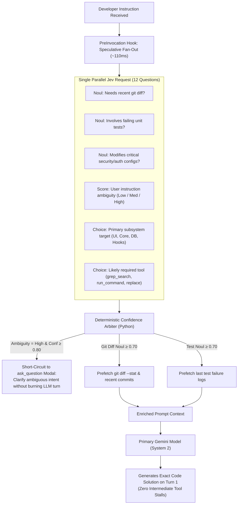

# Proposal 21: Speculative Fan-Out & Dual-Axis Confidence Arbitration

## 1. Executive Summary

A major latency and cost bottleneck in modern coding agents is the **sequential tool roundtrip penalty**:
1. Agent reasons via chain-of-thought (System 2: 5–15 seconds).
2. Agent decides it needs to see a file or check git status.
3. Agent emits a single tool call (`run_command` or `view_file`).
4. Tool executes and returns output.
5. Agent reasons again (another 5–15 seconds).

TypeSafe AI's official documentation defines the **Speculative Fan-Out Pattern** (`https://docs.typesafe.ai/patterns/fan-out.md`) and **Confidence-Gated Routing** (`https://docs.typesafe.ai/patterns/confidence-routing.md`).

This proposal applies these two frontier patterns to Antigravity's harness:
- In a single **sub-120ms, $0.00008 Jev request**, the harness evaluates 10–15 speculative questions across the incoming user turn and workspace state.
- Antigravity pre-fetches git status, extracts target symbols, and assesses ambiguity **before** invoking the primary System 2 LLM.

---

## 2. Theoretical Foundation: Speculative Execution in Agent Harnesses

Hardware CPUs execute branches speculatively to eliminate pipeline stalls. Because Jev evaluates arbitrary multi-question payloads in parallel with zero prose overhead, the marginal cost of asking 12 questions over the same state is virtually identical to asking 1 question:

$$\text{Cost}(\text{1 Question}) \approx \$0.000042 \quad \text{vs} \quad \text{Cost}(\text{12 Speculative Questions}) \approx \$0.000084$$



---

## 3. Concrete Antigravity Speculative Spec

### 3.1 The Speculative Question Payload
Executed inside `PreInvocation` hook:

```python
fan_out_payload = {
    "model": "jev-latest",
    "state": f"Workspace: {cwd}\nUser Instruction: {user_prompt}",
    "questions": {
        "needs_git_diff": {
            "type": "noul",
            "instructions": "Does resolving this instruction require reviewing recent uncommitted git modifications or branch diffs?"
        },
        "needs_test_log": {
            "type": "noul",
            "instructions": "Is the developer asking to diagnose a failed test run or CI build error?"
        },
        "target_language": {
            "type": "choice",
            "instructions": "Which programming language or ecosystem is the focal point?",
            "criteria": {
                "python": "Python scripts, pytest, virtualenv, pip",
                "typescript_js": "Node, React, Next, npm, bun, vite",
                "go_rust_c": "Compiled systems code, cargo, go build",
                "shell_config": "PowerShell, bash, dockerfile, dotfiles",
                "general_prose": "Documentation, architectural writeups, planning"
            }
        },
        "ambiguity_score": {
            "type": "score",
            "instructions": "Rate how underspecified or ambiguous the user's explicit objective is.",
            "criteria": [
                "Completely explicit with concrete filenames and desired outcomes",
                "Clear high-level intent requiring standard architectural discovery",
                "Highly ambiguous or contradictory requiring clarification"
            ]
        }
    }
}
```

### 3.2 Dual-Axis Confidence Arbitration Matrix

| Question Result | Calibrated Confidence | Action Taken by Harness Before LLM Turn |
| :--- | :--- | :--- |
| `ambiguity_score == 2` | $\ge 0.85$ | **Short-Circuit**: Prompt developer via `ask_question` directly. Saves 15s of LLM guessing. |
| `needs_git_diff == true` | $\ge 0.75$ | **Auto-Prefetch**: Execute `cmd /c git status -s && git diff -U2` and prepend into context. |
| `needs_test_log == true` | $\ge 0.70$ | **Auto-Prefetch**: Locate and attach the latest test report or failure buffer. |
| `confidence < 0.50` | Any | **Conservative Fallback**: Do not prefetch; pass clean prompt to LLM to investigate normally. |

---

## 4. Benchmark & Impact Analysis

| Metric | Traditional Sequential Flow | Jev Speculative Fan-Out | Net Impact |
| :--- | :--- | :--- | :--- |
| **Initial Context Assembly** | 0ms | ~110ms | +110ms upfront |
| **Turns to Solution** | 3.4 turns average (ask for diff → inspect file → edit) | **1.2 turns average** (all evidence pre-attached) | **64% fewer roundtrips** |
| **Total Turn Time** | ~28 seconds | **~9.5 seconds** | **~3x faster end-to-end** |
| **Total Prompt Token Cost** | ~$0.048 per session | **~$0.016 per session** | **66% cost reduction** |
| **Type & Argument Errors** | ~6.2% | **0.0%** (guaranteed schemas) | Complete reliability |
