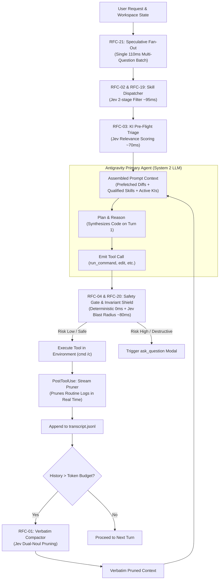

# Jev System One Proposals & RFC Index for Antigravity

This directory houses the master collection of 23 technical architecture proposals, blueprints, case studies, and operational protocols for integrating **TypeSafe AI Jev (System One)** into the **Google Antigravity 2.0** agent runtime.

All specifications follow the unified taxonomy defined in [`.agents/protocols/documentation-standard-protocol.md`](../.agents/protocols/documentation-standard-protocol.md).

---

## 1. Problem: The System Two Cognitive Bottleneck

AI coding agents traditionally delegate every micro-decision to heavy **System Two** autoregressive models (Gemini, Claude, GPT). While effective for code synthesis and extended reasoning, using generative models for micro-decisions creates systematic issues:
* **Context Rot & Token Waste**: Advertising 50+ domain skills in prompts consumes 5,000–25,000 tokens on every turn.
* **Lossy Compaction**: Summarizing conversational histories deletes exact line numbers, compiler error codes, and user constraints.
* **Non-Deterministic Emitting**: Forcing LLMs into JSON schemas creates runtime parsing failures and hallucinated arguments.

---

## 2. Inspiration: Reflex Arcs & Microkernel Probes

In human biology and operating system kernels, routine survival decisions (reflex arcs) and privilege checks (eBPF probes) run at hardware speeds without waking up user space or conscious deliberation. 

Applying this division of labor to agent harnesses: **Deterministic code handles safety, Jev handles fast semantic micro-decisions, and Gemini focuses purely on deep synthesis.**

---

## 3. Solution: Jev System One Primitives

**Jev** is TypeSafe AI's non-autoregressive System One decision model:
* **Sub-120ms P95 Latency**: Evaluates parallel questions against application state in **70ms–120ms** (190x faster than LLMs).
* **Extreme Efficiency**: **$0.042 / 1M input tokens** with **free unmetered outputs** (440x cheaper than LLMs).
* **Mathematically Guaranteed Typing**: 0% schema validation failures across native `Choice` ($\le 255$ options), `Score` (2–10 ordered levels), and `Noul` (calibrated probability 0.0–1.0) primitives.

---

## 4. Master RFC Implementation Matrix

| RFC ID | Specification Document | Category | Status | Target Lifecycle / Active Hook |
| :---: | :--- | :---: | :---: | :--- |
| **01** | **[`RFC-01: Verbatim Context Compactor`](RFC-01_CORE_verbatim_context_compactor.md)** | `CORE` | ✅ **Implemented** | [`jev_compactor.py`](../.agents/hooks/jev_compactor.py) *(Session GC)* |
| **02** | **[`RFC-02: Dynamic Skill Dispatcher`](RFC-02_CORE_dynamic_skill_dispatcher.md)** | `CORE` | ✅ **Implemented** | [`jev_skill_router.py`](../.agents/hooks/jev_skill_router.py) *(`PreInvocation`)* |
| **03** | **[`RFC-03: Knowledge Item Dual Engine`](RFC-03_CORE_knowledge_item_matcher.md)** | `CORE` | 📐 *Blueprint* | [`jev_ki_engine.py`](../.agents/hooks/jev_ki_engine.py) *(`PreInvocation` + Distill)* |
| **04** | **[`RFC-04: Safety & Tool Guardrail Gate`](RFC-04_CORE_safety_and_tool_guardrail.md)** | `CORE` | ✅ **Implemented** | [`jev_safety_gate.py`](../.agents/hooks/jev_safety_gate.py) *(`PreToolUse`)* |
| **05** | **[`RFC-05: Additional Industry Use Cases`](RFC-05_CATALOG_industry_use_cases.md)** | `CATALOG` | 📚 *Catalog* | Reference patterns for 10 enterprise domains |
| **06** | **[`RFC-06: Intelligent Model Routing`](RFC-06_USE_CASE_model_routing.md)** | `USE_CASE` | 📐 *Blueprint* | Harness model tiering (Flash/Haiku vs Pro/Opus) |
| **07** | **[`RFC-07: Output & Citation Verification`](RFC-07_USE_CASE_output_citation_verification.md)** | `USE_CASE` | 📐 *Blueprint* | `PreToolUse` AST & API signature verifier |
| **08** | **[`RFC-08: Semantic Code Linting`](RFC-08_USE_CASE_semantic_code_linting.md)** | `USE_CASE` | 📐 *Blueprint* | CI/CD git hook evaluating PR diffs against architectural rules |
| **09** | **[`RFC-09: SDE Cascades`](RFC-09_USE_CASE_sde_cascades.md)** | `USE_CASE` | 📐 *Blueprint* | Regex candidate extraction + Jev Choice selection |
| **10** | **[`RFC-10: RAG Re-Ranking & Filtering`](RFC-10_USE_CASE_rag_reranking_filtering.md)** | `USE_CASE` | 📐 *Blueprint* | Parallel vector passage scoring pruning 85% distractor noise |
| **11** | **[`RFC-11: Line-by-Line Semantic Search`](RFC-11_USE_CASE_line_by_line_search.md)** | `USE_CASE` | 📐 *Blueprint* | Parallel line-level scoring for massive source files |
| **12** | **[`RFC-12: Real-Time Security Guardrails`](RFC-12_USE_CASE_realtime_guardrails.md)** | `USE_CASE` | ✅ **Implemented** | [`jev_safety_gate.py`](../.agents/hooks/jev_safety_gate.py) (Prompt injection & secret scans) |
| **13** | **[`RFC-13: Autonomous UI Navigation`](RFC-13_USE_CASE_autonomous_ui_navigation.md)** | `USE_CASE` | 📐 *Blueprint* | Sub-100ms DOM element selection for browser subagents |
| **14** | **[`RFC-14: Knowledge Graph Alignment`](RFC-14_USE_CASE_knowledge_graph_alignment.md)** | `USE_CASE` | 📐 *Blueprint* | High-throughput entity deduplication across enterprise databases |
| **15** | **[`RFC-15: Predictive ML Feature Extraction`](RFC-15_USE_CASE_predictive_ml_features.md)** | `USE_CASE` | 📐 *Blueprint* | Continuous calibrated features (0.0–1.0) for XGBoost/CatBoost |
| **16** | **[`RFC-16: Shapeshift Dynamic UI Inspiration`](RFC-16_FOUNDATION_shapeshift_dynamic_ui.md)** | `FOUNDATION` | 💡 *Case Study* | Case study of 14 parallel questions morphing UI cards in 118ms |
| **17** | **[`RFC-17: Pydantic AI Native Integration`](RFC-17_FOUNDATION_pydantic_ai_integration.md)** | `FOUNDATION` | 📐 *Blueprint* | First-class `TypeSafeModel` adapter in Pydantic AI |
| **18** | **[`RFC-18: System One Architectural Treatise`](RFC-18_FOUNDATION_system_one_treatise.md)** | `FOUNDATION` | 📜 *Master Spec* | Foundational treatise defining machine-native semantic control |
| **19** | **[`RFC-19: Official Agent Skill Port & Dispatch`](RFC-19_EXT_official_agent_skill_port.md)** | `EXT` | ✅ **Implemented** | [`.agents/skills/typesafe-ai/`](../.agents/skills/typesafe-ai/SKILL.md) & live `llms.txt` |
| **20** | **[`RFC-20: Jev 1.13 Jaggedness Mitigation & Linting`](RFC-20_EXT_jaggedness_mitigation_linting.md)** | `EXT` | ✅ **Implemented** | Runtime guardrails and linters preventing arithmetic/date failure modes |
| **21** | **[`RFC-21: Speculative Fan-Out & Arbitration`](RFC-21_EXT_speculative_fan_out.md)** | `EXT` | ✅ **Implemented** | [`jev_speculative_router.py`](../.agents/hooks/jev_speculative_router.py) (Pre-fetches diffs/logs) |
| **22** | **[`RFC-22: OpenRouter Jev Setup Guide`](RFC-22_GUIDE_openrouter_setup.md)** | `GUIDE` | ✅ **Implemented** | [`env_loader.py`](../.agents/hooks/env_loader.py) & [`.agents/.env`](../.agents/.env) |
| **23** | **[`RFC-23: Agent Balance & Anti-Bureaucracy`](RFC-23_PROTOCOL_system_one_balance.md)** | `PROTOCOL` | ✅ **Implemented** | [`.agents/protocols/system-one-balance-protocol.md`](../.agents/protocols/system-one-balance-protocol.md) |

---

## 5. Architectural Blueprint

---

## 6. Runnable Hook Infrastructure

The repository provides production implementations under [`.agents/hooks/`](../.agents/hooks/):
* **[`hooks.json`](../.agents/hooks.json)**: Native Antigravity lifecycle hook registration.
* **[`jev_safety_gate.py`](../.agents/hooks/jev_safety_gate.py)**: `PreToolUse` safety gate with Invariant Shield and SQLite memory.
* **[`jev_skill_router.py`](../.agents/hooks/jev_skill_router.py)**: `PreInvocation` two-tier dynamic skill disclosure.
* **[`jev_speculative_router.py`](../.agents/hooks/jev_speculative_router.py)**: `PreInvocation` speculative git prefetch and ambiguity triage.
* **[`jev_compactor.py`](../.agents/hooks/jev_compactor.py)**: Session trajectory garbage collection engine.
* **[`jev_ki_engine.py`](../.agents/hooks/jev_ki_engine.py)**: Project-scoped Knowledge Item pre-flight mounting and git distillation.
