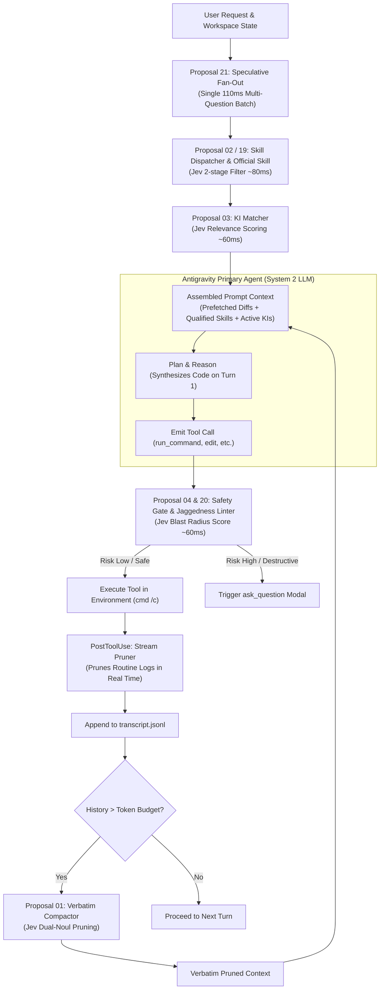

# Jev (TypeSafe AI) Integration Proposals for Antigravity

This directory contains technical architecture proposals for integrating **Jev (TypeSafe AI's System One model)** into the **Antigravity agent harness**.

## Background

Traditional AI coding agents rely exclusively on **System 2** generative models (such as Gemini, Claude, and GPT). While effective for code synthesis and extended reasoning, using generative LLMs for micro-decisions creates systematic issues:
- **Context Rot & Token Waste**: Loading hundreds of skills, rules, and extensive histories into prompts causes instruction drift and high latency.
- **Lossy Compaction**: Summarizing conversational histories deletes exact error codes, file paths, and user constraints.
- **Decision Inconsistency & Hallucination**: Generative models must be forced into JSON schemas via text generation, creating validation failures and hallucinated arguments.

**Jev** is TypeSafe AI's flagship **System One decision model**:
- **Non-autoregressive**: Evaluates structured questions in parallel against an application state in **70ms–500ms** (193.6x faster than LLMs).
- **Extreme Efficiency**: **$0.042 / 1M input tokens** ($42 per billion tokens) with **unmetered free outputs** (444.6x cheaper than LLMs).
- **Mathematically Guaranteed Typing**: 0% schema validation errors.
- **AI Primitives**: `Choice` (closed-set selection $\le 255$ options), `Score` (rubric rating 2–10 ordered levels), and `Noul` (calibrated true/false probability 0.0–1.0).
- **Dual-Axis Uncertainty**: Calibrated **Probability** (answers *what*) and Calibrated **Confidence** (answers *whether to act*).

---

## Master Implementation Status Matrix

The table below summarizes the operational status and purpose of all proposals across the Antigravity agent runtime:

| # | Proposal Document | Status | Description (What It Does) | Active File / Lifecycle Hook |
| :-: | :--- | :---: | :--- | :--- |
| **01** | **[Verbatim Context Compactor](file:///d:/01_GIT/Jev/proposals/01_PROPOSAL_A_VERBATIM_CONTEXT_COMPACTOR.md)** | ✅ **Implemented** | Replaces lossy LLM summarization with surgical dual-Noul pruning of stale tool calls and outputs. Keeps 100% of user discourse, file paths, and code diffs verbatim while drastically reducing session tokens. | [`jev_compactor.py`](file:///d:/01_GIT/Jev/.agents/hooks/jev_compactor.py) [`jev_output_pruner.py`](file:///d:/01_GIT/Jev/.agents/hooks/jev_output_pruner.py) *(`PostToolUse` + Trajectory GC)* |
| **02** | **[Dynamic Skill Dispatcher](file:///d:/01_GIT/Jev/proposals/02_PROPOSAL_B_DYNAMIC_SKILL_DISPATCHER.md)** | ✅ **Implemented** | Evaluates incoming user requests against all installed skill frontmatter in ~100ms via Jev Choice & Noul. Ephemerally injects only qualifying skills into context, cutting wrong skill loads by >50% and preventing prompt bloat. | [`jev_skill_router.py`](file:///d:/01_GIT/Jev/.agents/hooks/jev_skill_router.py) *(`PreInvocation`)* |
| **03** | **[Knowledge Item Matcher](file:///d:/01_GIT/Jev/proposals/03_PROPOSAL_C_KNOWLEDGE_ITEM_MATCHER.md)** | 📐 *Blueprint* | Pre-flight semantic matcher scanning repository memory artifacts before code investigation begins. Prevents agents from redundantly researching solved architectural patterns, known bugs, or existing conventions. | Planned for `PreInvocation` |
| **04** | **[Safety & Tool Disambiguation Gate](file:///d:/01_GIT/Jev/proposals/04_PROPOSAL_D_SAFETY_AND_TOOL_ROUTER.md)** | ✅ **Implemented** | Evaluates proposed shell commands and file mutations on a calibrated 0–3 blast-radius rubric before execution. Halts destructive actions, prompts developer confirmation, and enforces platform rules (e.g., Windows `cmd /c`). | [`jev_safety_gate.py`](file:///d:/01_GIT/Jev/.agents/hooks/jev_safety_gate.py) *(`PreToolUse`)* |
| **05** | **[Additional Use Cases & Patterns](file:///d:/01_GIT/Jev/proposals/05_ADDITIONAL_USE_CASES_AND_INDUSTRY_PATTERNS.md)** | 📚 *Catalog* | A comprehensive reference catalog mapping 10 real-world industry domains to System One decision patterns. Demonstrates how to replace brittle generative JSON extraction with calibrated micro-decisions. | Reference Architecture |
| **06** | **[Intelligent Model Routing](file:///d:/01_GIT/Jev/proposals/06_USE_CASE_MODEL_ROUTING.md)** | 📐 *Blueprint* | Scores prompt difficulty and required reasoning depth in 70ms to tier requests between fast models (Flash/Haiku) and reasoning models (Pro/Opus). Maximizes speed and slashes token costs without degrading complex task quality. | Harness Model Router |
| **07** | **[Output & Citation Verification](file:///d:/01_GIT/Jev/proposals/07_USE_CASE_OUTPUT_AND_CITATION_VERIFICATION.md)** | 📐 *Blueprint* | Pre-execution verification gate inspecting LLM-generated function signatures, arguments, and doc citations against library ASTs. Eliminates hallucinated API calls and broken link citations before runtime errors happen. | `PreToolUse` / Linter |
| **08** | **[Semantic Code Linting](file:///d:/01_GIT/Jev/proposals/08_USE_CASE_SEMANTIC_CODE_LINTING.md)** | 📐 *Blueprint* | Automates CI/CD evaluation of pull request diffs against natural language architectural conventions and design guidelines. Flags subtle conceptual anti-patterns that standard regex and AST linters miss. | CI/CD Git Hook |
| **09** | **[SDE Cascades](file:///d:/01_GIT/Jev/proposals/09_USE_CASE_STRUCTURED_DATA_EXTRACTION_CASCADE.md)** | 📐 *Blueprint* | Combines high-throughput regex candidate extraction with Jev Choice classification to extract structured data fields. Guarantees 100% verbatim text matches conforming to strict schemas with zero hallucination. | Pipeline Utility |
| **10** | **[RAG Re-Ranking & Filtering](file:///d:/01_GIT/Jev/proposals/10_USE_CASE_RAG_RERANKING_AND_FILTERING.md)** | 📐 *Blueprint* | Scores retrieved vector passages in parallel against user queries, discarding up to 85% of irrelevant distractor text. Ensures the downstream LLM receives only high-density evidence without context dilution. | Search & Retrieval |
| **11** | **[Line-by-Line Semantic Search](file:///d:/01_GIT/Jev/proposals/11_USE_CASE_LINE_BY_LINE_SEMANTIC_SEARCH.md)** | 📐 *Blueprint* | Evaluates hundreds of candidate source lines in parallel to pinpoint exact clauses, error sources, or relevant sections in large files. Bypasses file size limits by locating precise line ranges without reading whole files. | Navigation Tool |
| **12** | **[Real-Time Security Guardrails](file:///d:/01_GIT/Jev/proposals/12_USE_CASE_REALTIME_GUARDRAILS.md)** | ✅ **Implemented** | Performs sub-100ms pre-execution scans on inbound user prompts and outbound git commits for prompt injections, credential leaks, and secret tokens. Halts compromised execution before mutations reach storage. | [`jev_safety_gate.py`](file:///d:/01_GIT/Jev/.agents/hooks/jev_safety_gate.py) *(`PreToolUse`)* |
| **13** | **[Autonomous UI Navigation](file:///d:/01_GIT/Jev/proposals/13_USE_CASE_AUTONOMOUS_UI_NAVIGATION.md)** | 📐 *Blueprint* | Enables browser automation agents to select interactive DOM elements via sub-100ms Jev Choice evaluations. Replaces multi-second chain-of-thought delays with real-time UI interactions. | Browser Subagent |
| **14** | **[Knowledge Graph Alignment](file:///d:/01_GIT/Jev/proposals/14_USE_CASE_KNOWLEDGE_GRAPH_ENTITY_ALIGNMENT.md)** | 📐 *Blueprint* | High-throughput deduplication and contradiction resolution across disparate enterprise databases. Compares candidate entity pairs using calibrated probabilities without expensive LLM prompts. | Database Sync |
| **15** | **[Predictive ML Feature Extraction](file:///d:/01_GIT/Jev/proposals/15_USE_CASE_PREDICTIVE_ML_FEATURE_EXTRACTION.md)** | 📐 *Blueprint* | Converts unstructured text signals (sentiment nuance, urgency, dispute risk) into continuous calibrated numeric features (0.0–1.0). Provides high-signal inputs directly consumable by gradient-boosted trees (XGBoost/CatBoost). | ML Pipeline |
| **16** | **[Shapeshift Dynamic UI](file:///d:/01_GIT/Jev/proposals/16_INSPIRATION_SHAPESHIFT_DYNAMIC_UI.md)** | 💡 *Case Study* | Case study of an input string morphing into 8+ UI cards via 14 parallel Jev questions in under 120ms. Illustrates the core architectural mantra: *"Jev decides, code computes."* | UI Architecture |
| **17** | **[Pydantic AI Integration](file:///d:/01_GIT/Jev/proposals/17_FRAMEWORK_PYDANTIC_AI_TYPESAFE_INTEGRATION.md)** | 📐 *Blueprint* | Architectural adapter integrating TypeSafe as a first-class `TypeSafeModel` in Pydantic AI. Maps field schemas to parallel questions and introduces native pre-tool verification hooks. | Framework Adapter |
| **18** | **[Architectural Treatise: System One](file:///d:/01_GIT/Jev/proposals/18_ARCHITECTURAL_TREATISE_SYSTEM_ONE_ANTIGRAVITY.md)** | 📜 *Master Spec* | Comprehensive architectural treatise establishing the machine-native semantic control layer for Antigravity. Defines the formal division of labor between System 1 micro-decisions and System 2 reasoning. | Architectural Core |
| **19** | **[Official Agent Skill Port & Dispatch](file:///d:/01_GIT/Jev/proposals/19_PROPOSAL_OFFICIAL_AGENT_SKILL_PORT_AND_DISPATCH.md)** | ✅ **Implemented** | Vendors the official `typesafe-ai` agent skill into the repository and binds it to Antigravity's `PreInvocation` hook. Provides live documentation navigation via `llms.txt` and cookbook patterns. | [`.agents/skills/typesafe-ai/`](file:///d:/01_GIT/Jev/.agents/skills/typesafe-ai/SKILL.md) [`jev_skill_router.py`](file:///d:/01_GIT/Jev/.agents/hooks/jev_skill_router.py) |
| **20** | **[Jev 1.13 Jaggedness Mitigation](file:///d:/01_GIT/Jev/proposals/20_PROPOSAL_JEV_1_13_JAGGEDNESS_MITIGATION_AND_ANTI_ARITHMETIC_LINTING.md)** | ✅ **Implemented** | Formal runtime rules and linters preventing known `jev-1.13` failure modes such as arithmetic, token counting, and date logic. Enforces explicit code-level calculation and cardinality limits ($\le 255$). | [`jev_safety_gate.py`](file:///d:/01_GIT/Jev/.agents/hooks/jev_safety_gate.py) |
| **21** | **[Speculative Fan-Out & Arbitration](file:///d:/01_GIT/Jev/proposals/21_PROPOSAL_SPECULATIVE_FAN_OUT_AND_CONFIDENCE_ARBITRATION.md)** | 📐 *Blueprint* | Evaluates 10–15 speculative questions in a single 110ms batch at the start of a turn. Pre-fetches git status, test diffs, and context to eliminate multi-turn sequential tool roundtrips. | Planned for `PreInvocation` |
| **22** | **[Guide: OpenRouter Jev Setup](file:///d:/01_GIT/Jev/proposals/22_GUIDE_OPENROUTER_JEV_SETUP.md)** | ✅ **Implemented** | Step-by-step configuration guide for using `typesafe/jev-latest` on OpenRouter. Features single-key billing, automatic fallback, and a zero-dependency environment loader. | [`env_loader.py`](file:///d:/01_GIT/Jev/.agents/hooks/env_loader.py) [`test_jev.py`](file:///d:/01_GIT/Jev/test_jev.py) [`.agents/.env`](file:///d:/01_GIT/Jev/.agents/.env) |

---

## Detailed Proposal Index

### Core Antigravity Harness Proposals

| Document | Status | Description (What It Is About) | Primary Value & Impact |
| :--- | :---: | :--- | :--- |
| **[01. Verbatim Context Compactor](file:///d:/01_GIT/Jev/proposals/01_PROPOSAL_A_VERBATIM_CONTEXT_COMPACTOR.md)** | ✅ Implemented | Uses dual-Noul questions to score whether tool calls and results are still relevant to ongoing work. Stale results are dropped or stubbed while all user instructions and code edits stay 100% verbatim. | Replaces lossy summaries with surgical tool-call pruning while keeping code & discourse 100% verbatim. |
| **[02. Dynamic Skill Dispatcher](file:///d:/01_GIT/Jev/proposals/02_PROPOSAL_B_DYNAMIC_SKILL_DISPATCHER.md)** | ✅ Implemented | Evaluates incoming user prompts against candidate skill frontmatter in ~100ms via Jev Choice & Noul. Ephemerally injects qualifying instructions only when needed. | 2-stage progressive disclosure that cuts wrong skill loads by >50% and scales to hundreds of skills. |
| **[03. Knowledge Item (KI) Matcher](file:///d:/01_GIT/Jev/proposals/03_PROPOSAL_C_KNOWLEDGE_ITEM_MATCHER.md)** | 📐 Blueprint | Automatically compares user tasks against repository Knowledge Item summaries before the agent starts investigating. Directly mounts relevant design docs and gotchas. | Automates pre-flight checking of Knowledge Items, preventing redundant investigations. |
| **[04. Safety & Tool Disambiguation Gate](file:///d:/01_GIT/Jev/proposals/04_PROPOSAL_D_SAFETY_AND_TOOL_ROUTER.md)** | ✅ Implemented | Intercepts proposed commands and mutations before execution, scoring blast radius on a calibrated 0–3 rubric. Halts destructive operations and enforces Windows `cmd /c`. | Calibrated risk scoring before destructive shell execution and confident argument extraction. |

### Additional Dedicated Use Cases & Industry Patterns

| Document | Status | Description (What It Is About) | Key Capability |
| :--- | :---: | :--- | :--- |
| **[06. Intelligent Model Routing](file:///d:/01_GIT/Jev/proposals/06_USE_CASE_MODEL_ROUTING.md)** | 📐 Blueprint | Evaluates prompt complexity in 70ms to tier tasks between fast/cheap models (Flash/Haiku) and reasoning models (Pro/Opus). | 70ms task difficulty scoring to route between fast (Haiku/Flash) and reasoning (Pro/Opus) models. |
| **[07. Output & Citation Verification](file:///d:/01_GIT/Jev/proposals/07_USE_CASE_OUTPUT_AND_CITATION_VERIFICATION.md)** | 📐 Blueprint | Verifies generated function calls, arguments, and doc links against AST definitions before tool execution occurs. | Pre-execution gate checking generated function calls against library docs and types. |
| **[08. Semantic Code Linting](file:///d:/01_GIT/Jev/proposals/08_USE_CASE_SEMANTIC_CODE_LINTING.md)** | 📐 Blueprint | Scans pull request diffs against natural language architectural rules in CI/CD pipelines. | Automated PR diff evaluation against natural language architectural conventions. |
| **[09. SDE Cascades](file:///d:/01_GIT/Jev/proposals/09_USE_CASE_STRUCTURED_DATA_EXTRACTION_CASCADE.md)** | 📐 Blueprint | Combines regex extraction with Jev Choice selection to achieve 100% verbatim, schema-compliant entity extraction. | Regex candidate extraction + Jev Choice selection for 100% verbatim, schema-guaranteed fields. |
| **[10. RAG Re-Ranking & Noise Filtering](file:///d:/01_GIT/Jev/proposals/10_USE_CASE_RAG_RERANKING_AND_FILTERING.md)** | 📐 Blueprint | Scores retrieved vector passages in parallel, filtering out up to 85% of distractor passages before LLM context ingestion. | Parallel scoring of vector chunks, pruning up to 85% of distractor passages before LLM context. |
| **[11. Line-by-Line Semantic Search](file:///d:/01_GIT/Jev/proposals/11_USE_CASE_LINE_BY_LINE_SEMANTIC_SEARCH.md)** | 📐 Blueprint | Evaluates hundreds of line IDs in parallel to locate exact error origins or semantic clauses in large codebases. | Scores hundreds of line IDs in parallel to locate exact clauses or errors in large files/logs. |
| **[12. Real-Time Security Guardrails](file:///d:/01_GIT/Jev/proposals/12_USE_CASE_REALTIME_GUARDRAILS.md)** | ✅ Implemented | Scans prompts and code commits in under 100ms for prompt injection attempts, credential leaks, and secret exposure. | Sub-100ms scans on inbound prompts and outbound git commits for injections and secret leaks. |
| **[13. Autonomous UI Navigation](file:///d:/01_GIT/Jev/proposals/13_USE_CASE_AUTONOMOUS_UI_NAVIGATION.md)** | 📐 Blueprint | Selects interactive DOM elements for browser agents in sub-100ms without expensive chain-of-thought steps. | Sub-100ms DOM element selection for browser agents, eliminating chain-of-thought delay. |
| **[14. Knowledge Graph Alignment](file:///d:/01_GIT/Jev/proposals/14_USE_CASE_KNOWLEDGE_GRAPH_ENTITY_ALIGNMENT.md)** | 📐 Blueprint | Deduplicates entities and resolves contradictions across inconsistent enterprise databases using calibrated probabilities. | High-throughput entity deduplication and contradiction checking across inconsistent databases. |
| **[15. Predictive ML Feature Extraction](file:///d:/01_GIT/Jev/proposals/15_USE_CASE_PREDICTIVE_ML_FEATURE_EXTRACTION.md)** | 📐 Blueprint | Converts unstructured text into continuous calibrated numeric features (0.0–1.0) for gradient-boosted trees. | Converts raw text into continuous, calibrated 0.0–1.0 features for gradient-boosted trees. |

### External References, Frameworks & Treatises

| Document | Status | Description (What It Is About) | Insights & Design Patterns |
| :--- | :---: | :--- | :--- |
| **[16. Shapeshift Dynamic UI](file:///d:/01_GIT/Jev/proposals/16_INSPIRATION_SHAPESHIFT_DYNAMIC_UI.md)** | 💡 Case Study | Real-time input morphing into 8+ UI cards via 14 parallel Jev questions in 110ms. | Real-time input morphing into 8+ UI cards via 14 parallel Jev questions: *"Jev decides, code computes."* |
| **[17. Pydantic AI Native Integration](file:///d:/01_GIT/Jev/proposals/17_FRAMEWORK_PYDANTIC_AI_TYPESAFE_INTEGRATION.md)** | 📐 Blueprint | First-class `TypeSafeModel` in Pydantic AI integrating schema-as-questions mapping and before-tool hooks. | First-class `TypeSafeModel` in Pydantic AI: Schema-as-questions mapping, `before_tool_execute` hooks, and per-step `SelectModel`. |
| **[18. Architectural Treatise: System One Antigravity](file:///d:/01_GIT/Jev/proposals/18_ARCHITECTURAL_TREATISE_SYSTEM_ONE_ANTIGRAVITY.md)** | 📜 Master Spec | Foundational blueprint defining machine-native semantic control and the 3-phase integration roadmap for Antigravity. | Comprehensive theoretical foundation and 3-phase integration roadmap for Antigravity runtime. |

### Official Ecosystem & Frontier Harness Extensions

| Document | Status | Description (What It Is About) | Insights & Design Patterns |
| :--- | :---: | :--- | :--- |
| **[19. Official Agent Skill Port & Dispatch](file:///d:/01_GIT/Jev/proposals/19_PROPOSAL_OFFICIAL_AGENT_SKILL_PORT_AND_DISPATCH.md)** | ✅ Implemented | Vendors the official `typesafe-ai` agent skill into `.agents/skills/` with automated hook integration and live documentation access. | Direct integration of the official `typesafe-ai` skill into `.agents/skills/typesafe-ai/` with hook synergy and live docs navigation. |
| **[20. Jev 1.13 Jaggedness Mitigation & Linting](file:///d:/01_GIT/Jev/proposals/20_PROPOSAL_JEV_1_13_JAGGEDNESS_MITIGATION_AND_ANTI_ARITHMETIC_LINTING.md)** | ✅ Implemented | Establishes runtime rules and linters preventing known failure modes: keeps math in code, separates dates, and enforces cardinality bounds ($\le 255$). | Formal runtime rules and linters preventing known failure modes: anti-arithmetic, date extraction separation, and $\le 255$ cardinality limits. |
| **[21. Speculative Fan-Out & Confidence Arbitration](file:///d:/01_GIT/Jev/proposals/21_PROPOSAL_SPECULATIVE_FAN_OUT_AND_CONFIDENCE_ARBITRATION.md)** | 📐 Blueprint | Evaluates 10–15 speculative questions in a single 110ms batch to prefetch git diffs and symbols, eliminating sequential tool roundtrips. | Evaluating 10–15 speculative questions in a single 110ms batch to prefetch diffs/logs and eliminate multi-turn tool roundtrips. |
| **[22. Guide: OpenRouter Jev Setup](file:///d:/01_GIT/Jev/proposals/22_GUIDE_OPENROUTER_JEV_SETUP.md)** | ✅ Implemented | Complete guide and zero-dependency configuration loader for using Jev on OpenRouter with single-key billing and automated fallback. | Using `typesafe/jev-latest` on OpenRouter with zero-dependency automated fallback and single-key billing. |

---

## Runnable Antigravity Hook Infrastructure

The repository includes a ready-to-run implementation template under [`.agents/hooks/`](file:///d:/01_GIT/Jev/.agents/hooks):
- **[`hooks.json`](file:///d:/01_GIT/Jev/.agents/hooks.json)**: Antigravity lifecycle hooks configuration connecting `PreInvocation`, `PreToolUse`, and `PostToolUse`.
- **[`jev_skill_router.py`](file:///d:/01_GIT/Jev/.agents/hooks/jev_skill_router.py)**: `PreInvocation` hook for sub-100ms progressive skill selection and context hydration.
- **[`jev_safety_gate.py`](file:///d:/01_GIT/Jev/.agents/hooks/jev_safety_gate.py)**: `PreToolUse` hook evaluating blast radius (Levels 0–3) and halting high-risk commands.
- **[`jev_output_pruner.py`](file:///d:/01_GIT/Jev/.agents/hooks/jev_output_pruner.py)**: `PostToolUse` hook pruning verbose routine logs from test/build outputs.
- **[`jev_compactor.py`](file:///d:/01_GIT/Jev/.agents/hooks/jev_compactor.py)**: Trajectory Garbage Collection engine adapting `fast-jev-compaction` for Antigravity session histories.
- **[`typesafe-ai skill`](file:///d:/01_GIT/Jev/.agents/skills/typesafe-ai/SKILL.md)**: Official drop-in agent skill for TypeSafe AI design and cookbook patterns.

---

## Architectural Blueprint

