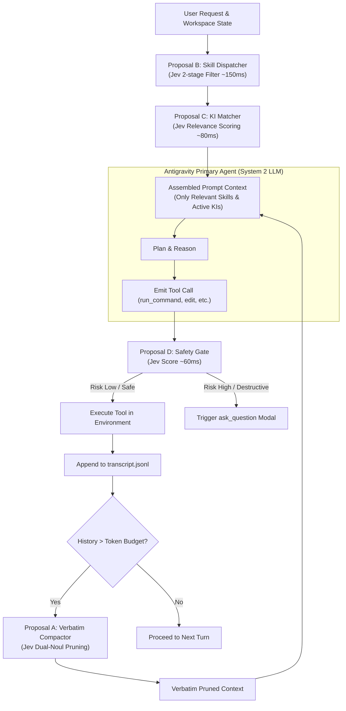

# Jev (TypeSafe AI) Integration Proposals for Antigravity

This directory contains technical architecture proposals for integrating **Jev (TypeSafe AI's System One model)** into the **Antigravity agent harness**.

## Background

Traditional AI coding agents rely exclusively on **System 2** generative models (such as Gemini, Claude, and GPT). While effective for code synthesis and extended reasoning, using generative LLMs for micro-decisions creates systematic issues:
- **Context Rot & Token Waste**: Loading hundreds of skills, rules, and extensive histories into prompts causes instruction drift and high latency.
- **Lossy Compaction**: Summarizing conversational histories deletes exact error codes, file paths, and user constraints.
- **Decision Inconsistency**: Generative models must be forced into JSON schemas via text generation, creating schema validation failures and hallucinated arguments.

**Jev** is a **System One decision model**:
- **Non-autoregressive**: Evaluates structured questions in parallel against a state (50ms–250ms latency).
- **Zero prose generation**: Directly outputs typed enums, scores, and calibrated probabilities.
- **AI Primitives**: `Choice`, `Score`, and `Noul` (calibrated true/false probability 0.0–1.0).

---

## Antigravity Core Proposals

| Document | Focus Area | Impact & Primary Value |
| :--- | :--- | :--- |
| **[01. Verbatim Context Compactor](file:///d:/01_GIT/Jev/proposals/01_PROPOSAL_A_VERBATIM_CONTEXT_COMPACTOR.md)** | Conversation history & context compaction | Replaces lossy summaries with surgical tool-call pruning while keeping code & discourse 100% verbatim. |
| **[02. Dynamic Skill Dispatcher](file:///d:/01_GIT/Jev/proposals/02_PROPOSAL_B_DYNAMIC_SKILL_DISPATCHER.md)** | Skill discovery & prompt efficiency | 2-stage progressive disclosure that cuts wrong skill loads by >50% and scales to hundreds of skills. |
| **[03. Knowledge Item (KI) Matcher](file:///d:/01_GIT/Jev/proposals/03_PROPOSAL_C_KNOWLEDGE_ITEM_MATCHER.md)** | Repository memory & architectural patterns | Automates pre-flight checking of Knowledge Items, preventing redundant investigations. |
| **[04. Safety & Tool Disambiguation Gate](file:///d:/01_GIT/Jev/proposals/04_PROPOSAL_D_SAFETY_AND_TOOL_ROUTER.md)** | Tool calling, safety, and argument mapping | Calibrated risk scoring before destructive shell execution and confident argument extraction. |

## Additional Dedicated Use Cases & Industry Patterns

| Document | Focus Area | Key Capability |
| :--- | :--- | :--- |
| **[06. Intelligent Model Routing](file:///d:/01_GIT/Jev/proposals/06_USE_CASE_MODEL_ROUTING.md)** | Harness Engineering | 70ms task difficulty scoring to route between fast (Haiku/Flash) and reasoning (Pro/Opus) models. |
| **[07. Output & Citation Verification](file:///d:/01_GIT/Jev/proposals/07_USE_CASE_OUTPUT_AND_CITATION_VERIFICATION.md)** | Anti-Hallucination | Pre-execution gate checking generated function calls against library docs and types. |
| **[08. Semantic Code Linting](file:///d:/01_GIT/Jev/proposals/08_USE_CASE_SEMANTIC_CODE_LINTING.md)** | CI/CD & Code Quality | Automated PR diff evaluation against natural language architectural conventions. |
| **[09. SDE Cascades](file:///d:/01_GIT/Jev/proposals/09_USE_CASE_STRUCTURED_DATA_EXTRACTION_CASCADE.md)** | Data Extraction | Regex candidate extraction + Jev Choice selection for 100% verbatim, schema-guaranteed fields. |
| **[10. RAG Re-Ranking & Noise Filtering](file:///d:/01_GIT/Jev/proposals/10_USE_CASE_RAG_RERANKING_AND_FILTERING.md)** | Search & Retrieval | Parallel scoring of vector chunks, pruning up to 85% of distractor passages before LLM context. |
| **[11. Line-by-Line Semantic Search](file:///d:/01_GIT/Jev/proposals/11_USE_CASE_LINE_BY_LINE_SEMANTIC_SEARCH.md)** | Navigation & Debugging | Scores hundreds of line IDs in parallel to locate exact clauses or errors in large files/logs. |
| **[12. Real-Time Security Guardrails](file:///d:/01_GIT/Jev/proposals/12_USE_CASE_REALTIME_GUARDRAILS.md)** | Safety & Compliance | Sub-100ms scans on inbound prompts and outbound git commits for injections and secret leaks. |
| **[13. Autonomous UI Navigation](file:///d:/01_GIT/Jev/proposals/13_USE_CASE_AUTONOMOUS_UI_NAVIGATION.md)** | Browser Automation | Sub-100ms DOM element selection for browser agents, eliminating chain-of-thought delay. |
| **[14. Knowledge Graph Alignment](file:///d:/01_GIT/Jev/proposals/14_USE_CASE_KNOWLEDGE_GRAPH_ENTITY_ALIGNMENT.md)** | Data Unification | High-throughput entity deduplication and contradiction checking across inconsistent databases. |
| **[15. Predictive ML Feature Extraction](file:///d:/01_GIT/Jev/proposals/15_USE_CASE_PREDICTIVE_ML_FEATURE_EXTRACTION.md)** | Machine Learning | Converts raw text into continuous, calibrated 0.0–1.0 features for gradient-boosted trees. |

## External References & Ecosystem Implementations

| Document | Category | Insights & Design Patterns |
| :--- | :--- | :--- |
| **[16. Shapeshift Dynamic UI](file:///d:/01_GIT/Jev/proposals/16_INSPIRATION_SHAPESHIFT_DYNAMIC_UI.md)** | UI & UX Pattern | Real-time input morphing into 8+ UI cards via 14 parallel Jev questions: *"Jev decides, code computes."* |
| **[17. Pydantic AI Native Integration](file:///d:/01_GIT/Jev/proposals/17_FRAMEWORK_PYDANTIC_AI_TYPESAFE_INTEGRATION.md)** | Framework Architecture | First-class `TypeSafeModel` in Pydantic AI: Schema-as-questions mapping, `before_tool_execute` hooks, and per-step `SelectModel`. |
| **[18. Architectural Treatise: System One Antigravity](file:///d:/01_GIT/Jev/proposals/18_ARCHITECTURAL_TREATISE_SYSTEM_ONE_ANTIGRAVITY.md)** | Master Specification | Comprehensive theoretical foundation and 3-phase integration roadmap for Antigravity runtime. |

## Runnable Antigravity Hook Infrastructure

The repository includes a ready-to-run implementation template under [`.agents/hooks/`](file:///d:/01_GIT/Jev/.agents/hooks):
- **[`hooks.json`](file:///d:/01_GIT/Jev/.agents/hooks.json)**: Antigravity lifecycle hooks configuration connecting `PreInvocation`, `PreToolUse`, and `PostToolUse`.
- **[`jev_skill_router.py`](file:///d:/01_GIT/Jev/.agents/hooks/jev_skill_router.py)**: `PreInvocation` hook for sub-100ms progressive skill selection and context hydration.
- **[`jev_safety_gate.py`](file:///d:/01_GIT/Jev/.agents/hooks/jev_safety_gate.py)**: `PreToolUse` hook evaluating blast radius (Levels 0–3) and halting high-risk commands.
- **[`jev_output_pruner.py`](file:///d:/01_GIT/Jev/.agents/hooks/jev_output_pruner.py)**: `PostToolUse` hook pruning verbose routine logs from test/build outputs.
- **[`jev_compactor.py`](file:///d:/01_GIT/Jev/.agents/hooks/jev_compactor.py)**: Trajectory Garbage Collection engine adapting `fast-jev-compaction` for Antigravity session histories.

---

## Architectural Blueprint

