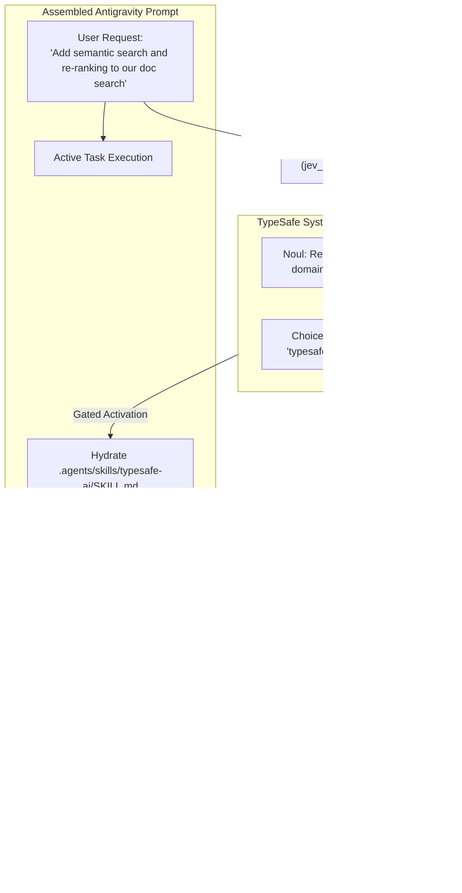

# Proposal 19: Official TypeSafe Agent Skill Integration & Progressive Harness Dispatch

## 1. Executive Summary

TypeSafe AI has released an official agent skill ([`typesafe-ai`](https://github.com/typesafe-ai/skills)) for Claude Code, Codex, and modern AI coding agents. 

This proposal details the architectural integration of the official TypeSafe agent skill directly into the **Google Antigravity** runtime:
1. **Local Vendoring**: Deploying the official skill at [`.agents/skills/typesafe-ai/SKILL.md`](../.agents/skills/typesafe-ai/SKILL.md).
2. **Hook Synergy**: Connecting the skill to Antigravity's `PreInvocation` lifecycle hook ([`jev_skill_router.py`](../.agents/hooks/jev_skill_router.py)) for sub-100ms automatic skill hydration.
3. **Live Documentation Access**: Equipping the primary agent with fast index navigation via `https://docs.typesafe.ai/llms.txt`.
4. **Side-by-Side Verification**: Comparing native Jev primitive dispatch against traditional generative prompt-and-parse patterns.

---

## 2. Background & Official Release Context

In September 2026, TypeSafe AI exited stealth, launching the **Jev** System One model (`jev-latest`, version `jev-1.13`) alongside an open skill ecosystem:
- **Pricing**: $0.042 / MTok input ($42 per billion tokens), unmetered free outputs.
- **Latency**: 70ms–500ms parallel non-autoregressive sampling.
- **Guaranteed Typing**: 0% schema validation errors.
- **Official Marketplace Package**: `typesafe-ai/skills`.

While Claude Code users install this via `claude plugin install typesafe@typesafe-ai`, Antigravity possesses a superior customization system supporting workspace-level skill discovery under `.agents/skills/` and dynamic hook interception.

---

## 3. Architecture Blueprint



---

## 4. Key Capabilities Provided by the Native Skill

When the `typesafe-ai` skill is active, the agent adheres to 4 core design principles:

### 4.1 "Decisions, Not Strings"
Rather than prompting an LLM to generate unstructured text and then writing brittle regexes or JSON parsers, the agent refactors the workflow into deterministic code with fuzzy decision gates powered by Jev:
- **Deterministic Logic**: Handles I/O, loops, arithmetic, formatting, and file systems.
- **Jev Micro-Decisions**: Classifies categories (`Choice`), rates severity/priority (`Score`), or evaluates booleans (`Noul`).

### 4.2 Speculative Fan-Out Batching
The skill instructs the agent to submit independent, speculative questions within a single HTTP payload:
```python
# Evaluated simultaneously by Jev in ~120ms for $0.000081
questions = {
    "is_security_sensitive": Noul(instructions="Does this PR touch auth or crypto?"),
    "target_subsystem": Choice(instructions="Which module does this PR modify?", criteria=subsystems),
    "review_urgency": Score(instructions="Rate deployment urgency.", criteria=urgency_rubric)
}
```

### 4.3 Dual-Axis Uncertainty Management
The agent separates:
- **Calibrated Probability**: The likelihood of the event or category ($0.0 \dots 1.0$).
- **Calibrated Confidence**: Epistemic certainty ($0.0 \dots 1.0$), determining whether the system should act autonomously or escalate to human review (`ask_question`).

---

## 5. Implementation in Antigravity

### 5.1 Skill Deployment
Installed at:
- `d:\01_GIT\Jev\.agents\skills\typesafe-ai\SKILL.md`

### 5.2 Router Verification
The `PreInvocation` hook (`.agents/hooks/jev_skill_router.py`) dynamically discovers this skill from `.agents/skills/` without manual registration. When a developer asks about TypeSafe, Jev, RLCD, or System One architectures, the router automatically activates `typesafe-ai`.

### 5.3 Developer Usage
Developers can invoke or reference the skill explicitly in prompt conversations:
> *"Using the TypeSafe skill, analyze our test suite output and implement a real-time failure triage gate."*

Or rely on the zero-configuration auto-routing hook.
