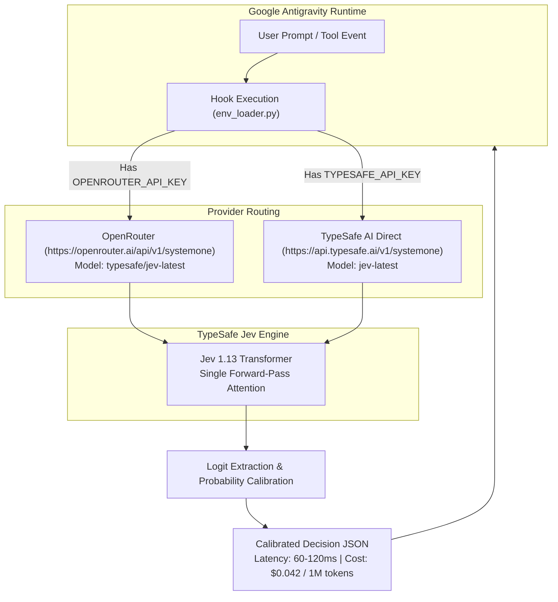

# Using TypeSafe Jev via OpenRouter (`typesafe/jev-latest`)

## Overview

TypeSafe AI's **Jev** is available on OpenRouter under the model slug:
👉 **[`typesafe/jev-latest`](https://openrouter.ai/~typesafe/jev-latest)** (and pinned version `typesafe/jev-1.13`).

Routing Jev through OpenRouter allows teams and autonomous harnesses like **Google Antigravity** to execute sub-100ms System One decisions, skill dispatches, blast-radius safety gating, and context compaction **without provisioning a separate billing account or enterprise contract with TypeSafe AI**.

---

## 1. Why Use Jev via OpenRouter?

| Advantage | Direct TypeSafe AI | OpenRouter (`typesafe/jev-latest`) |
| :--- | :--- | :--- |
| **Billing & Keys** | Requires dedicated TypeSafe credit card / invoice | Reuses existing OpenRouter credit balance and `OPENROUTER_API_KEY` |
| **Input Pricing** | **$0.042 / 1M tokens** (~$0.000000042 / token) | **$0.042 / 1M tokens** (Zero markup on evaluation calls) |
| **Output Pricing** | **$0.000 / token** (No generative autoregressive tokens) | **$0.000 / token** (Calculated logits and calibrated probabilities) |
| **Provider Fallbacks** | Single origin datacenter | Multi-datacenter edge routing and automated regional retry |
| **Antigravity Hooks** | Supported via `TYPESAFE_API_KEY` | **Supported out of the box** via `OPENROUTER_API_KEY` |

---

## 2. Model Identifier & Endpoints

### Model Slugs
- **`typesafe/jev-latest`** *(Recommended)*: Always points to the current production checkpoint (currently Jev 1.13).
- **`typesafe/jev-1.13`**: Pinned version for deterministic regression pipelines.

### Endpoints
- **System One Decision Endpoint**: `https://openrouter.ai/api/v1/systemone`
- **Fallback / Alternative**: `https://openrouter.ai/api/v1/chat/completions` (OpenRouter translates decision schemas into calibrated logit probabilities).

### Required Request Headers
When calling OpenRouter, standard ranking and statistics headers are passed:
```http
POST /api/v1/systemone HTTP/1.1
Host: openrouter.ai
Authorization: Bearer sk-or-v1-...
Content-Type: application/json
HTTP-Referer: https://github.com/google/antigravity
X-Title: Antigravity Jev Integration
```

---

## 3. How the Antigravity Hooks Handle OpenRouter Automatically

The repository's [`.agents/hooks/env_loader.py`](../.agents/hooks/env_loader.py) includes automated provider detection.

If you set `OPENROUTER_API_KEY` in `.agents/.env` (or project root `.env`), the hooks:
1. Detect that `OPENROUTER_API_KEY` is present.
2. Automatically redirect the endpoint to `https://openrouter.ai/api/v1/systemone`.
3. Set the default model slug to `typesafe/jev-latest`.
4. Add OpenRouter attribution headers (`HTTP-Referer`, `X-Title`).

### Minimal Configuration

Simply copy [`.agents/.env.example`](../.agents/.env.example) to `.agents/.env`:

```bash
# In .agents/.env
OPENROUTER_API_KEY=sk-or-v1-xxxxxxxxxxxxxxxxxxxxxxxxxxxxxxxx
```

That's it! All 4 hooks (`jev_skill_router.py`, `jev_safety_gate.py`, `jev_output_pruner.py`, and `jev_compactor.py`) will automatically route through OpenRouter.

---

## 4. Direct curl Verification

Test your OpenRouter Jev connection directly in terminal:

```bash
cmd /c curl -s -X POST https://openrouter.ai/api/v1/systemone ^
  -H "Authorization: Bearer %OPENROUTER_API_KEY%" ^
  -H "Content-Type: application/json" ^
  -H "HTTP-Referer: https://github.com/google/antigravity" ^
  -H "X-Title: Antigravity Jev Integration" ^
  -d "{\"model\": \"typesafe/jev-latest\", \"state\": \"git rm -rf src/\", \"questions\": {\"is_destructive\": {\"type\": \"noul\", \"instructions\": \"Does this delete code?\"}}}"
```

### Expected Response
```json
{
  "model": "typesafe/jev-latest",
  "answers": {
    "is_destructive": {
      "noul": 0.992,
      "confidence": 0.985
    }
  },
  "usage": {
    "prompt_tokens": 28,
    "completion_tokens": 0,
    "total_tokens": 28,
    "cost": 0.000001176
  }
}
```

---

## 5. Architectural Comparison: Direct TypeSafe vs. OpenRouter



---

## 6. Best Practices for OpenRouter Deployment

1. **Keep Latency Low**:
   OpenRouter has edge nodes worldwide. Ensure hook timeouts are set to `0.8`–`1.2` seconds to allow for network transit across diverse geographies without ever stalling Antigravity's interactive loop.
2. **Attribution Headers**:
   Always pass `HTTP-Referer` and `X-Title` (handled automatically by `env_loader.py`) so OpenRouter properly credits routing priority.
3. **Fail-Safe Fallbacks**:
   As implemented in all workspace hooks, if an API call fails or times out, the hook exits with code `0`, allowing the agent to continue safely without blocking developer workflows.
