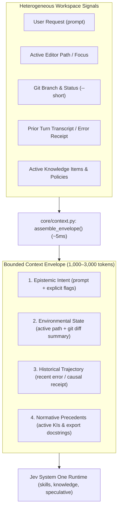

# RFC-26: Machine-Native Context Envelope & Multi-Modal State Assembly

> **Category**: `CORE`  
> **Status**: Implemented  
> **Target Lifecycle**: `PreInvocation` (`turn.before`) & `PreToolUse` (`tool.before`)  
> **Harnesses**: Google Antigravity and OpenAI Codex  
> **Implementation**: [`core/context.py`](../src/jev/core/context.py) & [`runtime.py`](../src/jev/runtime.py)  
> **Related Protocol**: [System One Balance Protocol](../.agents/protocols/system-one-balance-protocol.md)  
> **Grounding Philosophy**: [The Philosophy of Jev](../docs/PHILOSOPHY.md)

---

## 1. Problem

Autonomous coding agents frequently receive brief, continuation, or underspecified prompts from developers:
- *"Fix the bug"*
- *"Make it faster"*
- *"Run tests"*
- *"Refactor the auth handler"*

When agent hooks pass these bare prompt strings directly to decision models (e.g., skill routers, safety gates, or knowledge matchers), the evaluation suffers from **Context Starvation**:
1. **Low Decision Confidence**: Jev evaluates a 3-word prompt in a vacuum, yielding ambivalence ($P \approx 0.45 - 0.60$) where a decisive threshold ($\ge 0.80$) was needed.
2. **False Negative Skill Routing**: A developer asking *"fix the auth handler"* misses the `app-security` skill because the prompt lacked security keywords, even though the uncommitted diff touches JWT verification logic.
3. **The Inverse Trap (Context Flooding)**: Naive attempts to fix this dump 30,000+ tokens of raw bash logs and full repository file trees into the decision state, ballooning evaluation latency from 80ms to 4+ seconds.

---

## 2. Inspiration

In semiotics and functional linguistics (Ludwig Wittgenstein, M.A.K. Halliday), words have no inherent meaning in isolation: **meaning is situated in the context of the situation**. 

In biological cognition, the brain does not interpret language in an acoustic void. Words are merged continuously with **proprioception** (body state, physical orientation), **environmental cues** (visual horizon, objects in hand), and **immediate memory** (last action performed).

Translating this to agent systems: Jev System One micro-decisions must evaluate **Context Envelopes**, not bare prompt strings.

---

## 3. Solution: The 4-Layer Context Envelope

RFC-26 introduces a lightweight, bounded **Context Envelope** assembled automatically before any System One decision is evaluated:



### The 4 Layers of the Context Envelope:
1. **Epistemic Intent**: The raw user request stripped of redundant IDE metadata.
2. **Environmental State**: The physical workspace reality: active file path, current git branch, and modified git status summary (bounded to 500 chars).
3. **Historical Trajectory**: The causal trigger of the current turn: the immediate prior error, failed test assertion, or tool receipt (bounded to 400 chars).
4. **Normative Precedents**: Relevant Knowledge Items and library signature stubs.

---

## 4. Concrete Example & Impact

### Before: Context Starvation on Continuation Turns
1. Developer: *"Fix the broken test."*
2. Bare Prompt passed to Skill Dispatcher: `"Fix the broken test."`
3. Jev Result:
   - `skills.suggest` evaluates blind. No keyword matches `app-security`.
   - Confidence: `0.38`. Skill withheld.
   - Foundation model plans without domain guidelines and repeats deprecated API patterns.

### After: RFC-26 Context Envelope Assembly
1. Developer: *"Fix the broken test."*
2. Context Envelope assembled in 4.2ms:
   ```text
   Prompt: Fix the broken test.
   Active file: tests/test_token_refresh.py
   Branch: feature/jwt-renewal
   Uncommitted: M src/auth/jwt.py, M tests/test_token_refresh.py
   Recent error: AssertionError: token expired signature mismatch
   ```
3. Jev Result:
   - `skills.suggest` evaluates the enriched envelope in 88ms.
   - `app-security` confidence scores **0.93** (High confidence).
   - Knowledge Item `KI-04: JWT Renewal Invariants` auto-mounted on Turn 1.
4. Foundation model fixes the issue on Turn 1 without exploratory roundtrips.

---

## 5. Technical Specification & Implementation

### A. Data Contract (`ContextEnvelope`)

```python
@dataclass(frozen=True)
class ContextEnvelope:
    prompt: str
    active_path: str = ""
    git_branch: str = ""
    git_status_summary: str = ""
    prior_context: str = ""
    last_error: str = ""

    def to_semantic_string(self) -> str:
        """Renders high-signal state string for Jev System One questions."""
        ...
```

### B. Assembly Latency & Safety Invariants

1. **Sub-10ms Assembly Budget**: Git operations use `git status --short` with `timeout=0.15` and `safe.directory`. If git is absent or stalls, the envelope falls back to bare prompt gracefully.
2. **Strict Bounded Size**: The rendered semantic string is capped at 4,000 characters (~1,000 tokens), preventing context bloat.
3. **Secret Redaction**: All paths, prompts, and status lines pass through `redact()` before entering evaluation payloads.
4. **Harness-Neutral Integration**: Both Antigravity and Codex events feed into `assemble_envelope()`.
